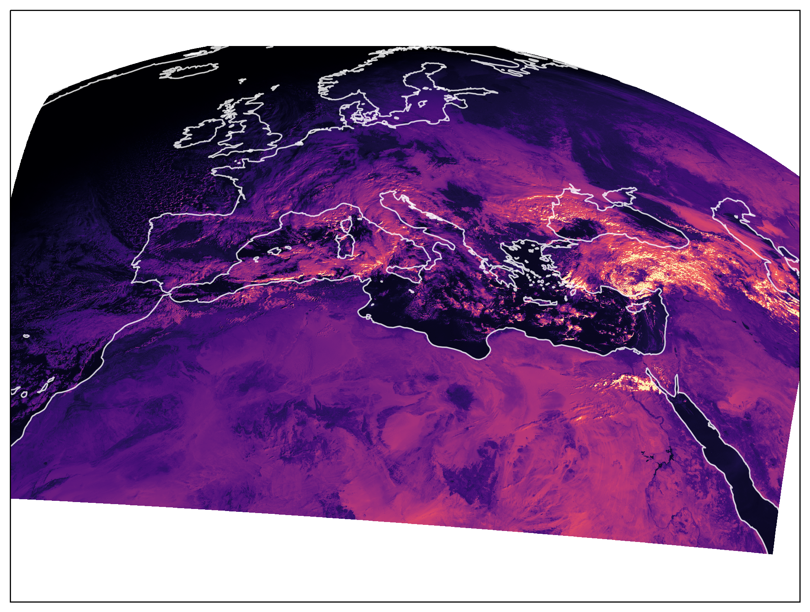
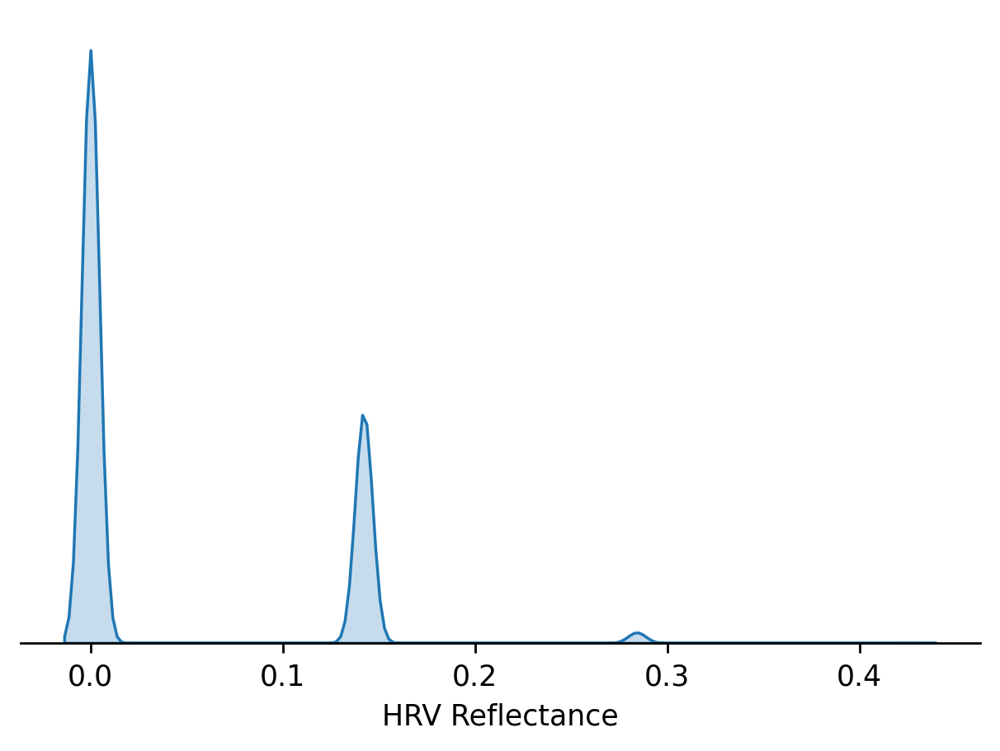
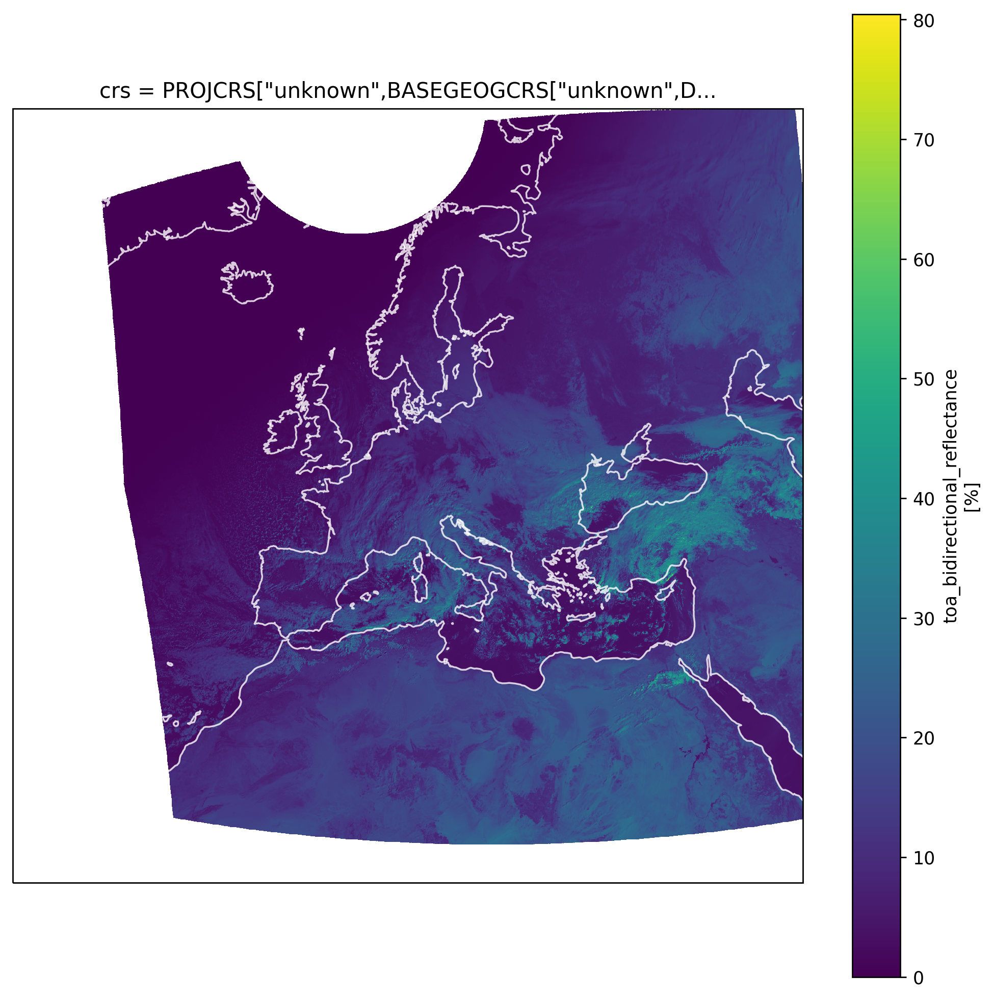
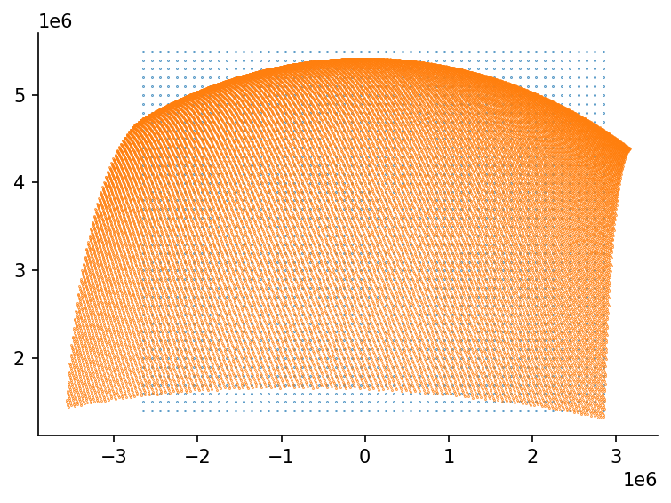

# Data Transformation


```python
#exports
import json
import pandas as pd
import xarray as xr
import numpy as np
import numpy.ma as ma

import matplotlib as mpl
import matplotlib.pyplot as plt
from matplotlib import colors
import seaborn as sns

import os
import time
from itertools import product
from collections import OrderedDict
from datetime import datetime
from ipypb import track
import FEAutils as hlp

import satpy
from satpy import Scene
from satpy.readers import seviri_l1b_native
import pyresample
from pyresample.geometry import AreaDefinition

# pyinterp fails to import on some machines for unknown reasons - leave it optional
try:
    import pyinterp
    import pyinterp.backends.xarray
except:
    pass

```

<br>

We'll separately install libraries that wont be needed for the `satip` module

```python
import rasterio
from rasterio import Affine as A
from rasterio.warp import reproject, Resampling, calculate_default_transform, transform
from rasterio.control import GroundControlPoint
from rasterio.transform import xy

import geopandas as gpd
from shapely.geometry import Point
import cartopy.crs as ccrs

from IPython.display import JSON
```

<br>

### User Input

```python
data_dir = '../data/raw'
intermediate_data_dir = '../data/intermediate'

calculate_reproj_coords = False
```

<br>

### Exploratory Data Analysis

We'll start by identifying the available files

```python
native_fps = sorted([f'{data_dir}/{f}' for f in os.listdir(data_dir) if '.nat' in f])

native_fps[0]
```


    '../data/raw/MSG3-SEVI-MSG15-0100-NA-20210121204918.196000000Z-NA.nat'


<br>

Then load one of them in as a SatPy scene

```python
native_fp = native_fps[0]

scene = Scene(filenames=[native_fp], reader='seviri_l1b_native')

scene
```


    <satpy.scene.Scene at 0x1c2a2940eb0>


<br>

We can get a list of the available datasets (bands)

```python
scene.all_dataset_names()
```


    ['HRV',
     'IR_016',
     'IR_039',
     'IR_087',
     'IR_097',
     'IR_108',
     'IR_120',
     'IR_134',
     'VIS006',
     'VIS008',
     'WV_062',
     'WV_073']


<br>

Each band contains an XArray DataArray

```python
scene.load(['HRV'])

scene['HRV']
```

    C:\Users\Ayrto\anaconda3\envs\satip_dev\lib\site-packages\pyproj\crs\crs.py:543: UserWarning: You will likely lose important projection information when converting to a PROJ string from another format. See: https://proj.org/faq.html#what-is-the-best-format-for-describing-coordinate-reference-systems
      proj_string = self.to_proj4()
    


<div><svg style="position: absolute; width: 0; height: 0; overflow: hidden">
<defs>
<symbol id="icon-database" viewBox="0 0 32 32">
<path d="M16 0c-8.837 0-16 2.239-16 5v4c0 2.761 7.163 5 16 5s16-2.239 16-5v-4c0-2.761-7.163-5-16-5z"></path>
<path d="M16 17c-8.837 0-16-2.239-16-5v6c0 2.761 7.163 5 16 5s16-2.239 16-5v-6c0 2.761-7.163 5-16 5z"></path>
<path d="M16 26c-8.837 0-16-2.239-16-5v6c0 2.761 7.163 5 16 5s16-2.239 16-5v-6c0 2.761-7.163 5-16 5z"></path>
</symbol>
<symbol id="icon-file-text2" viewBox="0 0 32 32">
<path d="M28.681 7.159c-0.694-0.947-1.662-2.053-2.724-3.116s-2.169-2.030-3.116-2.724c-1.612-1.182-2.393-1.319-2.841-1.319h-15.5c-1.378 0-2.5 1.121-2.5 2.5v27c0 1.378 1.122 2.5 2.5 2.5h23c1.378 0 2.5-1.122 2.5-2.5v-19.5c0-0.448-0.137-1.23-1.319-2.841zM24.543 5.457c0.959 0.959 1.712 1.825 2.268 2.543h-4.811v-4.811c0.718 0.556 1.584 1.309 2.543 2.268zM28 29.5c0 0.271-0.229 0.5-0.5 0.5h-23c-0.271 0-0.5-0.229-0.5-0.5v-27c0-0.271 0.229-0.5 0.5-0.5 0 0 15.499-0 15.5 0v7c0 0.552 0.448 1 1 1h7v19.5z"></path>
<path d="M23 26h-14c-0.552 0-1-0.448-1-1s0.448-1 1-1h14c0.552 0 1 0.448 1 1s-0.448 1-1 1z"></path>
<path d="M23 22h-14c-0.552 0-1-0.448-1-1s0.448-1 1-1h14c0.552 0 1 0.448 1 1s-0.448 1-1 1z"></path>
<path d="M23 18h-14c-0.552 0-1-0.448-1-1s0.448-1 1-1h14c0.552 0 1 0.448 1 1s-0.448 1-1 1z"></path>
</symbol>
</defs>
</svg>
<style>/* CSS stylesheet for displaying xarray objects in jupyterlab.
 *
 */

:root {
  --xr-font-color0: var(--jp-content-font-color0, rgba(0, 0, 0, 1));
  --xr-font-color2: var(--jp-content-font-color2, rgba(0, 0, 0, 0.54));
  --xr-font-color3: var(--jp-content-font-color3, rgba(0, 0, 0, 0.38));
  --xr-border-color: var(--jp-border-color2, #e0e0e0);
  --xr-disabled-color: var(--jp-layout-color3, #bdbdbd);
  --xr-background-color: var(--jp-layout-color0, white);
  --xr-background-color-row-even: var(--jp-layout-color1, white);
  --xr-background-color-row-odd: var(--jp-layout-color2, #eeeeee);
}

html[theme=dark],
body.vscode-dark {
  --xr-font-color0: rgba(255, 255, 255, 1);
  --xr-font-color2: rgba(255, 255, 255, 0.54);
  --xr-font-color3: rgba(255, 255, 255, 0.38);
  --xr-border-color: #1F1F1F;
  --xr-disabled-color: #515151;
  --xr-background-color: #111111;
  --xr-background-color-row-even: #111111;
  --xr-background-color-row-odd: #313131;
}

.xr-wrap {
  display: block;
  min-width: 300px;
  max-width: 700px;
}

.xr-text-repr-fallback {
  /* fallback to plain text repr when CSS is not injected (untrusted notebook) */
  display: none;
}

.xr-header {
  padding-top: 6px;
  padding-bottom: 6px;
  margin-bottom: 4px;
  border-bottom: solid 1px var(--xr-border-color);
}

.xr-header > div,
.xr-header > ul {
  display: inline;
  margin-top: 0;
  margin-bottom: 0;
}

.xr-obj-type,
.xr-array-name {
  margin-left: 2px;
  margin-right: 10px;
}

.xr-obj-type {
  color: var(--xr-font-color2);
}

.xr-sections {
  padding-left: 0 !important;
  display: grid;
  grid-template-columns: 150px auto auto 1fr 20px 20px;
}

.xr-section-item {
  display: contents;
}

.xr-section-item input {
  display: none;
}

.xr-section-item input + label {
  color: var(--xr-disabled-color);
}

.xr-section-item input:enabled + label {
  cursor: pointer;
  color: var(--xr-font-color2);
}

.xr-section-item input:enabled + label:hover {
  color: var(--xr-font-color0);
}

.xr-section-summary {
  grid-column: 1;
  color: var(--xr-font-color2);
  font-weight: 500;
}

.xr-section-summary > span {
  display: inline-block;
  padding-left: 0.5em;
}

.xr-section-summary-in:disabled + label {
  color: var(--xr-font-color2);
}

.xr-section-summary-in + label:before {
  display: inline-block;
  content: 'â–º';
  font-size: 11px;
  width: 15px;
  text-align: center;
}

.xr-section-summary-in:disabled + label:before {
  color: var(--xr-disabled-color);
}

.xr-section-summary-in:checked + label:before {
  content: 'â–¼';
}

.xr-section-summary-in:checked + label > span {
  display: none;
}

.xr-section-summary,
.xr-section-inline-details {
  padding-top: 4px;
  padding-bottom: 4px;
}

.xr-section-inline-details {
  grid-column: 2 / -1;
}

.xr-section-details {
  display: none;
  grid-column: 1 / -1;
  margin-bottom: 5px;
}

.xr-section-summary-in:checked ~ .xr-section-details {
  display: contents;
}

.xr-array-wrap {
  grid-column: 1 / -1;
  display: grid;
  grid-template-columns: 20px auto;
}

.xr-array-wrap > label {
  grid-column: 1;
  vertical-align: top;
}

.xr-preview {
  color: var(--xr-font-color3);
}

.xr-array-preview,
.xr-array-data {
  padding: 0 5px !important;
  grid-column: 2;
}

.xr-array-data,
.xr-array-in:checked ~ .xr-array-preview {
  display: none;
}

.xr-array-in:checked ~ .xr-array-data,
.xr-array-preview {
  display: inline-block;
}

.xr-dim-list {
  display: inline-block !important;
  list-style: none;
  padding: 0 !important;
  margin: 0;
}

.xr-dim-list li {
  display: inline-block;
  padding: 0;
  margin: 0;
}

.xr-dim-list:before {
  content: '(';
}

.xr-dim-list:after {
  content: ')';
}

.xr-dim-list li:not(:last-child):after {
  content: ',';
  padding-right: 5px;
}

.xr-has-index {
  font-weight: bold;
}

.xr-var-list,
.xr-var-item {
  display: contents;
}

.xr-var-item > div,
.xr-var-item label,
.xr-var-item > .xr-var-name span {
  background-color: var(--xr-background-color-row-even);
  margin-bottom: 0;
}

.xr-var-item > .xr-var-name:hover span {
  padding-right: 5px;
}

.xr-var-list > li:nth-child(odd) > div,
.xr-var-list > li:nth-child(odd) > label,
.xr-var-list > li:nth-child(odd) > .xr-var-name span {
  background-color: var(--xr-background-color-row-odd);
}

.xr-var-name {
  grid-column: 1;
}

.xr-var-dims {
  grid-column: 2;
}

.xr-var-dtype {
  grid-column: 3;
  text-align: right;
  color: var(--xr-font-color2);
}

.xr-var-preview {
  grid-column: 4;
}

.xr-var-name,
.xr-var-dims,
.xr-var-dtype,
.xr-preview,
.xr-attrs dt {
  white-space: nowrap;
  overflow: hidden;
  text-overflow: ellipsis;
  padding-right: 10px;
}

.xr-var-name:hover,
.xr-var-dims:hover,
.xr-var-dtype:hover,
.xr-attrs dt:hover {
  overflow: visible;
  width: auto;
  z-index: 1;
}

.xr-var-attrs,
.xr-var-data {
  display: none;
  background-color: var(--xr-background-color) !important;
  padding-bottom: 5px !important;
}

.xr-var-attrs-in:checked ~ .xr-var-attrs,
.xr-var-data-in:checked ~ .xr-var-data {
  display: block;
}

.xr-var-data > table {
  float: right;
}

.xr-var-name span,
.xr-var-data,
.xr-attrs {
  padding-left: 25px !important;
}

.xr-attrs,
.xr-var-attrs,
.xr-var-data {
  grid-column: 1 / -1;
}

dl.xr-attrs {
  padding: 0;
  margin: 0;
  display: grid;
  grid-template-columns: 125px auto;
}

.xr-attrs dt,
.xr-attrs dd {
  padding: 0;
  margin: 0;
  float: left;
  padding-right: 10px;
  width: auto;
}

.xr-attrs dt {
  font-weight: normal;
  grid-column: 1;
}

.xr-attrs dt:hover span {
  display: inline-block;
  background: var(--xr-background-color);
  padding-right: 10px;
}

.xr-attrs dd {
  grid-column: 2;
  white-space: pre-wrap;
  word-break: break-all;
}

.xr-icon-database,
.xr-icon-file-text2 {
  display: inline-block;
  vertical-align: middle;
  width: 1em;
  height: 1.5em !important;
  stroke-width: 0;
  stroke: currentColor;
  fill: currentColor;
}
</style><pre class='xr-text-repr-fallback'>&lt;xarray.DataArray &#x27;reshape-d4e0a459824b09e38634d18c1de710b4&#x27; (y: 4176, x: 5568)&gt;
dask.array&lt;mul, shape=(4176, 5568), dtype=float32, chunksize=(1392, 5568), chunktype=numpy.ndarray&gt;
Coordinates:
    crs      object PROJCRS[&quot;unknown&quot;,BASEGEOGCRS[&quot;unknown&quot;,DATUM[&quot;unknown&quot;,E...
  * y        (y) float64 1.395e+06 1.396e+06 1.397e+06 ... 5.57e+06 5.571e+06
  * x        (x) float64 2.83e+06 2.829e+06 2.828e+06 ... -2.736e+06 -2.737e+06
Attributes:
    orbital_parameters:                     {&#x27;projection_longitude&#x27;: 9.5, &#x27;pr...
    sun_earth_distance_correction_applied:  True
    sun_earth_distance_correction_factor:   0.9683646614038233
    units:                                  %
    wavelength:                             0.7 µm (0.5-0.9 µm)
    standard_name:                          toa_bidirectional_reflectance
    platform_name:                          Meteosat-10
    sensor:                                 seviri
    start_time:                             2021-01-21 20:45:11.814324
    end_time:                               2021-01-21 20:50:10.471270
    area:                                   Area ID: geos_seviri_hrv\nDescrip...
    name:                                   HRV
    resolution:                             1000.134348869
    calibration:                            reflectance
    modifiers:                              ()
    _satpy_id:                              DataID(name=&#x27;HRV&#x27;, wavelength=Wav...
    ancillary_variables:                    []</pre><div class='xr-wrap' hidden><div class='xr-header'><div class='xr-obj-type'>xarray.DataArray</div><div class='xr-array-name'>'reshape-d4e0a459824b09e38634d18c1de710b4'</div><ul class='xr-dim-list'><li><span class='xr-has-index'>y</span>: 4176</li><li><span class='xr-has-index'>x</span>: 5568</li></ul></div><ul class='xr-sections'><li class='xr-section-item'><div class='xr-array-wrap'><input id='section-e6245464-3f08-4a97-abdd-1e1ad577f694' class='xr-array-in' type='checkbox' checked><label for='section-e6245464-3f08-4a97-abdd-1e1ad577f694' title='Show/hide data repr'><svg class='icon xr-icon-database'><use xlink:href='#icon-database'></use></svg></label><div class='xr-array-preview xr-preview'><span>dask.array&lt;chunksize=(1392, 5568), meta=np.ndarray&gt;</span></div><div class='xr-array-data'><table>
<tr>
<td>
<table>
  <thead>
    <tr><td> </td><th> Array </th><th> Chunk </th></tr>
  </thead>
  <tbody>
    <tr><th> Bytes </th><td> 93.01 MB </td> <td> 31.00 MB </td></tr>
    <tr><th> Shape </th><td> (4176, 5568) </td> <td> (1392, 5568) </td></tr>
    <tr><th> Count </th><td> 214 Tasks </td><td> 3 Chunks </td></tr>
    <tr><th> Type </th><td> float32 </td><td> numpy.ndarray </td></tr>
  </tbody>
</table>
</td>
<td>
<svg width="170" height="140" style="stroke:rgb(0,0,0);stroke-width:1" >

  <!-- Horizontal lines -->
  <line x1="0" y1="0" x2="120" y2="0" style="stroke-width:2" />
  <line x1="0" y1="30" x2="120" y2="30" />
  <line x1="0" y1="60" x2="120" y2="60" />
  <line x1="0" y1="90" x2="120" y2="90" style="stroke-width:2" />

  <!-- Vertical lines -->
  <line x1="0" y1="0" x2="0" y2="90" style="stroke-width:2" />
  <line x1="120" y1="0" x2="120" y2="90" style="stroke-width:2" />

  <!-- Colored Rectangle -->
  <polygon points="0.0,0.0 120.0,0.0 120.0,90.0 0.0,90.0" style="fill:#ECB172A0;stroke-width:0"/>

  <!-- Text -->
  <text x="60.000000" y="110.000000" font-size="1.0rem" font-weight="100" text-anchor="middle" >5568</text>
  <text x="140.000000" y="45.000000" font-size="1.0rem" font-weight="100" text-anchor="middle" transform="rotate(-90,140.000000,45.000000)">4176</text>
</svg>
</td>
</tr>
</table></div></div></li><li class='xr-section-item'><input id='section-d3964f81-cfa0-4dcf-bc15-36974cd96fa7' class='xr-section-summary-in' type='checkbox'  checked><label for='section-d3964f81-cfa0-4dcf-bc15-36974cd96fa7' class='xr-section-summary' >Coordinates: <span>(3)</span></label><div class='xr-section-inline-details'></div><div class='xr-section-details'><ul class='xr-var-list'><li class='xr-var-item'><div class='xr-var-name'><span>crs</span></div><div class='xr-var-dims'>()</div><div class='xr-var-dtype'>object</div><div class='xr-var-preview xr-preview'>PROJCRS[&quot;unknown&quot;,BASEGEOGCRS[&quot;u...</div><input id='attrs-11d31292-0988-44b6-92ac-ca18e2fba5cc' class='xr-var-attrs-in' type='checkbox' disabled><label for='attrs-11d31292-0988-44b6-92ac-ca18e2fba5cc' title='Show/Hide attributes'><svg class='icon xr-icon-file-text2'><use xlink:href='#icon-file-text2'></use></svg></label><input id='data-f18a7ce7-b1dc-42d8-be1a-b8548acdfb98' class='xr-var-data-in' type='checkbox'><label for='data-f18a7ce7-b1dc-42d8-be1a-b8548acdfb98' title='Show/Hide data repr'><svg class='icon xr-icon-database'><use xlink:href='#icon-database'></use></svg></label><div class='xr-var-attrs'><dl class='xr-attrs'></dl></div><div class='xr-var-data'><pre>array(&lt;Projected CRS: PROJCRS[&quot;unknown&quot;,BASEGEOGCRS[&quot;unknown&quot;,DATUM[&quot;unk ...&gt;
Name: unknown
Axis Info [cartesian]:
- E[east]: Easting (metre)
- N[north]: Northing (metre)
Area of Use:
- undefined
Coordinate Operation:
- name: unknown
- method: Geostationary Satellite (Sweep Y)
Datum: unknown
- Ellipsoid: unknown
- Prime Meridian: Greenwich
, dtype=object)</pre></div></li><li class='xr-var-item'><div class='xr-var-name'><span class='xr-has-index'>y</span></div><div class='xr-var-dims'>(y)</div><div class='xr-var-dtype'>float64</div><div class='xr-var-preview xr-preview'>1.395e+06 1.396e+06 ... 5.571e+06</div><input id='attrs-cb5efcdb-b0fc-4b1a-bb51-7624f92e7f0a' class='xr-var-attrs-in' type='checkbox' ><label for='attrs-cb5efcdb-b0fc-4b1a-bb51-7624f92e7f0a' title='Show/Hide attributes'><svg class='icon xr-icon-file-text2'><use xlink:href='#icon-file-text2'></use></svg></label><input id='data-8eaf485c-b1c3-47d9-906f-d8f9926556da' class='xr-var-data-in' type='checkbox'><label for='data-8eaf485c-b1c3-47d9-906f-d8f9926556da' title='Show/Hide data repr'><svg class='icon xr-icon-database'><use xlink:href='#icon-database'></use></svg></label><div class='xr-var-attrs'><dl class='xr-attrs'><dt><span>units :</span></dt><dd>meter</dd></dl></div><div class='xr-var-data'><pre>array([1395187.416673, 1396187.551022, 1397187.68537 , ..., 5568748.054504,
       5569748.188853, 5570748.323202])</pre></div></li><li class='xr-var-item'><div class='xr-var-name'><span class='xr-has-index'>x</span></div><div class='xr-var-dims'>(x)</div><div class='xr-var-dtype'>float64</div><div class='xr-var-preview xr-preview'>2.83e+06 2.829e+06 ... -2.737e+06</div><input id='attrs-97e7f4be-73b1-4327-b031-a8954e8c9f92' class='xr-var-attrs-in' type='checkbox' ><label for='attrs-97e7f4be-73b1-4327-b031-a8954e8c9f92' title='Show/Hide attributes'><svg class='icon xr-icon-file-text2'><use xlink:href='#icon-file-text2'></use></svg></label><input id='data-884240d4-f3ad-4762-b483-0e82f23b298b' class='xr-var-data-in' type='checkbox'><label for='data-884240d4-f3ad-4762-b483-0e82f23b298b' title='Show/Hide data repr'><svg class='icon xr-icon-database'><use xlink:href='#icon-database'></use></svg></label><div class='xr-var-attrs'><dl class='xr-attrs'><dt><span>units :</span></dt><dd>meter</dd></dl></div><div class='xr-var-data'><pre>array([ 2830380.2073  ,  2829380.072951,  2828379.938602, ..., -2735367.444158,
       -2736367.578506, -2737367.712855])</pre></div></li></ul></div></li><li class='xr-section-item'><input id='section-ce9b68c4-7066-4e14-85a7-0acf1ffd4ddb' class='xr-section-summary-in' type='checkbox'  ><label for='section-ce9b68c4-7066-4e14-85a7-0acf1ffd4ddb' class='xr-section-summary' >Attributes: <span>(17)</span></label><div class='xr-section-inline-details'></div><div class='xr-section-details'><dl class='xr-attrs'><dt><span>orbital_parameters :</span></dt><dd>{&#x27;projection_longitude&#x27;: 9.5, &#x27;projection_latitude&#x27;: 0.0, &#x27;projection_altitude&#x27;: 35785831.0}</dd><dt><span>sun_earth_distance_correction_applied :</span></dt><dd>True</dd><dt><span>sun_earth_distance_correction_factor :</span></dt><dd>0.9683646614038233</dd><dt><span>units :</span></dt><dd>%</dd><dt><span>wavelength :</span></dt><dd>0.7 µm (0.5-0.9 µm)</dd><dt><span>standard_name :</span></dt><dd>toa_bidirectional_reflectance</dd><dt><span>platform_name :</span></dt><dd>Meteosat-10</dd><dt><span>sensor :</span></dt><dd>seviri</dd><dt><span>start_time :</span></dt><dd>2021-01-21 20:45:11.814324</dd><dt><span>end_time :</span></dt><dd>2021-01-21 20:50:10.471270</dd><dt><span>area :</span></dt><dd>Area ID: geos_seviri_hrv
Description: SEVIRI high resolution channel area
Projection ID: seviri_hrv
Projection: {&#x27;a&#x27;: &#x27;6378169&#x27;, &#x27;h&#x27;: &#x27;35785831&#x27;, &#x27;lon_0&#x27;: &#x27;9.5&#x27;, &#x27;no_defs&#x27;: &#x27;None&#x27;, &#x27;proj&#x27;: &#x27;geos&#x27;, &#x27;rf&#x27;: &#x27;295.488065897014&#x27;, &#x27;type&#x27;: &#x27;crs&#x27;, &#x27;units&#x27;: &#x27;m&#x27;, &#x27;x_0&#x27;: &#x27;0&#x27;, &#x27;y_0&#x27;: &#x27;0&#x27;}
Number of columns: 5568
Number of rows: 4176
Area extent: (2830880.2745, 5571248.3904, -2737867.78, 1394687.3495)</dd><dt><span>name :</span></dt><dd>HRV</dd><dt><span>resolution :</span></dt><dd>1000.134348869</dd><dt><span>calibration :</span></dt><dd>reflectance</dd><dt><span>modifiers :</span></dt><dd>()</dd><dt><span>_satpy_id :</span></dt><dd>DataID(name=&#x27;HRV&#x27;, wavelength=WavelengthRange(min=0.5, central=0.7, max=0.9, unit=&#x27;µm&#x27;), resolution=1000.134348869, calibration=&lt;calibration.reflectance&gt;, modifiers=())</dd><dt><span>ancillary_variables :</span></dt><dd>[]</dd></dl></div></li></ul></div></div>


<br>

We can see that the DataArray contains a crs, however we'll make our own custom area definition that's more accurate. First we'll create a helper function that will create our area definitions.

```python
#exports
def calculate_x_offset(native_fp):
    handler = seviri_l1b_native.NativeMSGFileHandler(native_fp, {}, None)
    lower_east_column_planned = handler.header['15_DATA_HEADER']['ImageDescription']['PlannedCoverageHRV']['LowerEastColumnPlanned']
    x_offset = 32500 + ((2733 - lower_east_column_planned) * 1000)

    return x_offset

def get_seviri_area_def(native_fp, num_x_pixels=5568, num_y_pixels=4176) -> AreaDefinition:
    """
    The HRV channel on Meteosat Second Generation satellites doesn't scan the full number of columns.
    The east boundary of the HRV channel changes (e.g. to maximise the amount of the image which
    is illuminated by sunlight.
    
    Parameters:
        native_fp: Data filepath
        

    """
    
    x_offset = calculate_x_offset(native_fp)
    
    # The EUMETSAT docs say "The distance between spacecraft and centre of earth is 42,164 km. The idealized earth
    # is a perfect ellipsoid with an equator radius of 6378.1690 km and a polar radius of 6356.5838 km." 
    # The projection used by SatPy expresses height as height above the Earth's surface (not distance
    # to the centre of the Earth).
    
    projection = {
        'proj': 'geos',
        'lon_0': 9.5,
        'a': 6378169.0,
        'b': 6356583.8,
        'h': 35785831.00,
        'units': 'm'}

    seviri = AreaDefinition(
        area_id='seviri',
        description='SEVIRI RSS HRV',
        proj_id='seviri',   
        projection=projection,
        width=num_x_pixels,
        height=num_y_pixels,
        area_extent=[
            -2768872.0236 + x_offset, # left
             1394687.3495,            # bottom (from scene['HRV'].area)
             2799876.1893 + x_offset, # right
             5570248.4773]            # top (from scene['HRV'].area)
    )

    return seviri
```

<br>

Then we'll use it to construct the relevant one for Seviri

```python
seviri = get_seviri_area_def(native_fp)
seviri_crs = seviri.to_cartopy_crs()

seviri_crs
```

    C:\Users\Ayrto\anaconda3\envs\satip_dev\lib\site-packages\pyproj\crs\crs.py:543: UserWarning: You will likely lose important projection information when converting to a PROJ string from another format. See: https://proj.org/faq.html#what-is-the-best-format-for-describing-coordinate-reference-systems
      proj_string = self.to_proj4()
    


<?xml version="1.0" encoding="utf-8" standalone="no"?>
<!DOCTYPE svg PUBLIC "-//W3C//DTD SVG 1.1//EN"
  "http://www.w3.org/Graphics/SVG/1.1/DTD/svg11.dtd">
<!-- Created with matplotlib (https://matplotlib.org/) -->
<svg height="177.48pt" version="1.1" viewBox="0 0 231.892076 177.48" width="231.892076pt" xmlns="http://www.w3.org/2000/svg" xmlns:xlink="http://www.w3.org/1999/xlink">
 <metadata>
  <rdf:RDF xmlns:cc="http://creativecommons.org/ns#" xmlns:dc="http://purl.org/dc/elements/1.1/" xmlns:rdf="http://www.w3.org/1999/02/22-rdf-syntax-ns#">
   <cc:Work>
    <dc:type rdf:resource="http://purl.org/dc/dcmitype/StillImage"/>
    <dc:date>2021-03-26T14:44:22.150408</dc:date>
    <dc:format>image/svg+xml</dc:format>
    <dc:creator>
     <cc:Agent>
      <dc:title>Matplotlib v3.3.2, https://matplotlib.org/</dc:title>
     </cc:Agent>
    </dc:creator>
   </cc:Work>
  </rdf:RDF>
 </metadata>
 <defs>
  <style type="text/css">*{stroke-linecap:butt;stroke-linejoin:round;}</style>
 </defs>
 <g id="figure_1">
  <g id="patch_1">
   <path d="M 0 177.48 
L 231.892076 177.48 
L 231.892076 0 
L 0 0 
z
" style="fill:none;"/>
  </g>
  <g id="axes_1">
   <g id="patch_2">
    <path d="M 7.2 170.28 
L 7.2 7.2 
L 224.692076 7.2 
L 224.692076 170.28 
L 7.2 170.28 
" style="fill:#ffffff;"/>
   </g>
   <g id="PathCollection_1">
    <path clip-path="url(#p7fe9941a6d)" d="M 77.20904 39.917195 
L 76.904917 41.299359 
L 74.270166 43.168999 
L 69.466627 44.573751 
L 66.310132 44.418713 
L 69.378712 42.192808 
L 69.367627 40.246189 
L 73.261324 38.606453 
L 75.420139 37.661085 
L 77.297243 37.505267 
L 79.074915 38.558925 
L 77.20904 39.917195 
" style="fill:none;stroke:#000000;"/>
    <path clip-path="url(#p7fe9941a6d)" d="M 191.541959 88.102676 
L 193.73191 88.252691 
L 196.111716 87.459912 
L 194.575249 88.688229 
L 195.185157 89.547344 
L 192.510358 90.681331 
L 190.871785 90.197552 
L 189.736887 88.893433 
L 191.360598 88.839399 
L 191.541959 88.102676 
" style="fill:none;stroke:#000000;"/>
    <path clip-path="url(#p7fe9941a6d)" d="M 170.754444 87.518371 
L 170.580869 88.435596 
L 165.944256 88.555455 
L 165.859303 88.034185 
L 161.718257 87.302101 
L 162.040225 85.985874 
L 164.060415 87.094096 
L 166.559478 86.992186 
L 169.028357 87.292418 
L 169.082907 87.837852 
L 170.754444 87.518371 
" style="fill:none;stroke:#000000;"/>
    <path clip-path="url(#p7fe9941a6d)" d="M 111.696592 69.893575 
L 113.278561 69.025393 
L 115.172837 71.018707 
L 114.738604 74.818 
L 113.263848 74.634394 
L 111.92948 75.611055 
L 110.710306 74.837943 
L 110.650944 71.367532 
L 109.965756 69.757363 
L 111.696592 69.893575 
" style="fill:none;stroke:#000000;"/>
    <path clip-path="url(#p7fe9941a6d)" d="M 111.881065 65.143792 
L 113.854132 64.118811 
L 114.373683 66.429541 
L 113.34298 68.55288 
L 111.930618 67.991071 
L 111.244073 66.14973 
L 111.881065 65.143792 
" style="fill:none;stroke:#000000;"/>
    <path clip-path="url(#p7fe9941a6d)" d="M 120.652341 35.083532 
L 121.471685 35.979942 
L 120.236012 37.446568 
L 117.738414 36.399189 
L 117.380337 35.65219 
L 120.652341 35.083532 
" style="fill:none;stroke:#000000;"/>
    <path clip-path="url(#p7fe9941a6d)" d="M 85.798746 31.490067 
L 88.311224 31.271515 
L 85.214307 33.108301 
L 87.452083 32.807817 
L 89.739881 32.744369 
L 88.586051 34.132888 
L 85.947629 35.75872 
L 88.172381 35.800927 
L 89.459929 38.084521 
L 90.933185 38.344411 
L 91.696336 40.4978 
L 92.15605 41.262012 
L 94.993868 41.579796 
L 94.385131 42.879685 
L 92.974533 43.508515 
L 93.713577 44.566628 
L 91.164702 45.725556 
L 87.775018 45.786489 
L 83.284857 46.496772 
L 82.255275 46.108196 
L 80.230809 47.175377 
L 77.993405 47.006793 
L 75.900169 47.905584 
L 74.744133 47.517078 
L 79.296278 45.12496 
L 81.673561 44.596226 
L 77.974461 44.377864 
L 77.642984 43.577536 
L 80.419334 42.851824 
L 79.576445 41.810331 
L 80.590497 40.498692 
L 83.990869 40.557627 
L 84.782897 39.421222 
L 83.713787 38.278018 
L 81.125993 38.046151 
L 80.837222 37.56415 
L 82.042214 36.716646 
L 81.569746 36.246655 
L 79.953105 37.148692 
L 80.736204 35.423919 
L 80.156787 34.57832 
L 81.919781 32.801813 
L 84.262408 31.423904 
L 85.798746 31.490067 
" style="fill:none;stroke:#000000;"/>
    <path clip-path="url(#p7fe9941a6d)" d="M 77.717261 21.882372 
L 76.384534 22.610265 
L 77.014386 23.272559 
L 73.884226 24.309241 
L 68.359354 25.487134 
L 66.731701 25.825747 
L 65.018324 25.801664 
L 61.568893 25.765424 
L 63.831098 25.077607 
L 61.802484 24.767798 
L 64.599546 24.298877 
L 65.118998 23.956493 
L 62.800756 23.959037 
L 65.021439 23.124872 
L 67.276977 22.769828 
L 68.04403 23.341266 
L 71.115547 22.5534 
L 72.345334 22.725358 
L 75.509646 21.971341 
L 77.717261 21.882372 
" style="fill:none;stroke:#000000;"/>
    <path clip-path="url(#p7fe9941a6d)" d="M 157.879127 17.718004 
L 157.778665 17.70058 
L 158.645515 17.959836 
L 160.366786 18.462346 
L 161.831262 18.991749 
L 164.236227 19.687427 
L 168.028936 20.658952 
L 167.789775 20.655852 
L 164.668766 20.0972 
L 163.279897 19.681316 
L 161.020743 19.23205 
L 159.53087 18.785398 
L 159.844745 18.741952 
L 158.415168 18.32961 
L 157.711671 17.954324 
L 156.70697 17.767581 
L 156.054887 17.462472 
L 154.637517 17.155346 
L 154.588816 17.08296 
L 154.640749 17.069898 
" style="fill:none;stroke:#000000;"/>
    <path clip-path="url(#p7fe9941a6d)" d="M 125.73877 13.552115 
L 125.396603 13.576087 
L 123.567877 13.513272 
L 121.4337 13.425346 
L 121.122118 13.389779 
L 120.163819 13.363198 
L 119.19814 13.306841 
L 120.938408 13.337133 
L 122.016974 13.381731 
L 122.376357 13.382655 
L 124.142579 13.461639 
L 125.73877 13.552115 
" style="fill:none;stroke:#000000;"/>
    <path clip-path="url(#p7fe9941a6d)" d="M 126.280037 13.867051 
L 124.896746 13.905965 
L 123.290308 13.798058 
L 123.635801 13.751842 
L 122.922211 13.664802 
L 124.314215 13.674945 
L 124.952747 13.768375 
L 126.280037 13.867051 
" style="fill:none;stroke:#000000;"/>
    <path clip-path="url(#p7fe9941a6d)" d="M 118.0309 13.339573 
L 118.150573 13.309139 
L 119.093732 13.323418 
L 120.117219 13.37708 
L 122.91487 13.546978 
L 121.363269 13.564323 
L 121.391139 13.711961 
L 120.7948 13.74195 
L 120.832907 13.963951 
L 119.804046 13.956049 
L 117.750607 13.755735 
L 118.382849 13.675622 
L 117.097362 13.594785 
L 115.456272 13.422589 
L 114.834127 13.313789 
L 116.607783 13.289595 
L 117.067185 13.32833 
L 118.0309 13.339573 
" style="fill:none;stroke:#000000;"/>
    <path clip-path="url(#p7fe9941a6d)" d="M 7.823543 41.527475 
L 7.200002 41.888263 
L 7.2 41.888264 
" style="fill:none;stroke:#000000;"/>
    <path clip-path="url(#p7fe9941a6d)" d="M 131.508928 77.958148 
L 133.968655 77.727352 
L 133.017019 80.073174 
L 133.602625 81.018433 
L 133.047696 82.582545 
L 130.39127 81.4024 
L 128.668952 81.057847 
L 123.930132 79.483895 
L 124.314513 77.948197 
L 128.18415 78.250052 
L 131.508928 77.958148 
" style="fill:none;stroke:#000000;"/>
    <path clip-path="url(#p7fe9941a6d)" d="M 192.364377 62.353598 
L 195.750009 63.52938 
L 200.187045 65.979089 
" style="fill:none;stroke:#000000;"/>
    <path clip-path="url(#p7fe9941a6d)" d="M 14.66835 146.146426 
L 14.5957 144.230717 
L 15.293648 142.292507 
L 14.753559 140.495018 
L 13.286429 138.906085 
L 14.281969 135.527188 
L 15.792606 134.448759 
L 17.312306 132.445224 
L 17.368203 131.18485 
L 19.102324 128.510245 
L 21.499763 126.084894 
L 22.767062 125.447506 
L 24.142862 123.272373 
L 24.670997 121.326726 
L 26.406696 119.040928 
L 28.949963 117.6419 
L 31.942621 113.91459 
L 34.026831 112.43983 
L 37.251293 111.933816 
L 40.470958 109.439486 
L 42.382233 108.45061 
L 45.867106 105.463877 
L 46.018877 101.254621 
L 47.982654 98.326516 
L 48.857221 96.56568 
L 51.522788 94.273924 
L 55.181343 92.676027 
L 57.936844 91.261961 
L 60.897494 87.893387 
L 62.37192 85.933858 
L 64.759712 85.876089 
L 66.442198 87.149433 
L 69.622134 86.846787 
L 72.928312 87.455969 
L 74.372623 87.45563 
L 77.874318 85.667402 
L 81.568371 85.051666 
L 83.861748 83.731684 
L 87.195602 82.738404 
L 92.908066 82.109404 
L 98.459199 81.799457 
L 100.117315 82.239216 
L 103.345476 81.011282 
L 106.92129 80.968157 
L 108.262315 81.672424 
L 110.563975 81.4803 
L 114.221813 80.248992 
L 116.563367 80.614589 
L 116.482404 82.158531 
L 119.312312 81.040094 
L 119.56607 81.626887 
L 117.91265 83.127291 
L 117.914779 84.561323 
L 119.11201 85.33992 
L 118.716385 88.069349 
L 116.453161 89.671585 
L 117.137241 91.430971 
L 118.954189 91.489877 
L 119.873309 93.040647 
L 121.230945 93.557203 
L 125.434909 94.709332 
L 126.911065 94.435024 
L 129.902915 95.007387 
L 134.717245 96.533103 
L 136.62633 99.531087 
L 139.904848 100.225913 
L 145.104705 101.718772 
L 149.122432 103.481163 
L 150.76166 102.622213 
L 152.265235 101.086081 
L 151.093661 98.485624 
L 151.967754 96.882192 
L 154.24179 95.380911 
L 156.545304 94.983438 
L 161.304557 95.768954 
L 162.742849 97.280149 
L 164.022703 97.327323 
L 165.220573 97.92437 
L 168.692733 98.410003 
L 169.746635 99.539732 
L 174.256776 99.620652 
L 181.264102 101.72511 
L 182.937858 102.306901 
L 185.232766 101.329304 
L 186.341508 100.416924 
L 189.147287 100.254255 
L 191.56652 100.772293 
L 192.909012 102.479797 
L 193.352138 101.409686 
L 196.150539 102.317299 
L 198.689902 102.619929 
L 199.990642 101.84352 
L 200.563122 100.782355 
L 200.290918 100.58255 
L 200.622603 99.066934 
L 200.435872 96.611906 
L 200.668107 95.777307 
L 200.832562 93.195988 
L 201.513967 90.916843 
L 200.332612 88.489785 
L 200.550881 87.246395 
L 198.934754 85.78271 
L 199.567638 84.691726 
L 197.913895 84.852296 
L 195.209595 84.014116 
L 193.856445 85.673358 
L 189.443995 85.792873 
L 186.431045 84.023725 
L 183.125104 83.77122 
L 182.832022 85.015883 
L 180.813108 85.291282 
L 177.313653 83.528382 
L 173.924833 83.450965 
L 171.214493 80.362164 
L 168.478824 78.620925 
L 169.307812 76.382294 
L 166.967458 74.920408 
L 169.452627 72.305666 
L 173.952699 72.379849 
L 174.405004 70.298297 
L 179.994269 70.923946 
L 182.619432 69.297125 
L 185.479074 68.696043 
L 189.917518 68.899009 
L 195.513862 71.134301 
L 199.833552 72.465673 
L 202.627649 72.246247 
L 204.959644 72.65641 
L 207.111701 71.429953 
L 206.800703 70.281872 
L 205.099375 68.377048 
L 203.102817 67.275089 
L 201.565535 66.86259 
L 200.187045 65.979089 
L 195.750009 63.52938 
L 192.364377 62.353598 
L 189.359708 60.707053 
L 190.918326 60.426796 
L 191.654668 58.482933 
L 189.711973 57.413855 
L 192.540819 56.679867 
L 192.128221 56.147864 
L 190.292924 56.378165 
L 188.531684 56.434073 
L 187.427544 57.107452 
L 185.235223 57.081977 
L 183.64435 57.858045 
L 184.653851 59.41234 
L 186.217189 60.09695 
L 188.671957 60.113723 
L 188.701766 60.983463 
L 186.190388 61.245109 
L 183.477911 62.51736 
L 181.765101 61.907759 
L 181.730205 60.739012 
L 178.527625 59.835299 
L 178.743448 59.378523 
L 180.765732 58.689811 
L 179.72993 58.077833 
L 175.444213 57.229601 
L 174.807495 56.308716 
L 172.583805 56.481623 
L 172.267593 57.784812 
L 171.061694 59.530184 
L 171.409689 60.186039 
L 170.339173 60.67193 
L 169.417236 60.394856 
L 169.915562 63.48052 
L 168.888457 64.510341 
L 168.560156 66.380278 
L 170.039874 67.969218 
L 170.758067 69.040055 
L 173.59861 70.043577 
L 173.319645 70.703535 
L 169.912328 70.712043 
L 168.944692 71.530482 
L 166.941127 72.962599 
L 165.596506 71.605987 
L 165.459005 71.026166 
L 163.619074 70.880706 
L 161.981548 70.561196 
L 158.537559 71.172231 
L 161.069184 72.834123 
L 159.642034 73.250574 
L 157.934445 73.200942 
L 155.948877 71.685882 
L 155.525592 72.292304 
L 156.625198 74.023226 
L 158.50594 75.428968 
L 157.482952 76.03435 
L 159.550235 77.441019 
L 161.314153 78.347705 
L 161.771025 80.038616 
L 158.649046 79.157117 
L 159.937958 80.717871 
L 157.973729 80.978133 
L 159.780907 83.708875 
L 157.627593 83.688781 
L 154.688459 82.284543 
L 152.998739 79.827824 
L 152.045683 77.825661 
L 148.592414 74.733859 
L 148.221601 73.904569 
L 147.6489 73.690591 
L 147.466127 73.056698 
L 145.55528 72.059273 
L 145.036598 70.704496 
L 144.938149 68.803592 
L 145.188399 67.955352 
L 144.592323 67.511237 
L 143.916005 67.285253 
L 142.898369 66.377185 
L 141.49475 65.81277 
L 138.492058 64.763588 
L 136.599165 63.773581 
L 133.750803 62.944642 
L 131.004556 60.989404 
L 131.574985 60.804262 
L 130.102981 59.707764 
L 129.944703 58.849461 
L 128.033109 58.429541 
L 127.253427 59.513411 
L 126.309916 58.655759 
L 126.391285 57.744354 
L 127.010823 57.524312 
L 124.685012 57.140213 
L 122.402194 58.008523 
L 122.644296 59.262915 
L 122.330414 59.987386 
L 123.384444 61.306243 
L 126.28366 62.644145 
L 127.997797 64.854444 
L 131.625066 67.076635 
L 134.030986 67.091848 
L 134.858745 67.708971 
L 134.063353 68.245727 
L 139.376396 70.174391 
L 142.286057 71.695769 
L 142.698394 72.233494 
L 142.277003 73.247488 
L 140.320114 71.880316 
L 137.523181 71.36703 
L 136.437094 73.193174 
L 138.880802 74.299343 
L 138.706213 75.814535 
L 137.382291 75.96768 
L 135.947109 78.483521 
L 134.605107 78.695941 
L 134.521635 77.783639 
L 135.012437 76.205738 
L 135.643284 75.588475 
L 133.062412 72.422561 
L 131.707381 72.050674 
L 130.651392 70.815207 
L 128.580542 70.281545 
L 127.129656 69.14369 
L 124.802492 68.944328 
L 122.293626 67.679154 
L 119.390581 65.888097 
L 117.268169 64.331841 
L 116.280366 61.721254 
L 114.792243 61.417169 
L 112.377766 60.564332 
L 111.005547 60.915633 
L 109.246615 62.127952 
L 107.99355 62.325144 
L 105.184893 63.832119 
L 99.298409 63.167493 
L 94.818375 64.083807 
L 94.258285 65.704274 
L 94.216265 67.282818 
L 91.042134 69.167097 
L 86.980844 69.82683 
L 86.547518 70.776863 
L 84.361337 72.387375 
L 82.739432 74.756814 
L 83.700953 76.402501 
L 81.622434 77.758973 
L 80.592583 79.716929 
L 78.035076 80.371453 
L 75.29753 82.766229 
L 68.071515 82.943383 
L 65.803599 84.088827 
L 64.299441 85.296719 
L 62.775975 85.087526 
L 61.837167 84.079782 
L 61.375627 82.344971 
L 58.551938 81.974517 
L 57.072094 82.810689 
L 55.538934 82.442389 
L 53.831473 82.839186 
L 55.002646 80.44999 
L 55.268975 78.624107 
L 53.990325 78.404887 
L 53.622857 77.315949 
L 54.485822 75.394546 
L 56.020509 74.296891 
L 56.613738 73.130281 
L 57.799209 71.40131 
L 58.137341 70.217176 
L 57.902103 69.244282 
L 58.103491 68.321164 
L 58.947209 66.377407 
L 58.22622 65.262909 
L 62.910605 63.184959 
L 66.200883 63.523675 
L 70.038921 63.369013 
L 72.970382 63.718179 
L 75.417851 63.505503 
L 80.115245 63.461291 
L 81.995798 61.850544 
L 83.752383 56.786759 
L 81.576441 54.309588 
L 79.933375 53.163081 
L 76.152838 52.389131 
L 76.4863 50.710956 
L 80.036594 50.103704 
L 84.26759 50.56198 
L 84.197307 48.037886 
L 86.366135 48.926786 
L 92.858745 47.063642 
L 94.026512 45.282211 
L 98.450273 44.365287 
L 99.850953 43.772523 
L 102.493688 40.763331 
L 105.914442 39.909174 
L 107.914686 39.94894 
L 108.418243 39.535584 
L 110.432599 39.420749 
L 110.858911 39.8456 
L 112.520679 38.892581 
L 111.997352 38.18383 
L 111.923863 37.129163 
L 111.028609 36.121719 
L 111.051058 34.318485 
L 111.443184 33.853429 
L 112.094845 33.342294 
L 114.023423 33.23518 
L 114.785595 32.773959 
L 116.509079 32.310818 
L 116.47089 33.16484 
L 115.840576 33.714124 
L 116.12049 34.194267 
L 117.337985 34.459356 
L 116.821203 35.116561 
L 116.143849 34.924018 
L 114.532445 36.202241 
L 115.169128 37.089444 
L 115.22094 37.805336 
L 117.615369 38.247817 
L 117.62234 38.9204 
L 120.017396 38.57521 
L 121.298054 38.068069 
L 124.055011 38.838417 
L 125.267512 39.460879 
L 126.802788 38.918364 
L 133.054393 37.525783 
L 135.444922 37.890267 
L 135.759141 38.351237 
L 137.999683 38.430136 
L 138.240085 37.621562 
L 141.141032 37.112945 
L 140.051848 35.583916 
L 139.576136 34.272242 
L 140.150749 33.239005 
L 141.850144 32.735834 
L 144.150464 34.049127 
L 145.824867 34.079072 
L 145.18842 31.851774 
L 144.562879 32.026264 
L 142.957312 31.407208 
L 142.273767 30.497665 
L 144.498416 30.163409 
L 146.791602 30.043793 
L 149.055083 30.392024 
L 150.994643 30.441993 
L 152.462909 29.710395 
L 149.949068 28.902837 
L 146.67183 28.858821 
L 143.71985 29.260043 
L 140.775633 29.457351 
L 139.198452 28.608944 
L 137.088238 28.071986 
L 136.73994 26.702162 
L 135.164689 25.468814 
L 135.555253 24.747953 
L 136.599297 24.020432 
L 139.373512 22.880193 
L 140.225836 22.686723 
L 139.622483 22.205782 
L 136.994423 21.60305 
L 134.565682 21.809079 
L 133.57585 22.531194 
L 134.309531 23.246166 
L 132.196512 24.13312 
L 129.319855 25.131818 
L 128.715048 26.988445 
L 130.444177 28.01346 
L 132.625859 28.866631 
L 131.431858 30.538924 
L 129.415788 30.861853 
L 129.378391 33.59188 
L 128.524938 35.189272 
L 125.77779 34.979386 
L 124.74394 36.376335 
L 122.10247 36.432535 
L 121.18495 34.745139 
L 119.145777 32.798548 
L 117.358778 30.509519 
L 115.932373 29.560139 
L 111.82832 31.365122 
L 108.978233 31.75543 
L 106.169672 30.964292 
L 105.716125 29.312253 
L 105.760359 26.035304 
L 107.63116 25.16947 
L 112.509429 24.080133 
L 115.94079 22.845889 
L 118.794194 21.314342 
L 121.975626 19.436644 
L 127.164486 17.839639 
L 129.712583 17.583439 
L 131.866952 17.697481 
L 132.978008 17.155301 
L 135.232273 17.284577 
L 137.138968 17.246646 
L 141.828101 18.005416 
L 140.638785 18.122684 
L 142.862283 18.716412 
L 143.637067 18.507426 
L 146.579966 19.153254 
L 150.343305 19.612624 
L 157.05633 21.075729 
L 158.937173 21.644876 
L 160.335773 22.353532 
L 159.910085 22.793358 
L 158.207934 22.897802 
L 150.760865 21.601004 
L 149.931754 21.664215 
L 153.392092 22.617792 
L 155.984421 24.359487 
L 160.053743 25.29622 
L 159.405663 24.707273 
L 157.776932 24.115815 
L 158.045118 23.739871 
L 162.63507 24.778618 
L 163.363334 24.588451 
L 161.032184 23.634826 
L 162.205238 22.816453 
L 163.499706 22.997797 
L 165.41683 23.513835 
L 164.675249 22.822865 
L 162.389095 22.07566 
L 161.658097 21.507731 
L 159.525935 20.818095 
L 163.398192 21.480554 
L 165.309625 22.128276 
L 164.129243 22.089942 
L 165.366514 22.68315 
L 167.068359 23.165726 
L 168.389966 23.140793 
L 167.183239 22.483715 
L 169.674704 21.893221 
L 170.519843 22.052333 
L 171.151063 22.532716 
L 172.689777 22.843003 
L 172.413996 22.576391 
L 174.064655 22.833388 
L 174.217612 22.629719 
L 176.892929 23.448308 
L 175.937519 22.924022 
L 172.893282 21.918989 
L 177.968592 23.228091 
L 183.989476 25.106494 
L 182.792031 24.626411 
L 171.948992 21.156467 
L 169.891502 20.582777 
L 169.891502 20.582777 
" style="fill:none;stroke:#000000;"/>
    <path clip-path="url(#p7fe9941a6d)" d="M 179.192539 23.314824 
L 179.204047 23.318491 
L 183.522262 24.760358 
L 186.109777 25.660245 
L 188.029171 26.377837 
L 191.368943 27.786326 
L 192.560062 28.199233 
L 191.657435 27.808961 
L 191.479592 27.69124 
L 190.032142 27.116415 
L 188.951531 26.690116 
L 186.793772 25.898378 
L 185.354382 25.381769 
" style="fill:none;stroke:#000000;"/>
    <path clip-path="url(#p7fe9941a6d)" d="M 184.618006 25.123719 
L 184.046648 24.927297 
L 182.109359 24.267387 
L 181.803744 24.165242 
" style="fill:none;stroke:#000000;"/>
    <path clip-path="url(#p7fe9941a6d)" d="M 224.692076 137.26152 
L 224.059801 135.549758 
L 223.672514 133.329744 
L 220.82741 129.120399 
L 218.962999 127.611393 
L 217.031161 126.772325 
L 215.441456 124.623182 
L 215.40814 123.805425 
L 214.026771 121.880092 
L 212.875041 121.029381 
L 210.911876 118.294386 
L 208.179355 115.329932 
L 205.876768 112.829292 
L 204.27275 112.774772 
L 204.24985 110.872808 
L 204.052134 109.659796 
L 204.0542 108.295171 
L 203.803702 107.790589 
L 203.303055 109.139368 
L 203.335821 111.742879 
L 202.937686 113.536809 
L 202.334236 114.122004 
L 200.946469 112.936032 
L 199.058672 111.30526 
L 195.413896 106.232619 
L 195.161217 106.530355 
L 197.477072 110.244536 
L 200.40275 113.862644 
L 204.283294 119.533919 
L 205.984576 121.553011 
L 207.541636 123.655407 
L 211.475171 127.849696 
L 210.961284 128.469457 
L 211.609594 130.893995 
L 216.236923 134.414423 
L 216.988555 135.210066 
L 218.853783 138.974149 
L 218.264624 139.638623 
L 219.541551 143.607889 
L 221.653467 148.279515 
L 223.111946 149.283994 
L 224.692075 150.418731 
" style="fill:none;stroke:#000000;"/>
    <path clip-path="url(#p7fe9941a6d)" d="M 9.147543 170.279999 
L 9.120342 169.878047 
L 9.794038 168.067113 
L 8.741063 164.956081 
L 7.2 163.579697 
" style="fill:none;stroke:#000000;"/>
    <path clip-path="url(#p7fe9941a6d)" d="M 7.200001 163.563164 
L 8.83255 162.764911 
L 10.931027 159.905846 
L 12.06485 157.833114 
L 12.08282 155.698999 
L 13.363495 153.717579 
L 14.394613 149.995722 
L 14.66835 146.146426 
" style="fill:none;stroke:#000000;"/>
    <path clip-path="url(#p7fe9941a6d)" d="M 224.692075 63.872068 
L 223.286832 63.453772 
L 221.980892 63.667908 
L 223.393179 65.538341 
L 221.261906 65.067316 
L 221.977337 65.920767 
L 223.593733 66.709534 
L 224.692074 67.715205 
L 224.692076 67.715207 
" style="fill:none;stroke:#000000;"/>
    <path clip-path="url(#p7fe9941a6d)" d="M 224.692075 73.387007 
L 223.030976 72.153202 
L 218.471146 68.71009 
L 217.434156 66.938873 
L 213.702169 64.261995 
L 213.853198 61.844181 
L 215.528578 61.643189 
L 215.271016 60.26636 
L 216.69041 59.95826 
L 218.007743 59.14477 
L 220.119794 59.938308 
L 221.863999 60.054465 
L 223.517349 61.624998 
L 224.692075 63.24719 
L 224.692076 63.247192 
" style="fill:none;stroke:#000000;"/>
    <path clip-path="url(#p7fe9941a6d)" d="M 96.638085 13.939751 
L 97.15655 13.898132 
L 95.163999 14.079338 
L 93.465325 14.266087 
L 91.410118 14.579289 
L 91.089088 14.727484 
L 89.845441 14.841154 
L 88.009343 15.073027 
L 88.406949 15.163602 
L 87.010329 15.532062 
L 85.936435 15.65603 
L 85.438511 16.004209 
L 83.323345 16.220129 
L 83.575316 16.357989 
L 82.595599 16.595344 
L 80.981582 16.812384 
L 79.697002 16.939459 
L 79.482205 17.267512 
L 78.600161 17.573096 
L 77.550369 17.474793 
L 76.494771 17.712106 
L 77.265971 17.756914 
L 77.334531 18.078117 
L 76.133045 18.668196 
L 73.837619 19.010625 
L 73.83742 18.777693 
L 73.825672 18.455739 
L 72.695957 18.959038 
L 70.350116 19.531212 
L 73.037501 19.272068 
L 74.422741 19.170909 
L 69.664995 20.237826 
L 64.926021 21.325163 
L 60.948558 22.06575 
L 59.775655 22.224731 
L 57.738931 22.779469 
L 53.60284 24.161366 
L 49.520636 25.334678 
L 48.696221 25.499894 
L 46.680732 26.028061 
L 44.610993 26.571984 
L 42.051563 27.523758 
L 40.08744 28.463258 
L 37.749371 29.467426 
L 33.85986 30.937774 
L 32.073392 32.024027 
L 29.292007 33.396257 
L 26.022839 35.076003 
L 24.380366 35.482499 
L 25.257552 34.472364 
L 23.424827 34.901766 
L 24.204053 34.235125 
L 26.581278 32.856084 
L 29.049783 31.362953 
L 30.707423 30.528766 
L 33.417603 29.304319 
L 35.436819 28.341722 
L 38.002985 27.321737 
L 38.730756 27.005514 
L 43.053902 25.415664 
L 45.136211 24.723389 
L 46.702208 24.189675 
L 49.305328 23.317509 
L 47.510842 23.883947 
L 46.723394 24.137585 
L 45.762734 24.44843 
L 46.168062 24.300607 
L 46.549133 24.173235 
" style="fill:none;stroke:#000000;"/>
    <path clip-path="url(#p7fe9941a6d)" d="M 50.826581 22.798938 
L 51.046671 22.744913 
L 51.943472 22.456371 
" style="fill:none;stroke:#000000;"/>
   </g>
   <g id="LineCollection_1">
    <path clip-path="url(#p7fe9941a6d)" d="M 7.2 68.283302 
L 7.916266 67.289321 
L 9.210255 65.529338 
L 10.517474 63.79673 
L 11.837663 62.091714 
L 13.170556 60.414499 
L 14.51589 58.765286 
L 15.873397 57.14427 
L 17.242809 55.551638 
L 18.623859 53.987572 
L 20.016274 52.452243 
L 21.419785 50.94582 
L 22.834118 49.46846 
L 24.259001 48.020317 
L 25.69416 46.601536 
L 27.13932 45.212254 
L 28.594205 43.852604 
L 30.05854 42.52271 
L 31.532048 41.22269 
L 33.014452 39.952654 
L 34.505476 38.712708 
L 36.004841 37.502949 
L 37.512271 36.323467 
L 39.027489 35.174347 
L 40.550215 34.055667 
L 42.080173 32.967498 
L 43.617086 31.909905 
L 45.160677 30.882945 
L 46.710668 29.886673 
L 48.266783 28.921132 
L 49.828748 27.986363 
L 51.396285 27.0824 
L 52.96912 26.20927 
L 54.54698 25.366994 
L 56.129591 24.555587 
L 57.716681 23.775061 
L 59.307977 23.025418 
L 60.903209 22.306657 
L 62.502108 21.618769 
L 64.104405 20.961743 
L 65.709833 20.33556 
L 67.318124 19.740195 
L 68.929015 19.175619 
L 70.542241 18.641798 
L 72.157541 18.138692 
L 73.774653 17.666255 
L 75.393318 17.224439 
L 77.013279 16.813187 
L 78.634278 16.432441 
L 80.256062 16.082135 
L 81.878377 15.7622 
L 83.500973 15.472563 
L 85.123599 15.213145 
L 86.746009 14.983862 
L 87.210475 14.92375 
" style="fill:none;stroke:#b0b0b0;stroke-width:0.8;"/>
    <path clip-path="url(#p7fe9941a6d)" d="M 74.373237 170.28 
L 74.492603 167.658012 
L 74.624863 164.897203 
L 74.763298 162.148992 
L 74.907872 159.413936 
L 75.058546 156.692586 
L 75.21528 153.985486 
L 75.378033 151.293175 
L 75.546762 148.616186 
L 75.721423 145.955046 
L 75.901971 143.310272 
L 76.088356 140.682379 
L 76.280533 138.071871 
L 76.478449 135.479246 
L 76.682055 132.904997 
L 76.891298 130.349606 
L 77.106122 127.81355 
L 77.326475 125.297295 
L 77.552299 122.801304 
L 77.783536 120.326027 
L 78.020127 117.871909 
L 78.262014 115.439385 
L 78.509135 113.028882 
L 78.761427 110.64082 
L 79.018827 108.275609 
L 79.281272 105.933649 
L 79.548696 103.615334 
L 79.821033 101.321048 
L 80.098216 99.051166 
L 80.380176 96.806054 
L 80.666845 94.586068 
L 80.958153 92.391558 
L 81.254029 90.222862 
L 81.554403 88.080309 
L 81.859201 85.964221 
L 82.168352 83.87491 
L 82.481781 81.812676 
L 82.799416 79.777814 
L 83.12118 77.770608 
L 83.446998 75.791332 
L 83.776795 73.840252 
L 84.110495 71.917625 
L 84.44802 70.023697 
L 84.789293 68.158706 
L 85.134236 66.322883 
L 85.482771 64.516447 
L 85.834819 62.739608 
L 86.190303 60.992569 
L 86.549141 59.275523 
L 86.911256 57.588655 
L 87.276567 55.932139 
L 87.644995 54.306142 
L 88.016459 52.710823 
L 88.390879 51.14633 
L 88.768175 49.612804 
L 89.148266 48.110378 
L 89.531073 46.639176 
L 89.916513 45.199313 
L 90.304508 43.790897 
L 90.694976 42.414027 
L 91.087837 41.068794 
L 91.48301 39.755281 
L 91.880416 38.473564 
L 92.279973 37.223711 
L 92.681603 36.005782 
L 93.085225 34.819828 
L 93.490759 33.665896 
L 93.898126 32.544022 
L 94.307247 31.454238 
L 94.718044 30.396566 
L 95.130436 29.371023 
L 95.544347 28.377617 
L 95.959698 27.416353 
L 96.376411 26.487225 
L 96.79441 25.590223 
L 97.213617 24.72533 
L 97.633956 23.892522 
L 98.055351 23.09177 
L 98.477726 22.323037 
L 98.901006 21.586283 
L 99.325118 20.881459 
L 99.749985 20.208511 
L 100.175536 19.567382 
L 100.601697 18.958005 
L 101.028395 18.380312 
L 101.455559 17.834226 
L 101.883117 17.319667 
L 102.310998 16.836551 
L 102.739132 16.384785 
L 103.16745 15.964275 
L 103.595882 15.574921 
L 104.02436 15.216618 
L 104.452817 14.889257 
L 104.881186 14.592724 
L 105.3094 14.326901 
L 105.737393 14.091667 
L 106.165101 13.886895 
L 106.592459 13.712454 
L 107.019403 13.568213 
L 107.445872 13.454031 
" style="fill:none;stroke:#b0b0b0;stroke-width:0.8;"/>
    <path clip-path="url(#p7fe9941a6d)" d="M 197.825331 170.279999 
L 197.627312 168.218885 
L 197.352158 165.482927 
L 197.064134 162.759126 
L 196.763316 160.048022 
L 196.449778 157.35015 
L 196.123601 154.666037 
L 195.784869 151.996208 
L 195.433665 149.341179 
L 195.07008 146.701463 
L 194.694205 144.077565 
L 194.306133 141.469984 
L 193.905964 138.879214 
L 193.493797 136.305739 
L 193.069734 133.750041 
L 192.633882 131.212591 
L 192.186348 128.693855 
L 191.727244 126.194292 
L 191.256682 123.714352 
L 190.774779 121.254481 
L 190.281652 118.815112 
L 189.777423 116.396677 
L 189.262214 113.999594 
L 188.736151 111.624277 
L 188.199361 109.271132 
L 187.651973 106.940555 
L 187.094119 104.632935 
L 186.525932 102.348652 
L 185.947549 100.08808 
L 185.359107 97.851583 
L 184.760745 95.639515 
L 184.152605 93.452225 
L 183.534829 91.290051 
L 182.907561 89.153323 
L 182.270949 87.042364 
L 181.62514 84.957487 
L 180.970282 82.898995 
L 180.306527 80.867186 
L 179.634026 78.862346 
L 178.952933 76.884753 
L 178.263403 74.934679 
L 177.565589 73.012384 
L 176.859651 71.118122 
L 176.145744 69.252135 
L 175.424029 67.41466 
L 174.694664 65.605924 
L 173.957811 63.826144 
L 173.21363 62.075531 
L 172.462283 60.354286 
L 171.703934 58.662602 
L 170.938745 57.000662 
L 170.16688 55.368644 
L 169.388504 53.766715 
L 168.603782 52.195035 
L 167.812878 50.653753 
L 167.015959 49.143015 
L 166.213189 47.662954 
L 165.404735 46.213697 
L 164.590762 44.795365 
L 163.771438 43.408067 
L 162.946927 42.051906 
L 162.117397 40.72698 
L 161.283013 39.433375 
L 160.443942 38.171173 
L 159.600348 36.940445 
L 158.752398 35.741258 
L 157.900257 34.573669 
L 157.04409 33.43773 
L 156.184061 32.333485 
L 155.320334 31.26097 
L 154.453074 30.220216 
L 153.582442 29.211246 
L 152.708603 28.234075 
L 151.831717 27.288714 
L 150.951946 26.375167 
L 150.069451 25.493429 
L 149.184391 24.643491 
L 148.296927 23.825338 
L 147.407215 23.038948 
L 146.515413 22.284292 
L 145.621678 21.561338 
L 144.726167 20.870045 
L 143.829032 20.210368 
L 142.930428 19.582257 
L 142.030508 18.985654 
L 141.129424 18.420499 
L 140.227325 17.886724 
L 139.324362 17.384257 
L 138.420682 16.913021 
L 137.516433 16.472933 
L 136.611761 16.063907 
L 135.70681 15.68585 
L 134.801724 15.338667 
L 133.896645 15.022256 
L 132.991713 14.736513 
L 132.08707 14.481326 
L 131.182852 14.256583 
L 130.279196 14.062165 
L 129.376239 13.89795 
L 128.474114 13.763812 
" style="fill:none;stroke:#b0b0b0;stroke-width:0.8;"/>
    <path clip-path="url(#p7fe9941a6d)" d="M 224.692076 53.153653 
L 223.418553 52.012332 
L 221.739944 50.542996 
L 220.048407 49.101684 
L 218.344251 47.688559 
L 216.627782 46.303774 
L 214.899311 44.947481 
L 213.159149 43.619822 
L 211.407608 42.320935 
L 209.644999 41.050949 
L 207.871638 39.809991 
L 206.087839 38.598178 
L 204.293916 37.415624 
L 202.490185 36.262435 
L 200.676964 35.138711 
L 198.854568 34.044548 
L 197.023315 32.980034 
L 195.183522 31.945251 
L 193.335507 30.940276 
L 191.479589 29.965181 
L 189.616083 29.02003 
L 187.74531 28.104882 
L 185.867585 27.219791 
L 183.983227 26.364805 
L 182.092552 25.539966 
L 180.195878 24.74531 
L 178.29352 23.980869 
L 176.385795 23.246667 
L 174.473018 22.542724 
L 172.555503 21.869055 
L 170.633564 21.225669 
L 168.707514 20.612569 
L 166.777665 20.029754 
L 164.844328 19.477217 
L 162.907813 18.954945 
L 160.96843 18.462923 
L 159.026485 18.001127 
L 157.082285 17.56953 
L 155.136136 17.1681 
L 153.883597 16.925846 
L 153.883596 16.925846 
" style="fill:none;stroke:#b0b0b0;stroke-width:0.8;"/>
    <path clip-path="url(#p7fe9941a6d)" style="fill:none;stroke:#b0b0b0;stroke-width:0.8;"/>
    <path clip-path="url(#p7fe9941a6d)" style="fill:none;stroke:#b0b0b0;stroke-width:0.8;"/>
    <path clip-path="url(#p7fe9941a6d)" style="fill:none;stroke:#b0b0b0;stroke-width:0.8;"/>
    <path clip-path="url(#p7fe9941a6d)" style="fill:none;stroke:#b0b0b0;stroke-width:0.8;"/>
   </g>
   <g id="LineCollection_2">
    <path clip-path="url(#p7fe9941a6d)" d="M 7.200006 142.933551 
L 14.283383 142.681226 
L 22.630339 142.412192 
L 31.214126 142.165376 
L 40.014507 141.941847 
L 49.010112 141.742596 
L 58.178525 141.568518 
L 67.496389 141.420409 
L 76.939519 141.298955 
L 86.483026 141.204723 
L 96.10145 141.13816 
L 105.768901 141.099581 
L 115.459206 141.08917 
L 125.146061 141.106977 
L 134.80318 141.152916 
L 144.40445 141.22677 
L 153.92408 141.328188 
L 163.336747 141.456691 
L 172.617733 141.61168 
L 181.743058 141.792439 
L 190.689603 141.998147 
L 199.435216 142.22788 
L 207.958816 142.480629 
L 216.240475 142.755301 
L 224.261493 143.050739 
L 224.692073 143.067463 
" style="fill:none;stroke:#b0b0b0;stroke-width:0.8;"/>
    <path clip-path="url(#p7fe9941a6d)" d="M 7.200001 107.031404 
L 8.51096 106.953193 
L 15.678195 106.549522 
L 23.08801 106.172142 
L 30.724349 105.822534 
L 38.570097 105.502102 
L 46.607132 105.212155 
L 54.816395 104.953899 
L 63.177965 104.728427 
L 71.671146 104.536706 
L 80.274561 104.379566 
L 88.966255 104.257697 
L 97.723806 104.171636 
L 106.524442 104.121766 
L 115.345159 104.10831 
L 124.162844 104.131326 
L 132.954401 104.190713 
L 141.696876 104.286206 
L 150.367574 104.417382 
L 158.944188 104.583661 
L 167.404902 104.784318 
L 175.72851 105.018485 
L 183.894508 105.28516 
L 191.883194 105.583222 
L 199.675748 105.911435 
L 207.254307 106.268463 
L 214.602026 106.652883 
L 221.703137 107.063194 
L 224.692074 107.248147 
" style="fill:none;stroke:#b0b0b0;stroke-width:0.8;"/>
    <path clip-path="url(#p7fe9941a6d)" d="M 7.200004 76.73406 
L 10.036116 76.478617 
L 15.88468 75.986361 
L 21.96183 75.52007 
L 28.255493 75.081369 
L 34.752709 74.67182 
L 41.439666 74.292909 
L 48.301733 73.946041 
L 55.323515 73.632521 
L 62.488896 73.353548 
L 69.781112 73.110203 
L 77.182808 72.903442 
L 84.676118 72.734083 
L 92.24274 72.602804 
L 99.864021 72.510134 
L 107.521047 72.456448 
L 115.194728 72.441963 
L 122.865895 72.466738 
L 130.515389 72.530674 
L 138.124159 72.63351 
L 145.67335 72.77483 
L 153.144393 72.954067 
L 160.519092 73.170506 
L 167.779708 73.42329 
L 174.909034 73.711431 
L 181.890469 74.033815 
L 188.708082 74.389215 
L 195.346671 74.776299 
L 201.791818 75.193639 
L 208.02993 75.639728 
L 214.048276 76.112986 
L 219.83502 76.611775 
L 224.692075 77.067078 
" style="fill:none;stroke:#b0b0b0;stroke-width:0.8;"/>
    <path clip-path="url(#p7fe9941a6d)" d="M 7.200002 53.536498 
L 10.586917 53.035799 
L 14.659336 52.481065 
L 18.945396 51.945758 
L 23.437841 51.431442 
L 28.12873 50.939652 
L 33.009439 50.47189 
L 38.070679 50.029613 
L 43.302511 49.614225 
L 48.694366 49.22707 
L 54.235075 48.869421 
L 59.912894 48.542474 
L 65.715547 48.247336 
L 71.630259 47.98502 
L 77.643805 47.756435 
L 83.742556 47.562384 
L 89.912532 47.403552 
L 96.139453 47.280505 
L 102.408804 47.193683 
L 108.705888 47.143399 
L 115.01589 47.129834 
L 121.323943 47.153037 
L 127.615184 47.212924 
L 133.874825 47.309279 
L 140.088211 47.441757 
L 146.240881 47.609883 
L 152.318631 47.81306 
L 158.307566 48.050571 
L 164.194158 48.321586 
L 169.965295 48.625166 
L 175.608331 48.960274 
L 181.111123 49.325778 
L 186.462077 49.720461 
L 191.650177 50.143032 
L 196.665017 50.59213 
L 201.496827 51.066335 
L 206.136491 51.564178 
L 210.575563 52.084148 
L 214.80628 52.6247 
L 218.821568 53.184268 
L 222.615043 53.761267 
L 224.692076 54.100059 
" style="fill:none;stroke:#b0b0b0;stroke-width:0.8;"/>
    <path clip-path="url(#p7fe9941a6d)" d="M 13.950391 38.409506 
L 15.535725 37.844646 
L 17.309161 37.28598 
L 19.269005 36.734729 
L 21.413124 36.192125 
L 23.738945 35.659412 
L 26.243443 35.137841 
L 28.923134 34.628663 
L 31.774076 34.133127 
L 34.791861 33.652474 
L 37.971622 33.187933 
L 41.308028 32.740714 
L 44.795292 32.312005 
L 48.427177 31.902965 
L 52.197007 31.514718 
L 56.097676 31.148347 
L 60.121662 30.804892 
L 64.261048 30.485339 
L 68.507536 30.19062 
L 72.852472 29.921601 
L 77.28687 29.679084 
L 81.801438 29.4638 
L 86.386605 29.276401 
L 91.032555 29.11746 
L 95.729255 28.987466 
L 100.466496 28.886822 
L 105.23392 28.815841 
L 110.021062 28.774743 
L 114.817388 28.763658 
L 119.612327 28.782619 
L 124.395316 28.831569 
L 129.155835 28.910353 
L 133.883442 29.018726 
L 138.567817 29.156352 
L 143.198792 29.322806 
L 147.766388 29.517575 
L 152.26085 29.740066 
L 156.672678 29.989605 
L 160.992658 30.265443 
L 165.211887 30.566761 
L 169.321802 30.892673 
L 173.314205 31.242234 
L 177.181278 31.614443 
L 180.91561 32.008249 
L 184.510204 32.422556 
L 187.958498 32.856232 
L 191.254373 33.308109 
L 194.392161 33.776992 
L 197.366652 34.261667 
L 200.1731 34.760901 
L 202.807218 35.273449 
L 205.265185 35.798062 
L 207.543638 36.333489 
L 209.639671 36.87848 
L 211.550827 37.431795 
L 213.27509 37.992202 
L 214.810877 38.558486 
L 216.157026 39.12945 
L 217.312788 39.703917 
L 217.405888 39.754887 
" style="fill:none;stroke:#b0b0b0;stroke-width:0.8;"/>
    <path clip-path="url(#p7fe9941a6d)" d="M 47.619205 23.820095 
L 48.595602 23.514246 
L 49.984496 23.118828 
L 51.494319 22.730741 
L 53.122919 22.350813 
L 54.867877 21.97987 
L 56.7265 21.618732 
L 58.695827 21.268208 
L 60.772627 20.929093 
L 62.953406 20.60217 
L 65.234407 20.288202 
L 67.61162 19.987931 
L 70.080783 19.702076 
L 72.637393 19.431329 
L 75.276715 19.176354 
L 77.993789 18.937779 
L 80.783444 18.716202 
L 83.640304 18.512179 
L 86.55881 18.326229 
L 89.533226 18.158828 
L 92.557656 18.010406 
L 95.626062 17.881349 
L 98.732277 17.771991 
L 101.870027 17.68262 
L 105.032941 17.61347 
L 108.214579 17.564722 
L 111.408442 17.536507 
L 114.607996 17.528897 
L 117.806691 17.541914 
L 120.997979 17.575522 
L 124.175334 17.629634 
L 127.332271 17.704106 
L 130.462365 17.798742 
L 133.55927 17.913295 
L 136.616737 18.047464 
L 139.628632 18.200901 
L 142.588952 18.373209 
L 145.491842 18.563946 
L 148.331612 18.772623 
L 151.102747 18.998713 
L 153.799927 19.241647 
L 156.418033 19.50082 
L 158.952163 19.775593 
L 161.397643 20.065296 
L 163.750031 20.369229 
L 166.005132 20.686667 
L 168.159 21.016861 
L 170.207949 21.359043 
L 172.148551 21.712428 
L 173.977647 22.076216 
L 175.692345 22.449594 
L 177.290025 22.831741 
L 178.768337 23.221831 
L 180.125203 23.619033 
L 180.757683 23.820094 
" style="fill:none;stroke:#b0b0b0;stroke-width:0.8;"/>
   </g>
   <g id="patch_3">
    <path d="M 7.2 170.28 
L 7.2 7.2 
L 224.692076 7.2 
L 224.692076 170.28 
L 7.2 170.28 
" style="fill:none;stroke:#000000;stroke-linejoin:miter;stroke-width:0.8;"/>
   </g>
  </g>
 </g>
 <defs>
  <clipPath id="p7fe9941a6d">
   <path d="M 7.2 170.28 
L 7.2 7.2 
L 224.692076 7.2 
L 224.692076 170.28 
L 7.2 170.28 
"/>
  </clipPath>
 </defs>
</svg>
<pre>_PROJ4Projection(+ellps=WGS84 +a=6378169.0 +rf=295.488065897001 +h=35785831.0 +lon_0=9.5 +no_defs=True +proj=geos +type=crs +units=m +x_0=0.0 +y_0=0.0 +no_defs)</pre>


<br>

We'll create a loader function that will extract the relevant data for `lower_east_column_planned` automatically

```python
#exports
def load_scene(native_fp):
    # Reading scene and loading HRV
    scene = Scene(filenames=[native_fp], reader='seviri_l1b_native')

    # Identifying and recording lower_east_column_planned
    handler = seviri_l1b_native.NativeMSGFileHandler(native_fp, {}, None)
    scene.attrs['lower_east_column_planned'] = handler.header['15_DATA_HEADER']['ImageDescription']['PlannedCoverageHRV']['LowerEastColumnPlanned']
    
    return scene
```

<br>

We'll see how quickly this loads

```python
%%time

scene = load_scene(native_fp)
scene.load(['HRV'])
```

    Wall time: 779 ms
    

    C:\Users\Ayrto\anaconda3\envs\satip_dev\lib\site-packages\pyproj\crs\crs.py:543: UserWarning: You will likely lose important projection information when converting to a PROJ string from another format. See: https://proj.org/faq.html#what-is-the-best-format-for-describing-coordinate-reference-systems
      proj_string = self.to_proj4()
    

<br>

We can visualise what a specific band looks like

```python
fig = plt.figure(dpi=250, figsize=(10, 10))
ax = plt.axes(projection=seviri_crs)

scene['HRV'].plot.imshow(ax=ax, add_colorbar=False, cmap='magma', vmin=0, vmax=50)

ax.set_title('')
ax.coastlines(resolution='50m', alpha=0.8, color='white')
```


    <cartopy.mpl.feature_artist.FeatureArtist at 0x1c2af21bb20>


<br>

One of the benefits of having access to the underlying XArray object is that we can more easily start to do some analysis with the data, for example defining a reflectance threshold

```python
reflectance_threshold = 35

cmap = colors.ListedColormap([
    (0, 0, 0, 0), # transparent
    (251/255, 242/255, 180/255, 1) # yellow
#     (0.533, 0.808, 0.922, 1) # grey-like blue
])

# Plotting
fig = plt.figure(dpi=250, figsize=(10, 10))
ax = plt.axes(projection=seviri_crs)

scene['HRV'].plot.imshow(ax=ax, vmin=0, vmax=50, cmap='magma', add_colorbar=False)
(scene['HRV']>reflectance_threshold).plot.imshow(ax=ax, cmap=cmap, add_colorbar=False)

ax.set_title('')
ax.coastlines(resolution='50m', alpha=0.8, color='white')
```


    <cartopy.mpl.feature_artist.FeatureArtist at 0x1c2a4d10ee0>





<br>

We'll extract the values from the XArray object, then mask all NaN values to enable us to carry out statistical analysis

```python
HRV = scene["HRV"].values
HRV_masked = ma.masked_array(HRV, mask=xr.ufuncs.isnan(scene["HRV"]).values)

np.mean(HRV_masked)
```


    0.03837633008116254


<br>

We can also visualise the full distribution.

N.b. to reduce the time it takes to calculate the best KDE fit we'll take only a sample of the data.

```python
HRV_sample = np.random.choice(HRV_masked.flatten(), 1_000_000)

# Plotting
fig, ax = plt.subplots(dpi=250)

sns.kdeplot(HRV_sample, ax=ax, fill=True)

ax.set_yticks([])
ax.set_ylabel('')
ax.set_xlabel('HRV Reflectance')
hlp.hide_spines(ax, positions=['top', 'left', 'right'])
```





<br>

### Evaluating Reprojection to Tranverse Mercator

Before we can resample we need to define the area we're resampling to, we'll write a constructor to help us do this

```python
#exports
def construct_area_def(scene, area_id, description,
                       proj_id, projection,
                       west, south, east, north,
                       pixel_size=None):

    # If None then will use same number of x and y points
    # HRV's resolution will be more like 4km for Europe
    if pixel_size is not None:
        width = int((east - west) / pixel_size)
        height = int((north - south) / pixel_size)
    else:
        width = scene[list(scene.keys())[0]['name']].x.values.shape[0]
        height = scene[list(scene.keys())[0]['name']].y.values.shape[0]

    area_extent = (west, south, east, north)

    area_def = AreaDefinition(area_id, description,
                              proj_id, projection,
                              width, height, area_extent)

    return area_def

def construct_TM_area_def(scene):
    meters_per_pixel = 4000 
    west, south, east, north = (-3090000, 1690000, 4390000, 9014000)

    area_id = 'TM'
    description = 'Transverse Mercator' 
    proj_id = 'TM'

    projection = {
        'ellps': 'WGS84',
        'proj': 'tmerc',  # Transverse Mercator
        'units': 'm'  # meters
    }

    tm_area_def = construct_area_def(scene, area_id, description,
                                     proj_id, projection,
                                     west, south, east, north,
                                     meters_per_pixel)
    
    return tm_area_def
```

```python
tm_area_def = construct_TM_area_def(scene)

tm_area_def.to_cartopy_crs()
```

    C:\Users\Ayrto\anaconda3\envs\satip_dev\lib\site-packages\pyproj\crs\crs.py:543: UserWarning: You will likely lose important projection information when converting to a PROJ string from another format. See: https://proj.org/faq.html#what-is-the-best-format-for-describing-coordinate-reference-systems
      proj_string = self.to_proj4()
    


<?xml version="1.0" encoding="utf-8" standalone="no"?>
<!DOCTYPE svg PUBLIC "-//W3C//DTD SVG 1.1//EN"
  "http://www.w3.org/Graphics/SVG/1.1/DTD/svg11.dtd">
<!-- Created with matplotlib (https://matplotlib.org/) -->
<svg height="177.48pt" version="1.1" viewBox="0 0 180.953577 177.48" width="180.953577pt" xmlns="http://www.w3.org/2000/svg" xmlns:xlink="http://www.w3.org/1999/xlink">
 <metadata>
  <rdf:RDF xmlns:cc="http://creativecommons.org/ns#" xmlns:dc="http://purl.org/dc/elements/1.1/" xmlns:rdf="http://www.w3.org/1999/02/22-rdf-syntax-ns#">
   <cc:Work>
    <dc:type rdf:resource="http://purl.org/dc/dcmitype/StillImage"/>
    <dc:date>2021-03-26T14:44:44.261206</dc:date>
    <dc:format>image/svg+xml</dc:format>
    <dc:creator>
     <cc:Agent>
      <dc:title>Matplotlib v3.3.2, https://matplotlib.org/</dc:title>
     </cc:Agent>
    </dc:creator>
   </cc:Work>
  </rdf:RDF>
 </metadata>
 <defs>
  <style type="text/css">*{stroke-linecap:butt;stroke-linejoin:round;}</style>
 </defs>
 <g id="figure_1">
  <g id="patch_1">
   <path d="M 0 177.48 
L 180.953577 177.48 
L 180.953577 0 
L 0 0 
z
" style="fill:none;"/>
  </g>
  <g id="axes_1">
   <g id="patch_2">
    <path d="M 7.2 170.28 
L 7.2 7.2 
L 173.753577 7.2 
L 173.753577 170.28 
L 7.2 170.28 
" style="fill:#ffffff;"/>
   </g>
   <g id="PathCollection_1">
    <path clip-path="url(#pfa31e7b516)" d="M 66.930454 74.556112 
L 67.021396 76.344429 
L 65.688257 78.452078 
L 62.826144 79.625229 
L 60.703977 78.97381 
L 62.274018 76.559724 
L 61.837582 73.947479 
L 64.052022 72.267211 
L 65.260018 71.236164 
L 66.457284 71.256451 
L 67.850921 72.921704 
L 66.930454 74.556112 
" style="fill:none;stroke:#000000;"/>
    <path clip-path="url(#pfa31e7b516)" d="M 25.333635 7.200001 
L 25.182856 7.920256 
L 25.352537 9.591068 
L 23.879482 12.017921 
L 24.528806 13.530687 
L 22.752753 14.179189 
L 19.098542 13.997614 
L 19.470164 12.238588 
L 21.026591 9.563451 
L 20.1458 8.436854 
L 18.684312 8.92989 
L 17.746363 10.648859 
L 17.305142 12.587796 
L 16.880676 13.33788 
L 14.860925 15.261478 
L 12.931954 15.796639 
L 12.87667 14.057505 
L 13.567428 10.35271 
L 12.135252 12.900751 
L 11.215705 14.803476 
L 10.450685 15.418129 
L 9.9653 11.789727 
L 10.409136 8.667682 
L 10.972934 7.200001 
" style="fill:none;stroke:#000000;"/>
    <path clip-path="url(#pfa31e7b516)" d="M 143.752045 108.614297 
L 145.28896 108.068825 
L 146.906046 106.540445 
L 145.911758 108.2067 
L 146.402152 108.814214 
L 144.606726 110.696584 
L 143.435193 110.743796 
L 142.56053 109.886245 
L 143.67871 109.351548 
L 143.752045 108.614297 
" style="fill:none;stroke:#000000;"/>
    <path clip-path="url(#pfa31e7b516)" d="M 129.835083 113.450056 
L 129.78681 114.276401 
L 126.826599 115.316719 
L 126.736659 114.891604 
L 124.066349 115.053099 
L 124.176293 113.879008 
L 125.529929 114.440323 
L 127.109786 113.865519 
L 128.709216 113.619626 
L 128.782224 114.076747 
L 129.835083 113.450056 
" style="fill:none;stroke:#000000;"/>
    <path clip-path="url(#pfa31e7b516)" d="M 92.354392 106.237849 
L 93.212362 105.372919 
L 94.533721 107.008227 
L 94.625862 110.315947 
L 93.732597 110.251738 
L 93.027396 111.157846 
L 92.233047 110.570537 
L 91.873883 107.589327 
L 91.309279 106.214328 
L 92.354392 106.237849 
" style="fill:none;stroke:#000000;"/>
    <path clip-path="url(#pfa31e7b516)" d="M 91.983574 101.951716 
L 93.054738 100.878968 
L 93.605623 102.967068 
L 93.204125 104.947853 
L 92.305611 104.532344 
L 91.707928 102.90965 
L 91.983574 101.951716 
" style="fill:none;stroke:#000000;"/>
    <path clip-path="url(#pfa31e7b516)" d="M 93.089423 67.850203 
L 93.756866 69.000854 
L 93.272611 71.143936 
L 91.562027 70.001829 
L 91.203765 69.010932 
L 93.089423 67.850203 
" style="fill:none;stroke:#000000;"/>
    <path clip-path="url(#pfa31e7b516)" d="M 70.546001 63.170746 
L 72.118015 63.046221 
L 70.574877 65.653612 
L 71.947203 65.385429 
L 73.401386 65.452198 
L 72.989333 67.461315 
L 71.668281 69.634459 
L 73.100419 69.846698 
L 74.400019 73.063141 
L 75.381998 73.472052 
L 76.278 76.297314 
L 76.707258 77.274217 
L 78.532297 77.718969 
L 78.383724 79.307487 
L 77.616977 80.047934 
L 78.255593 81.318936 
L 76.868075 82.635198 
L 74.766678 82.608917 
L 72.070096 83.230621 
L 71.353086 82.716103 
L 70.256693 83.829935 
L 68.804768 83.468482 
L 67.62539 84.340133 
L 66.815128 83.783353 
L 69.298601 81.341198 
L 70.715662 80.879563 
L 68.314717 80.325609 
L 67.949896 79.310071 
L 69.591561 78.647083 
L 68.848702 77.261924 
L 69.237522 75.658845 
L 71.425114 76.001612 
L 71.70245 74.572628 
L 70.782801 72.965676 
L 69.0679 72.424649 
L 68.775689 71.73053 
L 69.36716 70.660399 
L 68.954834 69.945814 
L 68.109478 71.058177 
L 68.221745 68.666238 
L 67.640001 67.3449 
L 68.351339 64.829876 
L 69.527018 62.903619 
L 70.546001 63.170746 
" style="fill:none;stroke:#000000;"/>
    <path clip-path="url(#pfa31e7b516)" d="M 61.703077 42.052639 
L 61.101053 43.569604 
L 61.862249 45.491022 
L 60.084729 47.03567 
L 56.587766 47.885771 
L 55.535615 48.052029 
L 54.24141 47.258554 
L 51.57848 45.480065 
L 52.977034 44.810229 
L 51.22035 42.823357 
L 53.156298 43.047612 
L 53.370357 42.339585 
L 51.541319 40.995012 
L 52.801948 39.737178 
L 54.363848 39.942541 
L 55.286808 42.080761 
L 57.18656 41.269188 
L 58.200606 42.318209 
L 60.141998 41.477378 
L 61.703077 42.052639 
" style="fill:none;stroke:#000000;"/>
    <path clip-path="url(#pfa31e7b516)" d="M 110.280962 7.200002 
L 110.949073 8.235193 
L 112.287848 10.619936 
L 114.113276 11.738376 
L 116.76246 11.638386 
L 116.664901 12.184206 
L 114.744783 14.235849 
L 113.70697 13.707614 
L 112.235171 14.431225 
L 111.098184 13.632989 
L 111.184424 12.662797 
L 110.081532 11.807957 
L 109.25688 9.315598 
L 108.610076 9.652521 
L 107.867097 7.2 
" style="fill:none;stroke:#000000;"/>
    <path clip-path="url(#pfa31e7b516)" d="M 84.293788 7.2 
L 84.919785 7.477486 
L 84.95672 7.200001 
L 84.95672 7.2 
" style="fill:none;stroke:#000000;"/>
    <path clip-path="url(#pfa31e7b516)" d="M 87.352741 7.2 
L 87.352952 7.200073 
L 87.360109 8.694803 
L 86.272415 9.503243 
L 84.871488 9.601517 
L 84.565656 8.982002 
L 83.955646 9.144758 
L 83.16199 8.19815 
L 84.087698 7.200001 
" style="fill:none;stroke:#000000;"/>
    <path clip-path="url(#pfa31e7b516)" d="M 88.574216 12.707719 
L 87.878113 14.114062 
L 86.785188 13.916274 
L 86.898687 13.186233 
L 86.326352 12.550821 
L 87.114755 11.704756 
L 87.661212 12.491269 
L 88.574216 12.707719 
" style="fill:none;stroke:#000000;"/>
    <path clip-path="url(#pfa31e7b516)" d="M 82.679838 10.005644 
L 82.619085 9.140911 
L 83.203275 8.883068 
L 83.989492 9.547933 
L 86.042626 10.788388 
L 85.227452 12.126683 
L 85.53671 13.955926 
L 85.236558 14.544779 
L 85.587322 16.595655 
L 84.954964 16.879212 
L 83.415423 15.708638 
L 83.675355 14.733159 
L 82.744266 14.218007 
L 81.359027 12.364029 
L 80.644687 10.516118 
L 81.638156 9.402451 
L 82.071867 10.195239 
L 82.679838 10.005644 
" style="fill:none;stroke:#000000;"/>
    <path clip-path="url(#pfa31e7b516)" d="M 7.479339 7.2 
L 7.200001 7.781751 
" style="fill:none;stroke:#000000;"/>
    <path clip-path="url(#pfa31e7b516)" d="M 7.200001 19.293135 
L 7.527792 19.331336 
L 7.200001 19.753975 
" style="fill:none;stroke:#000000;"/>
    <path clip-path="url(#pfa31e7b516)" d="M 104.889934 111.541174 
L 106.345909 111.073992 
L 105.964373 113.155621 
L 106.39003 113.878984 
L 106.178625 115.230381 
L 104.497563 114.532637 
L 103.441683 114.417323 
L 100.490793 113.544775 
L 100.592813 112.231073 
L 102.925668 112.126746 
L 104.889934 111.541174 
" style="fill:none;stroke:#000000;"/>
    <path clip-path="url(#pfa31e7b516)" d="M 142.026347 81.375988 
L 144.500757 81.201979 
L 147.893517 81.978365 
" style="fill:none;stroke:#000000;"/>
    <path clip-path="url(#pfa31e7b516)" d="M 37.502367 159.053493 
L 37.333377 157.760119 
L 37.699855 156.515346 
L 37.203415 155.242752 
L 36.059013 154.007665 
L 36.526652 151.775114 
L 37.515923 151.185134 
L 38.437179 149.948903 
L 38.383035 149.073145 
L 39.392969 147.377355 
L 40.870038 145.917537 
L 41.694124 145.598587 
L 42.468257 144.196085 
L 42.674678 142.860034 
L 43.673761 141.397934 
L 45.283056 140.650783 
L 46.984486 138.2453 
L 48.250287 137.372867 
L 50.338873 137.305886 
L 52.237502 135.766628 
L 53.396123 135.203023 
L 55.392467 133.283465 
L 55.123378 130.144271 
L 56.12125 128.078368 
L 56.519379 126.795604 
L 58.009974 125.234519 
L 60.184401 124.266626 
L 61.78942 123.351664 
L 63.32492 120.87774 
L 64.055537 119.397146 
L 65.539478 119.493523 
L 66.705934 120.604062 
L 68.639048 120.513315 
L 70.720799 121.125104 
L 71.60153 121.172702 
L 73.568358 119.855755 
L 75.747309 119.44116 
L 77.011291 118.419262 
L 78.925992 117.647509 
L 82.288573 117.125454 
L 85.568308 116.787397 
L 86.591304 117.101495 
L 88.403091 116.012182 
L 90.520465 115.840682 
L 91.374295 116.352695 
L 92.722152 116.086218 
L 94.788139 114.879715 
L 96.206998 115.031278 
L 96.2844 116.293294 
L 97.872748 115.189321 
L 98.070655 115.64976 
L 97.209364 116.981175 
L 97.322713 118.131398 
L 98.091909 118.670661 
L 98.062121 120.851219 
L 96.840536 122.242403 
L 97.370648 123.556784 
L 98.448647 123.487349 
L 99.099659 124.613605 
L 99.937777 124.915628 
L 102.504808 125.486082 
L 103.362685 125.161786 
L 105.179143 125.349315 
L 108.15031 126.074363 
L 109.479203 128.157715 
L 111.490714 128.353844 
L 114.722337 128.917803 
L 117.271163 129.778094 
L 118.226512 128.92969 
L 119.0621 127.568522 
L 118.187911 125.721447 
L 118.627717 124.358564 
L 119.937302 122.860072 
L 121.340364 122.203911 
L 124.363829 122.081566 
L 125.362414 123.053706 
L 126.174016 122.877692 
L 126.969583 123.151753 
L 129.21424 122.930097 
L 129.958291 123.647251 
L 132.88411 122.859665 
L 138.787354 123.24739 
L 140.280233 121.917828 
L 140.979959 120.892076 
L 142.891638 120.065455 
L 144.597054 119.887549 
L 145.634588 120.995777 
L 145.882085 119.963041 
L 147.910359 119.984244 
L 149.742244 119.529179 
L 150.633638 118.467157 
L 150.983898 117.355375 
L 150.774535 117.260822 
L 150.921076 115.804069 
L 150.629613 113.641349 
L 150.743311 112.802518 
L 150.689687 110.356817 
L 151.02539 107.968803 
L 149.995865 106.061632 
L 150.06147 104.775866 
L 148.78968 103.934492 
L 149.159682 102.62723 
L 147.989688 103.391894 
L 146.010796 103.529089 
L 145.187088 105.588605 
L 142.135589 107.103692 
L 139.945509 106.353125 
L 137.695372 107.069259 
L 137.591221 108.296109 
L 136.262906 109.089047 
L 133.817912 108.393285 
L 131.59561 109.155542 
L 129.605387 107.009792 
L 127.710871 106.060436 
L 128.06128 103.801585 
L 126.443659 102.991432 
L 127.808334 99.902051 
L 130.718851 98.783365 
L 130.826308 96.59449 
L 134.547792 95.547261 
L 136.1402 93.008125 
L 137.998763 91.370648 
L 141.030335 89.91904 
L 145.1192 90.095263 
L 148.300434 89.688189 
L 150.286435 88.143594 
L 152.021438 87.475658 
L 153.479714 84.929033 
L 153.132921 83.719911 
L 151.68719 82.327303 
L 150.121909 82.047244 
L 148.972693 82.345708 
L 147.893517 81.978365 
L 144.500757 81.201979 
L 142.026347 81.375988 
L 139.787799 80.749866 
L 140.816884 79.701529 
L 141.090068 76.928249 
L 139.637802 76.507066 
L 141.472666 74.155311 
L 141.122966 73.66606 
L 139.903165 74.893911 
L 138.718615 75.818322 
L 138.057865 77.187372 
L 136.585571 78.136381 
L 135.618099 79.767101 
L 136.47135 81.217065 
L 137.596345 81.380377 
L 139.253531 80.337623 
L 139.372813 81.372746 
L 137.707381 82.751284 
L 136.030828 85.302251 
L 134.826986 85.258508 
L 134.676417 83.934864 
L 132.466702 84.089523 
L 132.557191 83.485401 
L 133.808809 81.918743 
L 133.056615 81.596608 
L 130.160354 82.188282 
L 129.640009 81.336467 
L 128.224842 82.316717 
L 128.17146 83.922789 
L 127.591103 86.274802 
L 127.886095 86.890151 
L 127.251249 87.753947 
L 126.63121 87.731393 
L 127.27274 90.889627 
L 126.718898 92.25927 
L 126.692377 94.270514 
L 127.791448 95.47597 
L 128.352801 96.354144 
L 130.279509 96.569085 
L 130.158645 97.305172 
L 127.961861 98.234027 
L 127.414537 99.281327 
L 126.260164 101.151155 
L 125.286508 100.177938 
L 125.147834 99.65406 
L 123.969881 99.947775 
L 122.908815 100.016311 
L 120.80409 101.343836 
L 122.534991 102.36514 
L 121.675852 103.054854 
L 120.60445 103.358646 
L 119.236921 102.350664 
L 119.027083 102.995923 
L 119.858976 104.373277 
L 121.149099 105.285221 
L 120.560852 106.033167 
L 121.966459 106.895311 
L 123.145435 107.356234 
L 123.565399 108.770278 
L 121.539213 108.597625 
L 122.46671 109.726177 
L 121.258607 110.320983 
L 122.592801 112.350627 
L 121.245898 112.720802 
L 119.315406 112.028068 
L 118.082709 110.196815 
L 117.336651 108.610866 
L 114.960736 106.451561 
L 114.663405 105.770935 
L 114.294581 105.672686 
L 114.128318 105.132561 
L 112.874322 104.539689 
L 112.437867 103.390442 
L 112.204888 101.655584 
L 112.278642 100.823929 
L 111.873497 100.506024 
L 111.440141 100.404273 
L 110.734234 99.713286 
L 109.826783 99.401714 
L 107.903839 98.862444 
L 106.66027 98.193094 
L 104.857184 97.792418 
L 102.9984 96.261485 
L 103.321932 96.008122 
L 102.317327 95.120721 
L 102.127465 94.291933 
L 100.930696 94.109379 
L 100.582801 95.272619 
L 99.920475 94.534465 
L 99.866203 93.618278 
L 100.213468 93.326117 
L 98.77152 93.203662 
L 97.500808 94.309236 
L 97.788294 95.522165 
L 97.680819 96.260284 
L 98.457041 97.430672 
L 100.33776 98.407655 
L 101.593303 100.302766 
L 103.990138 101.942224 
L 105.438675 101.657117 
L 105.996267 102.118915 
L 105.568192 102.713287 
L 108.952905 103.758319 
L 110.852901 104.713222 
L 111.150717 105.135846 
L 110.983216 106.104706 
L 109.677221 105.164037 
L 107.940622 105.088257 
L 107.447056 106.852908 
L 109.017119 107.507884 
L 109.039845 108.853323 
L 108.253842 109.155871 
L 107.596439 111.485534 
L 106.806943 111.821805 
L 106.68261 111.058371 
L 106.84697 109.651624 
L 107.174565 109.043339 
L 105.348951 106.586893 
L 104.502312 106.415934 
L 103.757097 105.439884 
L 102.466985 105.191518 
L 101.491914 104.325437 
L 100.080956 104.379888 
L 98.459439 103.474384 
L 96.546657 102.094696 
L 95.118016 100.829412 
L 94.247721 98.452668 
L 93.323365 98.273221 
L 91.781712 97.62165 
L 90.999014 98.043045 
L 90.080907 99.294143 
L 89.351915 99.544747 
L 87.83513 101.080468 
L 84.223991 100.647733 
L 81.626078 101.57125 
L 81.471354 103.06848 
L 81.620535 104.501924 
L 79.909096 106.201574 
L 77.521654 106.764174 
L 77.361444 107.597505 
L 76.206049 108.973687 
L 75.468306 110.985272 
L 76.219003 112.398589 
L 75.093622 113.499177 
L 74.660556 115.103083 
L 73.169253 115.578851 
L 71.730949 117.452756 
L 67.305648 117.293138 
L 66.012462 118.105614 
L 65.195993 118.999347 
L 64.223974 118.737145 
L 63.533599 117.854456 
L 63.063218 116.39281 
L 61.237978 115.872534 
L 60.387184 116.450839 
L 59.367962 116.012525 
L 58.316022 116.191607 
L 58.800989 114.280163 
L 58.761745 112.738595 
L 57.910466 112.42352 
L 57.541959 111.436024 
L 57.866645 109.82949 
L 58.724566 109.009171 
L 58.961867 108.021472 
L 59.507598 106.571881 
L 59.57226 105.518279 
L 59.291165 104.5903 
L 59.297579 103.746826 
L 59.578254 101.993183 
L 58.951774 100.837181 
L 61.693139 99.31872 
L 63.852016 99.9615 
L 66.268818 100.123291 
L 68.160879 100.65852 
L 69.664202 100.599506 
L 72.575121 100.776206 
L 73.532375 99.310665 
L 73.945001 94.385964 
L 72.238876 91.750275 
L 71.039081 90.456498 
L 68.534461 89.381444 
L 68.475157 87.566745 
L 70.623582 87.138269 
L 73.351146 87.863889 
L 72.902692 85.048998 
L 74.40268 86.140798 
L 78.135091 84.200949 
L 78.568271 82.161906 
L 81.145805 81.085344 
L 81.909294 80.366045 
L 83.021472 76.644912 
L 84.97154 75.455456 
L 86.20352 75.413243 
L 86.439066 74.861202 
L 87.650109 74.596456 
L 87.984343 75.11036 
L 88.831706 73.77345 
L 88.386073 72.888809 
L 88.148643 71.496487 
L 87.411121 70.194749 
L 87.070975 67.674867 
L 87.217454 66.981065 
L 87.512638 66.192496 
L 88.673904 65.882466 
L 89.045437 65.135767 
L 90.004137 64.27978 
L 90.158232 65.552861 
L 89.884374 66.416177 
L 90.151698 67.081255 
L 90.947818 67.338322 
L 90.760239 68.320184 
L 90.309383 68.115788 
L 89.569684 70.036393 
L 90.123073 71.182779 
L 90.284586 72.132181 
L 91.821197 72.488945 
L 91.942945 73.365799 
L 93.338557 72.661972 
L 94.027993 71.845865 
L 95.834654 72.509744 
L 96.675231 73.154906 
L 97.514748 72.228292 
L 101.068043 69.320613 
L 102.582627 69.356288 
L 102.852392 69.920125 
L 104.22716 69.564289 
L 104.234629 68.402904 
L 105.910678 67.028466 
L 104.972525 65.093522 
L 104.436648 63.265233 
L 104.584496 61.544903 
L 105.517355 60.31212 
L 107.17802 61.732242 
L 108.204481 61.301191 
L 107.366832 57.926861 
L 107.022533 58.401673 
L 105.915325 57.853753 
L 105.303096 56.527957 
L 106.58104 55.28284 
L 107.948272 54.329074 
L 109.404009 54.163783 
L 110.596513 53.547141 
L 111.322212 51.645208 
L 109.601214 51.11645 
L 107.600268 52.231668 
L 105.902122 53.93767 
L 104.159759 55.170669 
L 103.005095 54.121231 
L 101.596194 53.735007 
L 101.044206 51.298873 
L 99.76301 49.337885 
L 99.799685 47.773932 
L 100.221269 45.940373 
L 101.544557 42.482328 
L 101.994699 41.718491 
L 101.471998 40.781655 
L 99.684618 40.23748 
L 98.291327 41.54238 
L 97.931916 43.536707 
L 98.601604 44.932405 
L 97.586055 47.406688 
L 96.119724 50.107648 
L 96.240367 53.737863 
L 97.545426 55.211311 
L 99.073931 56.22116 
L 98.724455 59.268923 
L 97.568522 60.185851 
L 98.107802 64.394429 
L 97.895954 66.86407 
L 96.187372 67.003361 
L 95.818738 69.111404 
L 94.223876 69.544461 
L 93.348845 67.305503 
L 91.717926 64.722232 
L 90.133846 61.415392 
L 89.041898 60.043374 
L 86.925848 63.249431 
L 85.253765 64.02859 
L 83.335471 62.939662 
L 82.661123 60.31633 
L 81.829354 54.632829 
L 82.756016 52.950438 
L 85.482981 50.54196 
L 87.234174 47.680114 
L 88.491534 43.919299 
L 89.751444 38.708612 
L 90.785144 36.500336 
L 92.221993 32.797484 
L 93.634572 31.14778 
L 94.984568 30.771745 
L 95.358058 28.367587 
L 96.762233 27.857156 
L 97.858036 26.766087 
L 101.011293 27.157896 
L 100.384135 28.280304 
L 101.985072 29.20496 
L 102.327986 27.992171 
L 104.360958 28.546405 
L 106.757453 27.692035 
L 111.314339 27.914166 
L 112.65745 28.402491 
L 113.779753 29.693632 
L 113.719194 31.458655 
L 112.766984 33.023174 
L 107.885245 33.955553 
L 107.421536 34.616623 
L 109.826391 35.325013 
L 111.975297 38.462125 
L 113.60621 38.341465 
L 114.711185 38.40632 
L 114.130072 37.292691 
L 112.959843 36.751365 
L 112.986394 35.558131 
L 116.072783 35.316074 
L 116.43532 34.251187 
L 114.707885 33.194022 
L 115.058683 29.698137 
L 115.882889 29.198747 
L 117.20981 29.242849 
L 116.476582 27.515267 
L 114.82599 26.927336 
L 114.130859 25.445962 
L 112.57611 24.734922 
L 115.080847 23.541323 
L 116.487324 24.187501 
L 115.811636 25.281696 
L 116.801618 26.324129 
L 117.993777 26.413685 
L 118.722326 24.901146 
L 117.710531 23.569815 
L 118.646905 17.244733 
L 119.182092 16.763868 
L 119.846565 18.476359 
L 120.837764 17.689479 
L 120.504661 16.605904 
L 121.491187 15.101837 
L 121.37663 13.326946 
L 123.291114 13.25311 
L 122.372698 11.424116 
L 120.575673 11.473681 
L 120.085896 10.624666 
L 122.091478 8.684648 
L 123.404635 7.925733 
L 125.130045 7.200001 
L 125.130045 7.200001 
" style="fill:none;stroke:#000000;"/>
    <path clip-path="url(#pfa31e7b516)" d="M 173.753576 143.64529 
L 171.91722 142.079185 
L 170.992484 140.146299 
L 170.576812 138.389811 
L 168.039047 135.68071 
L 166.452738 134.961281 
L 164.860514 134.821737 
L 163.49891 133.475226 
L 163.435046 132.795052 
L 162.257205 131.572306 
L 161.317026 131.189553 
L 159.665738 129.445254 
L 157.433107 127.721005 
L 155.573282 126.255914 
L 154.377471 126.663243 
L 154.260305 125.052713 
L 154.048735 124.070583 
L 153.975446 122.893715 
L 153.762433 122.53072 
L 153.467762 123.839791 
L 153.631393 126.050541 
L 153.4314 127.671262 
L 153.01799 128.321833 
L 151.943318 127.699048 
L 150.490788 126.83204 
L 147.612192 123.524875 
L 147.449851 123.841173 
L 149.298773 126.355568 
L 151.595181 128.610386 
L 154.720377 132.288904 
L 156.082297 133.507852 
L 157.348984 134.827922 
L 160.539041 137.238784 
L 160.168725 137.875444 
L 160.770767 139.675415 
L 164.547224 141.354856 
L 165.179163 141.808054 
L 166.82695 144.38515 
L 166.374469 145.068964 
L 167.553715 147.942771 
L 169.44725 151.171382 
L 170.694153 151.632924 
L 172.511408 152.346104 
L 173.753575 153.861494 
" style="fill:none;stroke:#000000;"/>
    <path clip-path="url(#pfa31e7b516)" d="M 33.563398 170.28 
L 33.147973 169.921188 
L 34.285166 169.521901 
L 35.63328 167.82141 
L 36.327661 166.557505 
L 36.229434 165.16408 
L 37.022707 163.965174 
L 37.53737 161.593663 
L 37.502367 159.053493 
" style="fill:none;stroke:#000000;"/>
    <path clip-path="url(#pfa31e7b516)" d="M 173.753576 70.041126 
L 173.281026 69.37755 
L 173.753577 68.374763 
" style="fill:none;stroke:#000000;"/>
    <path clip-path="url(#pfa31e7b516)" d="M 173.753577 84.648152 
L 172.608263 83.820144 
L 171.67443 82.625301 
L 171.963411 81.533351 
L 171.657597 80.429277 
L 170.564479 78.291199 
L 171.939541 76.921952 
L 170.86718 76.71558 
L 169.925729 77.263087 
L 167.699686 76.269577 
L 165.803651 75.730222 
L 161.794353 74.381284 
L 160.776765 72.675275 
L 157.595096 71.6116 
L 157.395863 68.003925 
L 158.633483 66.4012 
L 158.246447 64.488092 
L 159.275878 62.809935 
L 160.155445 60.311408 
L 161.8947 59.679026 
L 163.261942 58.178776 
L 164.799338 59.241441 
L 166.539213 61.60443 
L 164.890734 62.531481 
L 163.892307 64.082682 
L 165.267941 65.764947 
L 163.520012 66.898608 
L 164.197256 67.589679 
L 165.58505 67.397428 
L 168.081366 68.802079 
L 170.700986 67.886804 
L 171.727177 68.39645 
L 172.149724 69.722132 
L 172.737398 70.201022 
L 173.753576 70.766558 
L 173.753577 70.766559 
" style="fill:none;stroke:#000000;"/>
    <path clip-path="url(#pfa31e7b516)" d="M 70.26554 7.200001 
L 69.459458 7.703061 
L 69.074811 8.186937 
L 67.661748 8.175397 
L 68.558278 8.603632 
L 67.503777 10.169551 
L 66.61882 11.57405 
L 65.717366 14.196199 
L 65.820235 15.948178 
L 64.955352 15.762624 
L 63.801725 16.17625 
L 64.363678 17.79154 
L 63.805636 19.84122 
L 63.08601 19.831077 
L 63.177914 22.138689 
L 61.700974 21.798067 
L 62.097403 23.02711 
L 61.581519 23.777588 
L 60.502117 23.784178 
L 59.570754 23.415769 
L 59.786547 25.330663 
L 59.390544 26.371458 
L 58.396734 24.844502 
L 57.772902 25.304104 
L 58.478392 26.285498 
L 58.864633 28.086616 
L 58.434916 30.079768 
L 56.874897 29.984649 
L 56.657244 28.845904 
L 56.319232 27.123579 
L 55.876172 28.79091 
L 54.442074 29.58853 
L 56.451328 30.588334 
L 57.490207 31.151155 
L 54.49991 32.281956 
L 51.426979 33.045204 
L 48.598199 32.558225 
L 47.685444 32.05706 
L 46.340686 32.401401 
L 43.772147 33.977727 
L 40.947632 34.278917 
L 40.291913 33.960199 
L 38.784618 33.667641 
L 37.197265 33.240648 
L 35.487995 33.93959 
L 34.364638 35.362639 
L 32.861499 36.350009 
L 30.055697 36.769117 
L 29.145357 38.662706 
L 27.343188 39.993643 
L 25.203253 41.566524 
L 23.672674 40.492109 
L 23.66128 37.590509 
L 21.78806 35.800458 
L 21.936111 33.884645 
L 23.221932 31.479378 
L 24.241779 27.71308 
L 25.15224 26.135692 
L 26.850428 24.477064 
L 27.760098 21.771241 
L 29.500204 20.850992 
L 29.793974 19.742017 
L 32.78234 18.601056 
L 34.438693 19.082302 
L 35.49909 18.655899 
L 37.147757 17.479545 
L 35.790301 17.29311 
L 35.179751 17.157591 
L 34.377753 16.749713 
L 34.362854 15.348814 
L 35.731199 14.244081 
L 37.029718 13.685277 
L 37.539163 14.284197 
L 38.106839 16.063322 
L 38.451825 13.907536 
L 38.694156 12.786739 
L 37.915645 12.353512 
L 38.031352 11.427577 
L 40.483955 10.731169 
L 40.980604 9.795195 
L 42.082791 8.29467 
L 42.934371 7.200001 
" style="fill:none;stroke:#000000;"/>
   </g>
   <g id="LineCollection_1">
    <path clip-path="url(#pfa31e7b516)" d="M 7.200001 27.085971 
L 7.389138 26.958394 
L 8.989152 25.88351 
L 10.58498 24.819033 
L 12.176683 23.764619 
L 13.764329 22.719938 
L 15.347987 21.684662 
L 16.927732 20.658476 
L 18.503638 19.641067 
L 20.075784 18.632132 
L 21.64425 17.631373 
L 23.209121 16.6385 
L 24.77048 15.653228 
L 26.328415 14.675277 
L 27.883015 13.704374 
L 29.434371 12.740251 
L 30.982573 11.782646 
L 32.527715 10.8313 
L 34.069892 9.885961 
L 35.6092 8.946381 
L 37.145734 8.012314 
L 38.486914 7.2 
" style="fill:none;stroke:#b0b0b0;stroke-width:0.8;"/>
    <path clip-path="url(#pfa31e7b516)" d="M 7.200001 76.559062 
L 8.126852 75.024721 
L 9.128558 73.384858 
L 10.135489 71.754941 
L 11.14745 70.134828 
L 12.164249 68.524373 
L 13.185704 66.923428 
L 14.211634 65.331842 
L 15.241867 63.749463 
L 16.276234 62.176136 
L 17.314572 60.611706 
L 18.356723 59.056015 
L 19.402534 57.508904 
L 20.451858 55.970212 
L 21.504552 54.43978 
L 22.560477 52.917443 
L 23.619499 51.40304 
L 24.681489 49.896405 
L 25.746322 48.397375 
L 26.813878 46.905784 
L 27.884039 45.421467 
L 28.956694 43.944258 
L 30.031734 42.473989 
L 31.109054 41.010496 
L 32.188553 39.55361 
L 33.270134 38.103166 
L 34.353702 36.658995 
L 35.439167 35.220933 
L 36.526441 33.78881 
L 37.615441 32.362462 
L 38.706085 30.941721 
L 39.798295 29.526421 
L 40.891996 28.116396 
L 41.987114 26.711479 
L 43.08358 25.311506 
L 44.181327 23.91631 
L 45.280288 22.525727 
L 46.380403 21.139592 
L 47.481609 19.75774 
L 48.58385 18.380007 
L 49.687068 17.006229 
L 50.791209 15.636243 
L 51.896221 14.269886 
L 53.002053 12.906995 
L 54.108656 11.547407 
L 55.215983 10.190961 
L 56.323988 8.837495 
L 57.432627 7.486847 
L 57.668439 7.200001 
" style="fill:none;stroke:#b0b0b0;stroke-width:0.8;"/>
    <path clip-path="url(#pfa31e7b516)" d="M 27.094125 170.279999 
L 27.234125 168.763753 
L 27.408396 166.953344 
L 27.590245 165.144332 
L 27.779625 163.336772 
L 27.976492 161.530715 
L 28.180798 159.726212 
L 28.392492 157.92331 
L 28.611525 156.12206 
L 28.837843 154.322507 
L 29.071394 152.524696 
L 29.312122 150.728672 
L 29.559971 148.934477 
L 29.814883 147.142153 
L 30.076799 145.35174 
L 30.345659 143.563275 
L 30.621401 141.776797 
L 30.903964 139.99234 
L 31.193282 138.209938 
L 31.489292 136.429625 
L 31.791928 134.65143 
L 32.101124 132.875384 
L 32.416811 131.101515 
L 32.738921 129.329849 
L 33.067385 127.560411 
L 33.402133 125.793224 
L 33.743093 124.02831 
L 34.090195 122.265689 
L 34.443366 120.505381 
L 34.802533 118.747401 
L 35.167623 116.991766 
L 35.538561 115.23849 
L 35.915273 113.487586 
L 36.297684 111.739063 
L 36.685718 109.992932 
L 37.0793 108.249201 
L 37.478352 106.507875 
L 37.882798 104.76896 
L 38.292562 103.032459 
L 38.707565 101.298374 
L 39.127731 99.566705 
L 39.552981 97.837451 
L 39.983237 96.110611 
L 40.418421 94.386179 
L 40.858456 92.66415 
L 41.303262 90.944519 
L 41.75276 89.227276 
L 42.206873 87.512412 
L 42.665522 85.799917 
L 43.128628 84.089778 
L 43.596112 82.381981 
L 44.067896 80.676513 
L 44.543901 78.973357 
L 45.024049 77.272495 
L 45.50826 75.57391 
L 45.996458 73.877582 
L 46.488563 72.18349 
L 46.984497 70.491611 
L 47.484183 68.801923 
L 47.987542 67.114402 
L 48.494497 65.429022 
L 49.004971 63.745756 
L 49.518885 62.064578 
L 50.036164 60.385459 
L 50.55673 58.708369 
L 51.080505 57.033279 
L 51.607415 55.360155 
L 52.137382 53.688967 
L 52.670331 52.019681 
L 53.206185 50.352263 
L 53.74487 48.686678 
L 54.28631 47.02289 
L 54.830429 45.360863 
L 55.377153 43.700558 
L 55.926408 42.041939 
L 56.478118 40.384965 
L 57.032211 38.729598 
L 57.588612 37.075797 
L 58.147247 35.423521 
L 58.708043 33.772729 
L 59.270928 32.123377 
L 59.835828 30.475424 
L 60.402671 28.828825 
L 60.971383 27.183537 
L 61.541894 25.539515 
L 62.114132 23.896713 
L 62.688023 22.255087 
L 63.263498 20.61459 
L 63.840484 18.975176 
L 64.418911 17.336798 
L 64.998707 15.699407 
L 65.579803 14.062957 
L 66.162127 12.427399 
L 66.745609 10.792685 
L 67.330179 9.158766 
L 67.915766 7.525593 
L 68.032656 7.200001 
" style="fill:none;stroke:#b0b0b0;stroke-width:0.8;"/>
    <path clip-path="url(#pfa31e7b516)" d="M 76.00355 170.28 
L 76.00355 169.314551 
L 76.00355 167.598104 
L 76.00355 165.881543 
L 76.00355 164.164865 
L 76.00355 162.448065 
L 76.00355 160.73114 
L 76.00355 159.014084 
L 76.00355 157.296894 
L 76.00355 155.579566 
L 76.00355 153.862097 
L 76.00355 152.144482 
L 76.00355 150.426717 
L 76.00355 148.708801 
L 76.00355 146.990727 
L 76.00355 145.272495 
L 76.00355 143.554099 
L 76.00355 141.835538 
L 76.00355 140.116807 
L 76.00355 138.397904 
L 76.00355 136.678826 
L 76.00355 134.95957 
L 76.00355 133.240133 
L 76.00355 131.520513 
L 76.00355 129.800708 
L 76.00355 128.080714 
L 76.00355 126.360531 
L 76.00355 124.640154 
L 76.00355 122.919583 
L 76.00355 121.198816 
L 76.00355 119.47785 
L 76.00355 117.756684 
L 76.00355 116.035317 
L 76.00355 114.313747 
L 76.00355 112.591972 
L 76.00355 110.869991 
L 76.00355 109.147804 
L 76.00355 107.42541 
L 76.00355 105.702806 
L 76.00355 103.979993 
L 76.00355 102.256971 
L 76.00355 100.533738 
L 76.00355 98.810294 
L 76.00355 97.086639 
L 76.00355 95.362773 
L 76.00355 93.638696 
L 76.00355 91.914408 
L 76.00355 90.189909 
L 76.00355 88.4652 
L 76.00355 86.740281 
L 76.00355 85.015152 
L 76.00355 83.289816 
L 76.00355 81.564271 
L 76.00355 79.83852 
L 76.00355 78.112564 
L 76.00355 76.386403 
L 76.00355 74.660039 
L 76.00355 72.933475 
L 76.00355 71.20671 
L 76.00355 69.479747 
L 76.00355 67.752588 
L 76.00355 66.025235 
L 76.00355 64.29769 
L 76.00355 62.569955 
L 76.00355 60.842032 
L 76.00355 59.113924 
L 76.00355 57.385633 
L 76.00355 55.657162 
L 76.00355 53.928514 
L 76.00355 52.199692 
L 76.00355 50.470698 
L 76.00355 48.741535 
L 76.00355 47.012207 
L 76.00355 45.282718 
L 76.00355 43.553069 
L 76.00355 41.823266 
L 76.00355 40.093311 
L 76.00355 38.363207 
L 76.00355 36.63296 
L 76.00355 34.902572 
L 76.00355 33.172048 
L 76.00355 31.441391 
L 76.00355 29.710605 
L 76.00355 27.979695 
L 76.00355 26.248665 
L 76.00355 24.517519 
L 76.00355 22.786262 
L 76.00355 21.054897 
L 76.00355 19.32343 
L 76.00355 17.591865 
L 76.00355 15.860206 
L 76.00355 14.128459 
L 76.00355 12.396627 
L 76.00355 10.664716 
L 76.00355 8.932731 
L 76.00355 7.200676 
" style="fill:none;stroke:#b0b0b0;stroke-width:0.8;"/>
    <path clip-path="url(#pfa31e7b516)" d="M 124.912975 170.279999 
L 124.772975 168.763753 
L 124.598704 166.953344 
L 124.416855 165.144332 
L 124.227474 163.336772 
L 124.030608 161.530715 
L 123.826302 159.726212 
L 123.614608 157.92331 
L 123.395575 156.12206 
L 123.169257 154.322507 
L 122.935706 152.524696 
L 122.694978 150.728672 
L 122.447129 148.934477 
L 122.192217 147.142153 
L 121.930301 145.35174 
L 121.661441 143.563275 
L 121.385699 141.776797 
L 121.103136 139.99234 
L 120.813818 138.209938 
L 120.517808 136.429625 
L 120.215172 134.65143 
L 119.905976 132.875384 
L 119.590289 131.101515 
L 119.268179 129.329849 
L 118.939715 127.560411 
L 118.604967 125.793224 
L 118.264007 124.02831 
L 117.916905 122.265689 
L 117.563734 120.505381 
L 117.204567 118.747401 
L 116.839477 116.991766 
L 116.468539 115.23849 
L 116.091826 113.487586 
L 115.709416 111.739063 
L 115.321381 109.992932 
L 114.9278 108.249201 
L 114.528748 106.507875 
L 114.124301 104.76896 
L 113.714538 103.032459 
L 113.299535 101.298374 
L 112.879369 99.566705 
L 112.454119 97.837451 
L 112.023863 96.110611 
L 111.588678 94.386179 
L 111.148644 92.66415 
L 110.703838 90.944519 
L 110.25434 89.227276 
L 109.800226 87.512412 
L 109.341578 85.799917 
L 108.878472 84.089778 
L 108.410988 82.381981 
L 107.939204 80.676513 
L 107.463199 78.973357 
L 106.983051 77.272495 
L 106.49884 75.57391 
L 106.010642 73.877582 
L 105.518537 72.18349 
L 105.022603 70.491611 
L 104.522917 68.801923 
L 104.019558 67.114402 
L 103.512603 65.429022 
L 103.002129 63.745756 
L 102.488214 62.064578 
L 101.970936 60.385459 
L 101.45037 58.708369 
L 100.926595 57.033279 
L 100.399685 55.360155 
L 99.869718 53.688967 
L 99.336769 52.019681 
L 98.800914 50.352263 
L 98.26223 48.686678 
L 97.72079 47.02289 
L 97.176671 45.360863 
L 96.629947 43.700558 
L 96.080692 42.041939 
L 95.528982 40.384965 
L 94.974889 38.729598 
L 94.418488 37.075797 
L 93.859853 35.423521 
L 93.299057 33.772729 
L 92.736172 32.123377 
L 92.171272 30.475424 
L 91.604429 28.828825 
L 91.035716 27.183537 
L 90.465205 25.539515 
L 89.892968 23.896713 
L 89.319077 22.255087 
L 88.743602 20.61459 
L 88.166616 18.975176 
L 87.588189 17.336798 
L 87.008392 15.699407 
L 86.427297 14.062957 
L 85.844973 12.427399 
L 85.261491 10.792685 
L 84.676921 9.158766 
L 84.091334 7.525593 
L 83.974444 7.200001 
" style="fill:none;stroke:#b0b0b0;stroke-width:0.8;"/>
    <path clip-path="url(#pfa31e7b516)" d="M 173.753577 139.646066 
L 173.693663 139.455323 
L 173.042996 137.417344 
L 172.376792 135.390497 
L 171.695407 133.374915 
L 170.999198 131.370717 
L 170.28852 129.378013 
L 169.563729 127.396895 
L 168.825177 125.427446 
L 168.073217 123.469737 
L 167.308197 121.523824 
L 166.530465 119.589753 
L 165.740364 117.667561 
L 164.938234 115.75727 
L 164.124411 113.858894 
L 163.299228 111.972435 
L 162.463013 110.097887 
L 161.616088 108.235234 
L 160.758773 106.384449 
L 159.891381 104.545498 
L 159.014219 102.718339 
L 158.127591 100.902919 
L 157.231794 99.09918 
L 156.327118 97.307055 
L 155.413851 95.526472 
L 154.492271 93.757349 
L 153.562652 91.999601 
L 152.625263 90.253135 
L 151.680364 88.517852 
L 150.728212 86.793649 
L 149.769057 85.080416 
L 148.80314 83.37804 
L 147.830701 81.686402 
L 146.85197 80.00538 
L 145.867172 78.334846 
L 144.876527 76.674672 
L 143.880248 75.024721 
L 142.878542 73.384858 
L 141.871611 71.754941 
L 140.85965 70.134828 
L 139.842851 68.524373 
L 138.821396 66.923428 
L 137.795466 65.331842 
L 136.765233 63.749463 
L 135.730866 62.176136 
L 134.692528 60.611706 
L 133.650377 59.056015 
L 132.604566 57.508904 
L 131.555241 55.970212 
L 130.502548 54.43978 
L 129.446623 52.917443 
L 128.387601 51.40304 
L 127.325611 49.896405 
L 126.260778 48.397375 
L 125.193222 46.905784 
L 124.123061 45.421467 
L 123.050406 43.944258 
L 121.975366 42.473989 
L 120.898046 41.010496 
L 119.818547 39.55361 
L 118.736966 38.103166 
L 117.653398 36.658995 
L 116.567933 35.220933 
L 115.480659 33.78881 
L 114.391659 32.362462 
L 113.301015 30.941721 
L 112.208805 29.526421 
L 111.115104 28.116396 
L 110.019986 26.711479 
L 108.92352 25.311506 
L 107.825773 23.91631 
L 106.726812 22.525727 
L 105.626697 21.139592 
L 104.525491 19.75774 
L 103.42325 18.380007 
L 102.320032 17.006229 
L 101.215891 15.636243 
L 100.110879 14.269886 
L 99.005047 12.906995 
L 97.898444 11.547407 
L 96.791117 10.190961 
L 95.683112 8.837495 
L 94.574473 7.486847 
L 94.338661 7.200001 
" style="fill:none;stroke:#b0b0b0;stroke-width:0.8;"/>
    <path clip-path="url(#pfa31e7b516)" d="M 173.753577 48.192521 
L 172.496086 47.197599 
L 170.820338 45.884666 
L 169.148953 44.589415 
L 167.48199 43.311329 
L 165.819496 42.0499 
L 164.161508 40.804635 
L 162.50805 39.575052 
L 160.85914 38.360683 
L 159.214784 37.161069 
L 157.574981 35.975764 
L 155.939722 34.804332 
L 154.308991 33.64635 
L 152.682764 32.501402 
L 151.061011 31.369086 
L 149.443699 30.249007 
L 147.830784 29.14078 
L 146.222222 28.044031 
L 144.617962 26.958394 
L 143.017948 25.88351 
L 141.42212 24.819033 
L 139.830417 23.764619 
L 138.242771 22.719938 
L 136.659113 21.684662 
L 135.079368 20.658476 
L 133.503462 19.641067 
L 131.931316 18.632132 
L 130.36285 17.631373 
L 128.797979 16.6385 
L 127.23662 15.653228 
L 125.678685 14.675277 
L 124.124085 13.704374 
L 122.572729 12.740251 
L 121.024527 11.782646 
L 119.479385 10.8313 
L 117.937208 9.885961 
L 116.3979 8.946381 
L 114.861366 8.012314 
L 113.520186 7.2 
" style="fill:none;stroke:#b0b0b0;stroke-width:0.8;"/>
   </g>
   <g id="LineCollection_2">
    <path clip-path="url(#pfa31e7b516)" d="M 7.200001 152.409865 
L 10.901714 153.080061 
L 14.766017 153.736179 
L 18.594701 154.343155 
L 22.390198 154.903208 
L 26.154886 155.418348 
L 29.891092 155.890389 
L 33.601095 156.320964 
L 37.287124 156.71154 
L 40.95137 157.063426 
L 44.595979 157.377787 
L 48.223066 157.655649 
L 51.83471 157.897911 
L 55.432961 158.105348 
L 59.019846 158.278617 
L 62.59737 158.418264 
L 66.167517 158.524725 
L 69.73226 158.598332 
L 73.293562 158.639313 
L 76.853378 158.647796 
L 80.41366 158.623805 
L 83.976361 158.567268 
L 87.543439 158.478009 
L 91.116861 158.35575 
L 94.698606 158.200111 
L 98.290667 158.010603 
L 101.895059 157.786627 
L 105.513818 157.527471 
L 109.149011 157.232301 
L 112.80273 156.900159 
L 116.477106 156.529954 
L 120.174307 156.120452 
L 123.89654 155.670271 
L 127.646059 155.177866 
L 131.425164 154.641519 
L 135.236207 154.059325 
L 139.081591 153.429175 
L 142.963775 152.748743 
L 146.885274 152.015459 
L 150.848658 151.226493 
L 154.856554 150.378726 
L 158.911642 149.468725 
L 163.016654 148.492707 
L 167.174362 147.44651 
L 171.387579 146.325545 
L 173.753575 145.668557 
" style="fill:none;stroke:#b0b0b0;stroke-width:0.8;"/>
    <path clip-path="url(#pfa31e7b516)" d="M 7.200002 123.962176 
L 9.665944 124.695946 
L 13.157883 125.681961 
L 16.629653 126.601971 
L 20.082047 127.458564 
L 23.515929 128.254123 
L 26.932217 128.99084 
L 30.331881 129.670726 
L 33.715925 130.295617 
L 37.085392 130.867189 
L 40.441348 131.386958 
L 43.784886 131.856292 
L 47.117116 132.27642 
L 50.439161 132.648431 
L 53.752161 132.973285 
L 57.057262 133.251815 
L 60.355622 133.484731 
L 63.648401 133.672625 
L 66.936767 133.815973 
L 70.22189 133.915137 
L 73.504944 133.970366 
L 76.787104 133.981799 
L 80.069544 133.949465 
L 83.353439 133.873282 
L 86.639965 133.75306 
L 89.930292 133.588494 
L 93.22559 133.37917 
L 96.527024 133.124555 
L 99.835753 132.824003 
L 103.152929 132.476745 
L 106.479696 132.081887 
L 109.817185 131.638408 
L 113.166516 131.145154 
L 116.528788 130.60083 
L 119.905084 130.003999 
L 123.296458 129.353067 
L 126.703936 128.646286 
L 130.128507 127.881735 
L 133.571116 127.057319 
L 137.032658 126.170756 
L 140.513963 125.219566 
L 144.01579 124.20106 
L 147.538812 123.112332 
L 151.083596 121.95024 
L 154.650594 120.7114 
L 158.240113 119.392167 
L 161.852296 117.988625 
L 165.487096 116.496575 
L 169.144239 114.911518 
L 172.823191 113.228645 
L 173.753575 112.788559 
" style="fill:none;stroke:#b0b0b0;stroke-width:0.8;"/>
    <path clip-path="url(#pfa31e7b516)" d="M 7.200001 94.349903 
L 9.387851 95.348066 
L 12.33763 96.628619 
L 15.287618 97.836798 
L 18.236964 98.974698 
L 21.184963 100.044311 
L 24.13104 101.047523 
L 27.074741 101.986114 
L 30.015718 102.861759 
L 32.953722 103.676025 
L 35.888588 104.430375 
L 38.820232 105.126168 
L 41.748637 105.764658 
L 44.673849 106.346999 
L 47.595969 106.874244 
L 50.515147 107.347346 
L 53.431575 107.767161 
L 56.345482 108.134448 
L 59.257129 108.449873 
L 62.166804 108.714006 
L 65.074817 108.927324 
L 67.981497 109.090213 
L 70.887188 109.202968 
L 73.792243 109.265793 
L 76.697022 109.278801 
L 79.601887 109.242015 
L 82.507201 109.15537 
L 85.413321 109.018708 
L 88.320596 108.831782 
L 91.229362 108.594255 
L 94.139941 108.305697 
L 97.052633 107.965586 
L 99.967713 107.573307 
L 102.885427 107.12815 
L 105.805989 106.629309 
L 108.72957 106.075882 
L 111.656297 105.466869 
L 114.586246 104.801168 
L 117.519434 104.077579 
L 120.455814 103.294796 
L 123.395263 102.451412 
L 126.337578 101.545914 
L 129.282463 100.576684 
L 132.229521 99.541996 
L 135.178243 98.440019 
L 138.127992 97.268818 
L 141.077996 96.02635 
L 144.027329 94.710471 
L 146.974898 93.318941 
L 149.919427 91.84942 
L 152.859437 90.299482 
L 155.793232 88.666621 
L 158.718875 86.948257 
L 161.634169 85.141754 
L 164.53664 83.24443 
L 167.423507 81.253578 
L 170.29167 79.166486 
L 173.13768 76.980463 
L 173.753576 76.491495 
" style="fill:none;stroke:#b0b0b0;stroke-width:0.8;"/>
    <path clip-path="url(#pfa31e7b516)" d="M 7.2 62.125541 
L 7.739508 62.526689 
L 9.944244 64.112404 
L 12.173119 65.631821 
L 14.424109 67.085746 
L 16.695321 68.47502 
L 18.98499 69.80051 
L 21.291473 71.063104 
L 23.613246 72.263693 
L 25.948895 73.40317 
L 28.297112 74.482424 
L 30.65669 75.502326 
L 33.026516 76.463732 
L 35.405566 77.367472 
L 37.792898 78.214351 
L 40.187648 79.005138 
L 42.589022 79.740569 
L 44.996294 80.421343 
L 47.408797 81.048116 
L 49.82592 81.621503 
L 52.247104 82.142073 
L 54.671833 82.610349 
L 57.099635 83.026808 
L 59.530071 83.391874 
L 61.962737 83.705927 
L 64.397254 83.969292 
L 66.833268 84.182244 
L 69.270443 84.345007 
L 71.708459 84.457752 
L 74.147005 84.520599 
L 76.58578 84.533614 
L 79.024483 84.49681 
L 81.462815 84.41015 
L 83.900468 84.27354 
L 86.33713 84.086838 
L 88.772472 83.849847 
L 91.20615 83.562317 
L 93.6378 83.223951 
L 96.067031 82.834396 
L 98.493422 82.393252 
L 100.91652 81.900069 
L 103.335832 81.354349 
L 105.750822 80.755545 
L 108.160907 80.103067 
L 110.565449 79.39628 
L 112.963755 78.634507 
L 115.355066 77.817032 
L 117.738556 76.943102 
L 120.113325 76.01193 
L 122.478391 75.022699 
L 124.832689 73.974566 
L 127.175061 72.866667 
L 129.504254 71.698121 
L 131.81891 70.468039 
L 134.117562 69.175524 
L 136.398631 67.819689 
L 138.660415 66.399653 
L 140.90109 64.91456 
L 143.1187 63.363585 
L 145.311157 61.745944 
L 147.476233 60.060908 
L 149.611563 58.307816 
L 151.714637 56.486088 
L 153.782803 54.59524 
L 155.813268 52.6349 
L 157.803099 50.604827 
L 159.749225 48.504922 
L 161.648446 46.335255 
L 163.497442 44.096075 
L 165.292777 41.787834 
L 167.030917 39.411202 
L 168.708246 36.967086 
L 170.32108 34.456648 
L 171.865687 31.881317 
L 173.338317 29.242808 
L 173.753576 28.461927 
L 173.753577 28.461926 
" style="fill:none;stroke:#b0b0b0;stroke-width:0.8;"/>
    <path clip-path="url(#pfa31e7b516)" d="M 7.2 20.657065 
L 7.243479 20.733717 
L 8.316977 22.561791 
L 9.4387 24.352194 
L 10.60693 26.10375 
L 11.819934 27.815388 
L 13.075978 29.486138 
L 14.373328 31.115129 
L 15.710259 32.701584 
L 17.085062 34.244818 
L 18.496048 35.744229 
L 19.94155 37.1993 
L 21.419935 38.609589 
L 22.929597 39.974725 
L 24.468971 41.294405 
L 26.036526 42.568387 
L 27.630774 43.796486 
L 29.250267 44.978567 
L 30.893603 46.114543 
L 32.559421 47.204368 
L 34.246406 48.248034 
L 35.953286 49.245564 
L 37.678833 50.197011 
L 39.421865 51.102452 
L 41.181238 51.961984 
L 42.955854 52.77572 
L 44.744653 53.543787 
L 46.546613 54.266322 
L 48.360753 54.94347 
L 50.186122 55.575377 
L 52.021808 56.162195 
L 53.866928 56.704071 
L 55.720627 57.201152 
L 57.582081 57.653578 
L 59.45049 58.061483 
L 61.325076 58.424993 
L 63.205083 58.744223 
L 65.089774 59.019277 
L 66.978426 59.250249 
L 68.870332 59.437216 
L 70.764796 59.580244 
L 72.66113 59.679383 
L 74.558654 59.734668 
L 76.456692 59.746119 
L 78.354569 59.71374 
L 80.251609 59.637519 
L 82.147136 59.51743 
L 84.040465 59.353429 
L 85.930905 59.14546 
L 87.817754 58.893451 
L 89.7003 58.597316 
L 91.577811 58.256957 
L 93.449544 57.872265 
L 95.31473 57.443118 
L 97.172583 56.969388 
L 99.02229 56.450937 
L 100.863013 55.88762 
L 102.693886 55.279292 
L 104.514009 54.625802 
L 106.322454 53.927002 
L 108.118255 53.182744 
L 109.900412 52.392887 
L 111.667884 51.5573 
L 113.419595 50.675862 
L 115.154423 49.748465 
L 116.871207 48.775022 
L 118.568743 47.755468 
L 120.245783 46.689764 
L 121.901033 45.577899 
L 123.533157 44.419901 
L 125.140775 43.215834 
L 126.722461 41.965808 
L 128.276748 40.66998 
L 129.802128 39.328562 
L 131.297054 37.941825 
L 132.75994 36.510103 
L 134.189168 35.033801 
L 135.583087 33.513396 
L 136.940019 31.949446 
L 138.258266 30.342589 
L 139.536109 28.693557 
L 140.771819 27.003169 
L 141.963661 25.272344 
L 143.109901 23.5021 
L 144.208811 21.693557 
L 145.258682 19.847942 
L 146.257827 17.966587 
L 147.204591 16.050932 
L 148.097363 14.102527 
L 148.934578 12.123029 
L 149.714736 10.114198 
L 150.4364 8.077902 
L 150.72656 7.2 
" style="fill:none;stroke:#b0b0b0;stroke-width:0.8;"/>
    <path clip-path="url(#pfa31e7b516)" d="M 30.479021 7.2 
L 30.83753 7.898083 
L 31.486819 9.09739 
L 32.167975 10.276669 
L 32.880265 11.435081 
L 33.622936 12.571823 
L 34.395218 13.686128 
L 35.196323 14.777262 
L 36.025452 15.844528 
L 36.881791 16.887266 
L 37.76452 17.904846 
L 38.672808 18.896677 
L 39.605819 19.862198 
L 40.562713 20.800882 
L 41.542647 21.712234 
L 42.544776 22.59579 
L 43.568256 23.451116 
L 44.612243 24.277806 
L 45.675896 25.075484 
L 46.758377 25.843799 
L 47.858853 26.582425 
L 48.976495 27.291063 
L 50.11048 27.969434 
L 51.25999 28.617284 
L 52.424216 29.234379 
L 53.602354 29.820503 
L 54.793608 30.375461 
L 55.997189 30.899074 
L 57.212315 31.391179 
L 58.438212 31.851631 
L 59.674113 32.280297 
L 60.919259 32.677058 
L 62.172896 33.041807 
L 63.434278 33.374451 
L 64.702664 33.674905 
L 65.977321 33.943096 
L 67.257518 34.178962 
L 68.542532 34.382446 
L 69.831642 34.553503 
L 71.124132 34.692096 
L 72.419288 34.798193 
L 73.7164 34.871772 
L 75.014759 34.912818 
L 76.313656 34.92132 
L 77.612384 34.897279 
L 78.910235 34.840698 
L 80.206502 34.75159 
L 81.500474 34.629974 
L 82.79144 34.475876 
L 84.078684 34.28933 
L 85.361488 34.070378 
L 86.63913 33.819071 
L 87.910884 33.535466 
L 89.176018 33.219633 
L 90.433795 32.871648 
L 91.683471 32.491602 
L 92.924297 32.079593 
L 94.155517 31.635735 
L 95.376367 31.160152 
L 96.586077 30.652983 
L 97.78387 30.114383 
L 98.968961 29.54452 
L 100.140556 28.943583 
L 101.297856 28.311776 
L 102.440055 27.649322 
L 103.566338 26.956466 
L 104.675887 26.233473 
L 105.767875 25.480633 
L 106.84147 24.698256 
L 107.895838 23.88668 
L 108.930138 23.046268 
L 109.943529 22.177411 
L 110.935166 21.280527 
L 111.904204 20.356065 
L 112.8498 19.404503 
L 113.771111 18.426352 
L 114.667299 17.422155 
L 115.537531 16.392487 
L 116.38098 15.337957 
L 117.196829 14.259209 
L 117.984271 13.156923 
L 118.742511 12.031812 
L 119.470772 10.884625 
L 120.168289 9.716147 
L 120.834319 8.527198 
L 121.46814 7.318634 
L 121.528078 7.200001 
" style="fill:none;stroke:#b0b0b0;stroke-width:0.8;"/>
    <path clip-path="url(#pfa31e7b516)" d="M 64.347917 7.2 
L 64.696052 7.379124 
L 65.290618 7.669398 
L 65.89245 7.943786 
L 66.501131 8.20212 
L 67.116236 8.444243 
L 67.737342 8.670008 
L 68.36402 8.87928 
L 68.995842 9.071933 
L 69.632376 9.247852 
L 70.27319 9.406932 
L 70.917848 9.54908 
L 71.565916 9.674212 
L 72.216955 9.782254 
L 72.87053 9.873142 
L 73.526199 9.946823 
L 74.183526 10.003255 
L 74.842068 10.042404 
L 75.501387 10.064248 
L 76.161041 10.068773 
L 76.820589 10.055978 
L 77.479592 10.025869 
L 78.137609 9.978464 
L 78.794199 9.913792 
L 79.448923 9.831888 
L 80.101342 9.732803 
L 80.751017 9.616593 
L 81.397511 9.483326 
L 82.040388 9.333082 
L 82.679213 9.165949 
L 83.313551 8.982027 
L 83.94297 8.781424 
L 84.567041 8.564261 
L 85.185335 8.330668 
L 85.797426 8.080785 
L 86.402889 7.814766 
L 87.001304 7.532771 
L 87.592252 7.234974 
L 87.659183 7.2 
" style="fill:none;stroke:#b0b0b0;stroke-width:0.8;"/>
   </g>
   <g id="patch_3">
    <path d="M 7.2 170.28 
L 7.2 7.2 
L 173.753577 7.2 
L 173.753577 170.28 
L 7.2 170.28 
" style="fill:none;stroke:#000000;stroke-linejoin:miter;stroke-width:0.8;"/>
   </g>
  </g>
 </g>
 <defs>
  <clipPath id="pfa31e7b516">
   <path d="M 7.2 170.28 
L 7.2 7.2 
L 173.753577 7.2 
L 173.753577 170.28 
L 7.2 170.28 
"/>
  </clipPath>
 </defs>
</svg>
<pre>_PROJ4Projection(+ellps=WGS84 +k=1.0 +lat_0=0.0 +lon_0=0.0 +no_defs=True +proj=tmerc +type=crs +units=m +x_0=0.0 +y_0=0.0 +no_defs)</pre>


<br>

We can now carry out the resampling using the `pyresample` library

```python
%%time

resampled_scene = scene.resample(tm_area_def, resampler='nearest')
```

    C:\Users\Ayrto\anaconda3\envs\satip_dev\lib\site-packages\pyresample\spherical.py:123: RuntimeWarning: invalid value encountered in true_divide
      self.cart /= np.sqrt(np.einsum('...i, ...i', self.cart, self.cart))
    C:\Users\Ayrto\anaconda3\envs\satip_dev\lib\site-packages\pyresample\spherical.py:178: RuntimeWarning: invalid value encountered in double_scalars
      return (val + mod) % (2 * mod) - mod
    C:\Users\Ayrto\anaconda3\envs\satip_dev\lib\site-packages\pyproj\crs\crs.py:543: UserWarning: You will likely lose important projection information when converting to a PROJ string from another format. See: https://proj.org/faq.html#what-is-the-best-format-for-describing-coordinate-reference-systems
      proj_string = self.to_proj4()
    

    Wall time: 4.81 s
    

<br>

We'll quickly check that the reprojection looks ok

```python
fig = plt.figure(dpi=250, figsize=(10, 10))
ax = plt.axes(projection=ccrs.TransverseMercator())

resampled_scene['HRV'].plot.imshow(ax=ax)

ax.coastlines(resolution='50m', alpha=0.8, color='white')
```

    <ipython-input-20-ec0e500c536a>:2: UserWarning: The default value for the *approx* keyword argument to TransverseMercator will change from True to False after 0.18.
      ax = plt.axes(projection=ccrs.TransverseMercator())
    C:\Users\Ayrto\anaconda3\envs\satip_dev\lib\site-packages\dask\core.py:121: RuntimeWarning: invalid value encountered in cos
      return func(*(_execute_task(a, cache) for a in args))
    C:\Users\Ayrto\anaconda3\envs\satip_dev\lib\site-packages\dask\core.py:121: RuntimeWarning: invalid value encountered in sin
      return func(*(_execute_task(a, cache) for a in args))
    


    <cartopy.mpl.feature_artist.FeatureArtist at 0x1c2b58957f0>





<br>

We want to gain a deeper understanding of the reprojection that's being carried out, to do this we'll manually reproject a sample of the original gridded coordinates

```python
%%time

orig_x_values = scene['HRV'].x.values[::50]
orig_y_values = scene['HRV'].y.values[::50]

XX, YY = np.meshgrid(orig_x_values, orig_y_values)

df_proj_points = (gpd
                    .GeoSeries([
                        Point(x, y) 
                        for x, y 
                        in np.stack([XX.flatten(), YY.flatten()], axis=1)
                    ])
                    .set_crs(crs=scene['HRV'].area.crs_wkt)
                    .to_crs(crs=resampled_scene['HRV'].area.crs_wkt)
                    .apply(lambda point: pd.Series(list(point.coords)[0]))
                    .rename(columns={0: 'x_reproj', 1: 'y_reproj'})
                    .replace(np.inf, np.nan)
                    .pipe(lambda df: df.assign(x_orig=XX.flatten()))
                    .pipe(lambda df: df.assign(y_orig=YY.flatten()))
                   )

df_proj_points.head()
```

    Wall time: 8.13 s
    


|    |    x_reproj |    y_reproj |      x_orig |      y_orig |
|---:|------------:|------------:|------------:|------------:|
|  0 | 4.3395e+06  | 1.80726e+06 | 2.83038e+06 | 1.39519e+06 |
|  1 | 4.26554e+06 | 1.79291e+06 | 2.78037e+06 | 1.39519e+06 |
|  2 | 4.19261e+06 | 1.77906e+06 | 2.73037e+06 | 1.39519e+06 |
|  3 | 4.12066e+06 | 1.76567e+06 | 2.68036e+06 | 1.39519e+06 |
|  4 | 4.04965e+06 | 1.75274e+06 | 2.63035e+06 | 1.39519e+06 |</div>


<br>

We can then visualise the reprojection of the original grid against the regridded reprojection

```python
%%time

fig = plt.figure(dpi=250, figsize=(10, 10))
ax = plt.axes(projection=ccrs.TransverseMercator())

resampled_scene['HRV'].plot.imshow(ax=ax, cmap='Greys_r')

ax.coastlines(resolution='50m', alpha=0.8, color='white')
ax.scatter(df_proj_points['x_reproj'][::10], df_proj_points['y_reproj'][::10], s=2, color='red')
```

    <timed exec>:2: UserWarning: The default value for the *approx* keyword argument to TransverseMercator will change from True to False after 0.18.
    C:\Users\Ayrto\anaconda3\envs\satip_dev\lib\site-packages\dask\core.py:121: RuntimeWarning: invalid value encountered in sin
      return func(*(_execute_task(a, cache) for a in args))
    C:\Users\Ayrto\anaconda3\envs\satip_dev\lib\site-packages\dask\core.py:121: RuntimeWarning: invalid value encountered in cos
      return func(*(_execute_task(a, cache) for a in args))
    

    Wall time: 20.8 s
    


    <matplotlib.collections.PathCollection at 0x1c2af1a3400>


<br>

This is useful for quick visual inspection, for example we can see that the y axis gets stretched further the nearer to the pole. However, we want to get a better understanding of how the local cell resolution is changing for any given point, we'll begin by looking at this change for Greenwich.

```python
def lon_lat_to_new_crs(lon, lat, crs):
    x, y = list(gpd
                .GeoSeries([Point(lon, lat)])
                .set_crs(4326)
                .to_crs(crs)
                .iloc[0]
                .coords
               )[0]
    
    return x, y

def calc_res_change(src_x, src_y, src_da, dst_da, src_dx=10, src_dy=10):
    src_crs = src_da.area.crs_wkt
    dst_crs = dst_da.area.crs_wkt
    
    src_x_width = np.abs(np.diff(src_da.x.values)[0])
    src_y_width = np.abs(np.diff(src_da.y.values)[0])
    dst_x_width = np.abs(np.diff(dst_da.x.values)[0])
    dst_y_width = np.abs(np.diff(dst_da.y.values)[0])
    
    s_points = (gpd
                .GeoSeries([
                    Point(src_x, src_y),
                    Point(src_x+src_dx, src_y),
                    Point(src_x, src_y+src_dy)
                ])
                .set_crs(src_crs)
                .to_crs(dst_crs)
               )
    
    dst_dx = s_points.iloc[0].distance(s_points.iloc[1])
    dst_dy = s_points.iloc[0].distance(s_points.iloc[2])
    
    x_ratio_change = (dst_dx/dst_x_width) / (src_dx/src_x_width)
    y_ratio_change = (dst_dy/dst_y_width) / (src_dy/src_y_width)
    
    return x_ratio_change, y_ratio_change

lon = 0
lat = 51.4934

src_x, src_y = lon_lat_to_new_crs(lon, lat, scene['HRV'].area.crs_wkt)

x_ratio_change, y_ratio_change = calc_res_change(src_x, src_y, 
                                                 scene['HRV'], 
                                                 resampled_scene['HRV'])

x_ratio_change, y_ratio_change
```


    (0.27381567467569573, 0.528776076616483)


<br>

We'll double check this by calculating it through a different method, in this case by locating the nearest cell for each scene and comparing their sizes in a common coordinate system

```python
def get_da_nearest_cell_width_height(da, x, y, units_crs):
    nearest_loc = da.sel(x=x, y=y, method='nearest')

    nearest_x = nearest_loc.x.values
    nearest_y = nearest_loc.y.values

    next_nearest_x = da.x.values[list(da.x.values).index(nearest_x)+1]
    next_nearest_y = da.y.values[list(da.y.values).index(nearest_y)+1]
    
    s_points = (gpd
                .GeoSeries([
                    Point(nearest_x, nearest_y),
                    Point(next_nearest_x, nearest_y),
                    Point(nearest_x, next_nearest_y)
                ])
                .set_crs(da.area.crs_wkt)
                .to_crs(units_crs)
               )
    
    x_width = s_points.iloc[0].distance(s_points.iloc[1])
    y_height = s_points.iloc[0].distance(s_points.iloc[2])
    
    return x_width, y_height

src_x, src_y = lon_lat_to_new_crs(lon, lat, scene['HRV'].area.crs_wkt)
dst_x, dst_y = lon_lat_to_new_crs(lon, lat, resampled_scene['HRV'].area.crs_wkt)

src_x_width, src_y_height = get_da_nearest_cell_width_height(scene['HRV'], src_x, src_y, 27700)
dst_x_width, dst_y_height = get_da_nearest_cell_width_height(resampled_scene['HRV'], dst_x, dst_y, 27700)

print(f'The width has changed from {round(src_x_width/1000, 2)} km to {round(dst_x_width/1000, 2)} km')
print(f'The height has changed from {round(src_y_height/1000, 2)} km to {round(dst_y_height/1000, 2)} km')
```

    The width has changed from 1.09 km to 4.0 km
    The height has changed from 2.12 km to 4.0 km
    

<br>

This can easily be converted into a x and y pixel size ratio change which almost exactly matches our previous calculation. The first calculation is more accurate as the dx and dy can approach 0 and get closer to the true ratio change, however the `get_da_nearest_cell_width_height` function is still useful as it allows us to determine the cell width and height in more interpretable units

```python
x_ratio_change, y_ratio_change = src_x_width/dst_x_width, src_y_height/dst_y_height

x_ratio_change, y_ratio_change
```


    (0.2738180115545141, 0.5290020702784486)


<br>

Iceland is stretched further still

```python
def print_pixel_change(lon, lat, da_src, da_dst):
    src_x, src_y = lon_lat_to_new_crs(lon, lat, da_src.area.crs_wkt)
    dst_x, dst_y = lon_lat_to_new_crs(lon, lat, da_dst.area.crs_wkt)

    src_x_width, src_y_height = get_da_nearest_cell_width_height(da_src, src_x, src_y, 27700)
    dst_x_width, dst_y_height = get_da_nearest_cell_width_height(da_dst, dst_x, dst_y, 27700)

    print(f'The width has changed from {round(src_x_width/1000, 2)} km to {round(dst_x_width/1000, 2)} km')
    print(f'The height has changed from {round(src_y_height/1000, 2)} km to {round(dst_y_height/1000, 2)} km')
    
    return

lon = -18.779208
lat = 64.887370

print_pixel_change(lon, lat, scene['HRV'], resampled_scene['HRV'])
```

    The width has changed from 1.52 km to 3.99 km
    The height has changed from 4.75 km to 3.99 km
    

<br>

And contrasts with Marrakesh which is stretched less than Greenwich in the y axis

```python
lon = -8.005657
lat = 31.636355

print_pixel_change(lon, lat, scene['HRV'], resampled_scene['HRV'])
```

    The width has changed from 1.11 km to 3.99 km
    The height has changed from 1.33 km to 3.99 km
    

<br>

We can check what the cell height and width are at the center of the image, they should both be close to 1km according to the SEVIRI documentation
> <b>LineDirGridStep</b> gives the grid step size in km SSP in the line direction. Default value is 3km for VIS and IR, and 1km for HRV. The on-ground grid step size of 3 km at the SSP represents an instrument scan step of 251.53 microrad divided by 3. - <a href="http://www.eumetsat.int/website/wcm/idc/idcplg?IdcService=GET_FILE&dDocName=PDF_TEN_05105_MSG_IMG_DATA&RevisionSelectionMethod=LatestReleased&Rendition=Web">EUMETSAT</a>

```python
round_m_to_km = lambda m: round(m/1000, 2)

UTM_35N_epsg = 32632 # should be relatively accurate and is in meters

src_x = np.median(scene['HRV'].x.values)
src_y = np.median(scene['HRV'].y.values)

src_x_width, src_y_height = get_da_nearest_cell_width_height(scene['HRV'], src_x, src_y, UTM_35N_epsg)

round_m_to_km(src_x_width), round_m_to_km(src_y_height)
```


    (1.03, 1.36)


<br>

### Comparing Reprojection Libraries

In the last section we used `pyresample` to carry out the data reprojection, here we'll explore <a href="https://pangeo-pyinterp.readthedocs.io/en/latest/examples.html">`pyinterp`</a>.

Before we start we'll quickly extract the xarrays for the original and reprojected coordinates.

```python
def extract_formatted_scene(scene, variable='HRV', 
                            x_coords_name='x', 
                            y_coords_name='y', 
                            x_units='metre', 
                            y_units='metre'):
    da = (scene
          [variable]
          .copy()
          .rename({
              'x': x_coords_name, 
              'y': y_coords_name
          })
         )
    
    da[x_coords_name].attrs['units'] = x_units
    da[y_coords_name].attrs['units'] = y_units
    
    return da

da = extract_formatted_scene(scene)
da_resampled = extract_formatted_scene(resampled_scene)

da_resampled
```


<div><svg style="position: absolute; width: 0; height: 0; overflow: hidden">
<defs>
<symbol id="icon-database" viewBox="0 0 32 32">
<path d="M16 0c-8.837 0-16 2.239-16 5v4c0 2.761 7.163 5 16 5s16-2.239 16-5v-4c0-2.761-7.163-5-16-5z"></path>
<path d="M16 17c-8.837 0-16-2.239-16-5v6c0 2.761 7.163 5 16 5s16-2.239 16-5v-6c0 2.761-7.163 5-16 5z"></path>
<path d="M16 26c-8.837 0-16-2.239-16-5v6c0 2.761 7.163 5 16 5s16-2.239 16-5v-6c0 2.761-7.163 5-16 5z"></path>
</symbol>
<symbol id="icon-file-text2" viewBox="0 0 32 32">
<path d="M28.681 7.159c-0.694-0.947-1.662-2.053-2.724-3.116s-2.169-2.030-3.116-2.724c-1.612-1.182-2.393-1.319-2.841-1.319h-15.5c-1.378 0-2.5 1.121-2.5 2.5v27c0 1.378 1.122 2.5 2.5 2.5h23c1.378 0 2.5-1.122 2.5-2.5v-19.5c0-0.448-0.137-1.23-1.319-2.841zM24.543 5.457c0.959 0.959 1.712 1.825 2.268 2.543h-4.811v-4.811c0.718 0.556 1.584 1.309 2.543 2.268zM28 29.5c0 0.271-0.229 0.5-0.5 0.5h-23c-0.271 0-0.5-0.229-0.5-0.5v-27c0-0.271 0.229-0.5 0.5-0.5 0 0 15.499-0 15.5 0v7c0 0.552 0.448 1 1 1h7v19.5z"></path>
<path d="M23 26h-14c-0.552 0-1-0.448-1-1s0.448-1 1-1h14c0.552 0 1 0.448 1 1s-0.448 1-1 1z"></path>
<path d="M23 22h-14c-0.552 0-1-0.448-1-1s0.448-1 1-1h14c0.552 0 1 0.448 1 1s-0.448 1-1 1z"></path>
<path d="M23 18h-14c-0.552 0-1-0.448-1-1s0.448-1 1-1h14c0.552 0 1 0.448 1 1s-0.448 1-1 1z"></path>
</symbol>
</defs>
</svg>
<style>/* CSS stylesheet for displaying xarray objects in jupyterlab.
 *
 */

:root {
  --xr-font-color0: var(--jp-content-font-color0, rgba(0, 0, 0, 1));
  --xr-font-color2: var(--jp-content-font-color2, rgba(0, 0, 0, 0.54));
  --xr-font-color3: var(--jp-content-font-color3, rgba(0, 0, 0, 0.38));
  --xr-border-color: var(--jp-border-color2, #e0e0e0);
  --xr-disabled-color: var(--jp-layout-color3, #bdbdbd);
  --xr-background-color: var(--jp-layout-color0, white);
  --xr-background-color-row-even: var(--jp-layout-color1, white);
  --xr-background-color-row-odd: var(--jp-layout-color2, #eeeeee);
}

html[theme=dark],
body.vscode-dark {
  --xr-font-color0: rgba(255, 255, 255, 1);
  --xr-font-color2: rgba(255, 255, 255, 0.54);
  --xr-font-color3: rgba(255, 255, 255, 0.38);
  --xr-border-color: #1F1F1F;
  --xr-disabled-color: #515151;
  --xr-background-color: #111111;
  --xr-background-color-row-even: #111111;
  --xr-background-color-row-odd: #313131;
}

.xr-wrap {
  display: block;
  min-width: 300px;
  max-width: 700px;
}

.xr-text-repr-fallback {
  /* fallback to plain text repr when CSS is not injected (untrusted notebook) */
  display: none;
}

.xr-header {
  padding-top: 6px;
  padding-bottom: 6px;
  margin-bottom: 4px;
  border-bottom: solid 1px var(--xr-border-color);
}

.xr-header > div,
.xr-header > ul {
  display: inline;
  margin-top: 0;
  margin-bottom: 0;
}

.xr-obj-type,
.xr-array-name {
  margin-left: 2px;
  margin-right: 10px;
}

.xr-obj-type {
  color: var(--xr-font-color2);
}

.xr-sections {
  padding-left: 0 !important;
  display: grid;
  grid-template-columns: 150px auto auto 1fr 20px 20px;
}

.xr-section-item {
  display: contents;
}

.xr-section-item input {
  display: none;
}

.xr-section-item input + label {
  color: var(--xr-disabled-color);
}

.xr-section-item input:enabled + label {
  cursor: pointer;
  color: var(--xr-font-color2);
}

.xr-section-item input:enabled + label:hover {
  color: var(--xr-font-color0);
}

.xr-section-summary {
  grid-column: 1;
  color: var(--xr-font-color2);
  font-weight: 500;
}

.xr-section-summary > span {
  display: inline-block;
  padding-left: 0.5em;
}

.xr-section-summary-in:disabled + label {
  color: var(--xr-font-color2);
}

.xr-section-summary-in + label:before {
  display: inline-block;
  content: 'â–º';
  font-size: 11px;
  width: 15px;
  text-align: center;
}

.xr-section-summary-in:disabled + label:before {
  color: var(--xr-disabled-color);
}

.xr-section-summary-in:checked + label:before {
  content: 'â–¼';
}

.xr-section-summary-in:checked + label > span {
  display: none;
}

.xr-section-summary,
.xr-section-inline-details {
  padding-top: 4px;
  padding-bottom: 4px;
}

.xr-section-inline-details {
  grid-column: 2 / -1;
}

.xr-section-details {
  display: none;
  grid-column: 1 / -1;
  margin-bottom: 5px;
}

.xr-section-summary-in:checked ~ .xr-section-details {
  display: contents;
}

.xr-array-wrap {
  grid-column: 1 / -1;
  display: grid;
  grid-template-columns: 20px auto;
}

.xr-array-wrap > label {
  grid-column: 1;
  vertical-align: top;
}

.xr-preview {
  color: var(--xr-font-color3);
}

.xr-array-preview,
.xr-array-data {
  padding: 0 5px !important;
  grid-column: 2;
}

.xr-array-data,
.xr-array-in:checked ~ .xr-array-preview {
  display: none;
}

.xr-array-in:checked ~ .xr-array-data,
.xr-array-preview {
  display: inline-block;
}

.xr-dim-list {
  display: inline-block !important;
  list-style: none;
  padding: 0 !important;
  margin: 0;
}

.xr-dim-list li {
  display: inline-block;
  padding: 0;
  margin: 0;
}

.xr-dim-list:before {
  content: '(';
}

.xr-dim-list:after {
  content: ')';
}

.xr-dim-list li:not(:last-child):after {
  content: ',';
  padding-right: 5px;
}

.xr-has-index {
  font-weight: bold;
}

.xr-var-list,
.xr-var-item {
  display: contents;
}

.xr-var-item > div,
.xr-var-item label,
.xr-var-item > .xr-var-name span {
  background-color: var(--xr-background-color-row-even);
  margin-bottom: 0;
}

.xr-var-item > .xr-var-name:hover span {
  padding-right: 5px;
}

.xr-var-list > li:nth-child(odd) > div,
.xr-var-list > li:nth-child(odd) > label,
.xr-var-list > li:nth-child(odd) > .xr-var-name span {
  background-color: var(--xr-background-color-row-odd);
}

.xr-var-name {
  grid-column: 1;
}

.xr-var-dims {
  grid-column: 2;
}

.xr-var-dtype {
  grid-column: 3;
  text-align: right;
  color: var(--xr-font-color2);
}

.xr-var-preview {
  grid-column: 4;
}

.xr-var-name,
.xr-var-dims,
.xr-var-dtype,
.xr-preview,
.xr-attrs dt {
  white-space: nowrap;
  overflow: hidden;
  text-overflow: ellipsis;
  padding-right: 10px;
}

.xr-var-name:hover,
.xr-var-dims:hover,
.xr-var-dtype:hover,
.xr-attrs dt:hover {
  overflow: visible;
  width: auto;
  z-index: 1;
}

.xr-var-attrs,
.xr-var-data {
  display: none;
  background-color: var(--xr-background-color) !important;
  padding-bottom: 5px !important;
}

.xr-var-attrs-in:checked ~ .xr-var-attrs,
.xr-var-data-in:checked ~ .xr-var-data {
  display: block;
}

.xr-var-data > table {
  float: right;
}

.xr-var-name span,
.xr-var-data,
.xr-attrs {
  padding-left: 25px !important;
}

.xr-attrs,
.xr-var-attrs,
.xr-var-data {
  grid-column: 1 / -1;
}

dl.xr-attrs {
  padding: 0;
  margin: 0;
  display: grid;
  grid-template-columns: 125px auto;
}

.xr-attrs dt,
.xr-attrs dd {
  padding: 0;
  margin: 0;
  float: left;
  padding-right: 10px;
  width: auto;
}

.xr-attrs dt {
  font-weight: normal;
  grid-column: 1;
}

.xr-attrs dt:hover span {
  display: inline-block;
  background: var(--xr-background-color);
  padding-right: 10px;
}

.xr-attrs dd {
  grid-column: 2;
  white-space: pre-wrap;
  word-break: break-all;
}

.xr-icon-database,
.xr-icon-file-text2 {
  display: inline-block;
  vertical-align: middle;
  width: 1em;
  height: 1.5em !important;
  stroke-width: 0;
  stroke: currentColor;
  fill: currentColor;
}
</style><pre class='xr-text-repr-fallback'>&lt;xarray.DataArray &#x27;my_index-29d4abca897f6a873de1759d39a81a3b&#x27; (y: 1831, x: 1870)&gt;
dask.array&lt;copy, shape=(1831, 1870), dtype=float32, chunksize=(1831, 1870), chunktype=numpy.ndarray&gt;
Coordinates:
    crs      object PROJCRS[&quot;unknown&quot;,BASEGEOGCRS[&quot;unknown&quot;,DATUM[&quot;Unknown ba...
  * y        (y) float64 9.012e+06 9.008e+06 9.004e+06 ... 1.696e+06 1.692e+06
  * x        (x) float64 -3.088e+06 -3.084e+06 -3.08e+06 ... 4.384e+06 4.388e+06
Attributes:
    orbital_parameters:                     {&#x27;projection_longitude&#x27;: 9.5, &#x27;pr...
    sun_earth_distance_correction_applied:  True
    sun_earth_distance_correction_factor:   0.9683646614038233
    units:                                  %
    wavelength:                             0.7 µm (0.5-0.9 µm)
    standard_name:                          toa_bidirectional_reflectance
    platform_name:                          Meteosat-10
    sensor:                                 seviri
    start_time:                             2021-01-21 20:45:11.814324
    end_time:                               2021-01-21 20:50:10.471270
    area:                                   Area ID: TM\nDescription: Transve...
    name:                                   HRV
    resolution:                             1000.134348869
    calibration:                            reflectance
    modifiers:                              ()
    _satpy_id:                              DataID(name=&#x27;HRV&#x27;, wavelength=Wav...
    ancillary_variables:                    []</pre><div class='xr-wrap' hidden><div class='xr-header'><div class='xr-obj-type'>xarray.DataArray</div><div class='xr-array-name'>'my_index-29d4abca897f6a873de1759d39a81a3b'</div><ul class='xr-dim-list'><li><span class='xr-has-index'>y</span>: 1831</li><li><span class='xr-has-index'>x</span>: 1870</li></ul></div><ul class='xr-sections'><li class='xr-section-item'><div class='xr-array-wrap'><input id='section-6513f8f7-feb2-43e7-9a35-7cd2b361950a' class='xr-array-in' type='checkbox' checked><label for='section-6513f8f7-feb2-43e7-9a35-7cd2b361950a' title='Show/hide data repr'><svg class='icon xr-icon-database'><use xlink:href='#icon-database'></use></svg></label><div class='xr-array-preview xr-preview'><span>dask.array&lt;chunksize=(1831, 1870), meta=np.ndarray&gt;</span></div><div class='xr-array-data'><table>
<tr>
<td>
<table>
  <thead>
    <tr><td> </td><th> Array </th><th> Chunk </th></tr>
  </thead>
  <tbody>
    <tr><th> Bytes </th><td> 13.70 MB </td> <td> 13.70 MB </td></tr>
    <tr><th> Shape </th><td> (1831, 1870) </td> <td> (1831, 1870) </td></tr>
    <tr><th> Count </th><td> 360 Tasks </td><td> 1 Chunks </td></tr>
    <tr><th> Type </th><td> float32 </td><td> numpy.ndarray </td></tr>
  </tbody>
</table>
</td>
<td>
<svg width="170" height="167" style="stroke:rgb(0,0,0);stroke-width:1" >

  <!-- Horizontal lines -->
  <line x1="0" y1="0" x2="120" y2="0" style="stroke-width:2" />
  <line x1="0" y1="117" x2="120" y2="117" style="stroke-width:2" />

  <!-- Vertical lines -->
  <line x1="0" y1="0" x2="0" y2="117" style="stroke-width:2" />
  <line x1="120" y1="0" x2="120" y2="117" style="stroke-width:2" />

  <!-- Colored Rectangle -->
  <polygon points="0.0,0.0 120.0,0.0 120.0,117.49732620320856 0.0,117.49732620320856" style="fill:#ECB172A0;stroke-width:0"/>

  <!-- Text -->
  <text x="60.000000" y="137.497326" font-size="1.0rem" font-weight="100" text-anchor="middle" >1870</text>
  <text x="140.000000" y="58.748663" font-size="1.0rem" font-weight="100" text-anchor="middle" transform="rotate(-90,140.000000,58.748663)">1831</text>
</svg>
</td>
</tr>
</table></div></div></li><li class='xr-section-item'><input id='section-cd1bf16d-7fd1-4e8a-aede-c855583f14a7' class='xr-section-summary-in' type='checkbox'  checked><label for='section-cd1bf16d-7fd1-4e8a-aede-c855583f14a7' class='xr-section-summary' >Coordinates: <span>(3)</span></label><div class='xr-section-inline-details'></div><div class='xr-section-details'><ul class='xr-var-list'><li class='xr-var-item'><div class='xr-var-name'><span>crs</span></div><div class='xr-var-dims'>()</div><div class='xr-var-dtype'>object</div><div class='xr-var-preview xr-preview'>PROJCRS[&quot;unknown&quot;,BASEGEOGCRS[&quot;u...</div><input id='attrs-44ef016b-7dcd-4d1c-8131-45700b121b30' class='xr-var-attrs-in' type='checkbox' disabled><label for='attrs-44ef016b-7dcd-4d1c-8131-45700b121b30' title='Show/Hide attributes'><svg class='icon xr-icon-file-text2'><use xlink:href='#icon-file-text2'></use></svg></label><input id='data-61f12aca-b2f1-42cb-bdbb-367506966e63' class='xr-var-data-in' type='checkbox'><label for='data-61f12aca-b2f1-42cb-bdbb-367506966e63' title='Show/Hide data repr'><svg class='icon xr-icon-database'><use xlink:href='#icon-database'></use></svg></label><div class='xr-var-attrs'><dl class='xr-attrs'></dl></div><div class='xr-var-data'><pre>array(&lt;Projected CRS: PROJCRS[&quot;unknown&quot;,BASEGEOGCRS[&quot;unknown&quot;,DATUM[&quot;Unk ...&gt;
Name: unknown
Axis Info [cartesian]:
- E[east]: Easting (metre)
- N[north]: Northing (metre)
Area of Use:
- undefined
Coordinate Operation:
- name: unknown
- method: Transverse Mercator
Datum: Unknown based on WGS84 ellipsoid
- Ellipsoid: WGS 84
- Prime Meridian: Greenwich
, dtype=object)</pre></div></li><li class='xr-var-item'><div class='xr-var-name'><span class='xr-has-index'>y</span></div><div class='xr-var-dims'>(y)</div><div class='xr-var-dtype'>float64</div><div class='xr-var-preview xr-preview'>9.012e+06 9.008e+06 ... 1.692e+06</div><input id='attrs-c1162879-b4a4-458a-b486-c142152fd1d0' class='xr-var-attrs-in' type='checkbox' ><label for='attrs-c1162879-b4a4-458a-b486-c142152fd1d0' title='Show/Hide attributes'><svg class='icon xr-icon-file-text2'><use xlink:href='#icon-file-text2'></use></svg></label><input id='data-aa9c59fa-12ed-4d60-9b76-41cbf80fa637' class='xr-var-data-in' type='checkbox'><label for='data-aa9c59fa-12ed-4d60-9b76-41cbf80fa637' title='Show/Hide data repr'><svg class='icon xr-icon-database'><use xlink:href='#icon-database'></use></svg></label><div class='xr-var-attrs'><dl class='xr-attrs'><dt><span>units :</span></dt><dd>metre</dd></dl></div><div class='xr-var-data'><pre>array([9012000., 9008000., 9004000., ..., 1700000., 1696000., 1692000.])</pre></div></li><li class='xr-var-item'><div class='xr-var-name'><span class='xr-has-index'>x</span></div><div class='xr-var-dims'>(x)</div><div class='xr-var-dtype'>float64</div><div class='xr-var-preview xr-preview'>-3.088e+06 -3.084e+06 ... 4.388e+06</div><input id='attrs-803467f8-677f-4345-8c0c-1e3672a9b033' class='xr-var-attrs-in' type='checkbox' ><label for='attrs-803467f8-677f-4345-8c0c-1e3672a9b033' title='Show/Hide attributes'><svg class='icon xr-icon-file-text2'><use xlink:href='#icon-file-text2'></use></svg></label><input id='data-cf73d3ee-9735-4e26-819a-c6042137b8f9' class='xr-var-data-in' type='checkbox'><label for='data-cf73d3ee-9735-4e26-819a-c6042137b8f9' title='Show/Hide data repr'><svg class='icon xr-icon-database'><use xlink:href='#icon-database'></use></svg></label><div class='xr-var-attrs'><dl class='xr-attrs'><dt><span>units :</span></dt><dd>metre</dd></dl></div><div class='xr-var-data'><pre>array([-3088000., -3084000., -3080000., ...,  4380000.,  4384000.,  4388000.])</pre></div></li></ul></div></li><li class='xr-section-item'><input id='section-bb104136-b6b6-4672-852f-c114342f1853' class='xr-section-summary-in' type='checkbox'  ><label for='section-bb104136-b6b6-4672-852f-c114342f1853' class='xr-section-summary' >Attributes: <span>(17)</span></label><div class='xr-section-inline-details'></div><div class='xr-section-details'><dl class='xr-attrs'><dt><span>orbital_parameters :</span></dt><dd>{&#x27;projection_longitude&#x27;: 9.5, &#x27;projection_latitude&#x27;: 0.0, &#x27;projection_altitude&#x27;: 35785831.0}</dd><dt><span>sun_earth_distance_correction_applied :</span></dt><dd>True</dd><dt><span>sun_earth_distance_correction_factor :</span></dt><dd>0.9683646614038233</dd><dt><span>units :</span></dt><dd>%</dd><dt><span>wavelength :</span></dt><dd>0.7 µm (0.5-0.9 µm)</dd><dt><span>standard_name :</span></dt><dd>toa_bidirectional_reflectance</dd><dt><span>platform_name :</span></dt><dd>Meteosat-10</dd><dt><span>sensor :</span></dt><dd>seviri</dd><dt><span>start_time :</span></dt><dd>2021-01-21 20:45:11.814324</dd><dt><span>end_time :</span></dt><dd>2021-01-21 20:50:10.471270</dd><dt><span>area :</span></dt><dd>Area ID: TM
Description: Transverse Mercator
Projection ID: TM
Projection: {&#x27;ellps&#x27;: &#x27;WGS84&#x27;, &#x27;k&#x27;: &#x27;1&#x27;, &#x27;lat_0&#x27;: &#x27;0&#x27;, &#x27;lon_0&#x27;: &#x27;0&#x27;, &#x27;no_defs&#x27;: &#x27;None&#x27;, &#x27;proj&#x27;: &#x27;tmerc&#x27;, &#x27;type&#x27;: &#x27;crs&#x27;, &#x27;units&#x27;: &#x27;m&#x27;, &#x27;x_0&#x27;: &#x27;0&#x27;, &#x27;y_0&#x27;: &#x27;0&#x27;}
Number of columns: 1870
Number of rows: 1831
Area extent: (-3090000, 1690000, 4390000, 9014000)</dd><dt><span>name :</span></dt><dd>HRV</dd><dt><span>resolution :</span></dt><dd>1000.134348869</dd><dt><span>calibration :</span></dt><dd>reflectance</dd><dt><span>modifiers :</span></dt><dd>()</dd><dt><span>_satpy_id :</span></dt><dd>DataID(name=&#x27;HRV&#x27;, wavelength=WavelengthRange(min=0.5, central=0.7, max=0.9, unit=&#x27;µm&#x27;), resolution=1000.134348869, calibration=&lt;calibration.reflectance&gt;, modifiers=())</dd><dt><span>ancillary_variables :</span></dt><dd>[]</dd></dl></div></li></ul></div></div>


<br>

We'll now save the coordinates of the grid we're using in the new projection

```python
new_grid_4km_TM = {
    'x_coords': list(da_resampled.x.values),
    'y_coords': list(da_resampled.y.values)
}

save_data = True

if save_data == True:
    with open('../data/intermediate/new_grid_4km_TM.json', 'w') as fp:
        json.dump(new_grid_4km_TM, fp)

JSON(new_grid_4km_TM)
```


    <IPython.core.display.JSON object>


<br>

As well as calculate the locations of those points in the original CRS

```python
%%time

def chunks(list_, n):
    """
    Yield successive n-sized chunks from `list_`.
    """
    
    for i in range(0, len(list_), n):
        yield list_[i:i + n]
        
def reproject_geometries(da, old_crs, new_crs, chunk_size=5000):
    xx, yy = np.meshgrid(da.x.values, da.y.values, indexing='ij')
    geometry = gpd.points_from_xy(xx.flatten(), yy.flatten())

    new_coords_samples = []

    for geometry_sample in chunks(geometry, chunk_size):
        df_new_coords_sample = (gpd
                                .GeoSeries(geometry_sample, crs=old_crs)
                                .to_crs(new_crs)
                                .apply(lambda x: list(x.coords[0]))
                                .apply(pd.Series)
                                .rename(columns={0: 'x', 1: 'y'})
                               )

        new_coords_samples += [df_new_coords_sample]

    df_new_coords = pd.concat(new_coords_samples, ignore_index=True)
    
    return df_new_coords

if not os.path.exists(intermediate_data_dir):
    os.makedirs(intermediate_data_dir)

if calculate_reproj_coords == True:
    df_new_coords = reproject_geometries(da_resampled, '+proj=tmerc', seviri_crs.proj4_init)
    df_new_coords.to_csv(f'{intermediate_data_dir}/reproj_coords_TM_4km.csv', index=False)
elif 'reproj_coords_TM_4km.csv' not in os.listdir(intermediate_data_dir):
    df_new_coords = pd.read_csv('https://storage.googleapis.com/reprojection_cache/reproj_coords_TM_4km.csv')
else:
    df_new_coords = pd.read_csv(f'{intermediate_data_dir}/reproj_coords_TM_4km.csv')

df_new_coords.head()
```

    Wall time: 1.94 s
    


|    |   x |   y |
|---:|----:|----:|
|  0 | inf | inf |
|  1 | inf | inf |
|  2 | inf | inf |
|  3 | inf | inf |
|  4 | inf | inf |</div>


<br>

We can layer these on top of each other to get an alternative view of the transform operation

```python
%%time

old_x_positions, old_y_positions = [elem.flatten() for elem in np.meshgrid(da.x.values[::100], da.y.values[::100], indexing='ij')]
new_x_positions, new_y_positions = df_new_coords['x'][::100], df_new_coords['y'][::100]

# Plotting
fig, ax = plt.subplots(dpi=150)

ax.scatter(old_x_positions, old_y_positions, s=0.1)
ax.scatter(new_x_positions, new_y_positions, s=0.1)

hlp.hide_spines(ax)
```

    Wall time: 51 ms
    





<br>

We'll now use `pyinterp` to take these and use them to carry out the resampling. We'll also create a wrapper for converting the result back into an Xarray object.

```python
#exports
def reproj_with_manual_grid(da, x_coords, y_coords, new_grid):
    
    x_axis = pyinterp.Axis(da.x.values)
    y_axis = pyinterp.Axis(da.y.values)

    grid = pyinterp.Grid2D(x_axis, y_axis, da.data.T)

    reproj_data = (pyinterp
                   .bivariate(grid, x_coords, y_coords)
                   .reshape((len(new_grid['x_coords']), len(new_grid['y_coords'])))
                  )

    return reproj_data

def reproj_to_xarray(da, x_coords, y_coords, new_grid):
    # We'll reproject the data
    reproj_data = reproj_with_manual_grid(da, x_coords, y_coords, new_grid)

    # Then put it in an XArray DataArray
    da_reproj = xr.DataArray(np.flip(reproj_data.T, axis=(0, 1)), 
                             dims=('y', 'x'), 
                             coords={
                                 'x': new_grid['x_coords'][::-1], 
                                 'y': new_grid['y_coords'][::-1]
                             }, 
                             attrs=da.attrs)
    
    return da_reproj
```

<br>

We'll load the grid back in

```python
with open('../data/intermediate/new_grid_4km_TM.json', 'r') as fp:
    new_grid = json.load(fp)

JSON(new_grid)
```


    <IPython.core.display.JSON object>


<br>

Confirm that the size of the grid definition arrays match the number of coordinates we have

```python
df_new_coords['y'].size == len(new_grid['x_coords'])*len(new_grid['y_coords'])
```


    True


<br>

And finally carry out the reprojection

```python
%%timeit

# if pyinterp not present
try:
    da_reproj = reproj_to_xarray(da, df_new_coords['x'], df_new_coords['y'], new_grid)
except:
    pass
```

    860 ms ± 53.7 ms per loop (mean ± std. dev. of 7 runs, 1 loop each)
    

<br>

Most importantly we'll carry out a visual check that the reprojection was carried out properly.

```python
# if pyinterp not present
try:
    da_reproj = reproj_to_xarray(da, df_new_coords['x'], df_new_coords['y'], new_grid)

    # Plotting
    fig = plt.figure(dpi=250, figsize=(10, 10))
    ax = plt.axes(projection=ccrs.TransverseMercator())

    da_reproj.plot.imshow(ax=ax, cmap='Greys_r')

    ax.coastlines(resolution='50m', alpha=0.8, color='white')
except:
    pass
```

    <ipython-input-37-1ffad43e210d>:7: UserWarning: The default value for the *approx* keyword argument to TransverseMercator will change from True to False after 0.18.
      ax = plt.axes(projection=ccrs.TransverseMercator())
    


<br>

### Reprojection Wrappers

We'll now wrap the individual steps of our resampling approaches within some standalone functions

```python
#exports
def full_scene_pyresample(native_fp):
    # Loading scene
    scene = load_scene(native_fp)
    dataset_names = scene.all_dataset_names()
    scene.load(dataset_names)
    
    # Constructing target area definition
    tm_area_def = construct_TM_area_def(scene)
    
    # Reprojecting
    reproj_vars = list()

    for dataset_name in dataset_names:
        da = scene[dataset_name].sortby('y', ascending=False).sortby('x')
        num_y_pixels, num_x_pixels = da.shape
        seviri_area_def = get_seviri_area_def(native_fp, num_x_pixels=num_x_pixels, num_y_pixels=num_y_pixels)
        
        resampler = satpy.resample.KDTreeResampler(seviri_area_def, tm_area_def)
        da_reproj = resampler.resample(da)
        reproj_vars += [da_reproj]
    
    variable_idx = pd.Index(dataset_names, name='variable')
    
    ds_reproj = (xr
                 .concat(reproj_vars, dim=variable_idx)
                 .to_dataset(name='stacked_eumetsat_data')
                 .drop(labels='crs')
                )
    
    return ds_reproj

def full_scene_pyinterp(native_fp, new_x_coords, new_y_coords, new_grid_fp):
    # Loading data
    scene = load_scene(native_fp)
    dataset_names = scene.all_dataset_names()
    scene.load(dataset_names)
    
    with open(new_grid_fp, 'r') as fp:
        new_grid = json.load(fp)

    # Correcting x coordinates
    seviri_area_def = get_seviri_area_def(native_fp)
    area_extent = seviri_area_def.area_extent
    x_offset = calculate_x_offset(native_fp)

    width = scene['HRV'].x.size
    corrected_x_coords = np.linspace(area_extent[2], area_extent[0], width)
    scene['HRV'] = scene['HRV'].assign_coords({'x': corrected_x_coords})
    
    # Reprojecting
    reproj_vars = list()

    for dataset_name in dataset_names:
        da_reproj = reproj_to_xarray(scene[dataset_name], new_x_coords, new_y_coords, new_grid)
        reproj_vars += [da_reproj]
    
    variable_idx = pd.Index(dataset_names, name='variable')
    ds_reproj = xr.concat(reproj_vars, dim=variable_idx).to_dataset(name='stacked_eumetsat_data')
    
    return ds_reproj
```

<br>

We'll then create a new `Reprojector` class which allows us to easily switch between the two and also stores the cached coordinates required for the `pyinterp` approach

```python
#exports
class Reprojector:
    def __init__(self, new_coords_fp=None, new_grid_fp=None):
        if new_coords_fp is None and new_grid_fp is None:
            return
        
        df_new_coords = pd.read_csv(new_coords_fp)
        
        self.new_x_coords = df_new_coords['x']
        self.new_y_coords = df_new_coords['y']
        self.new_grid_fp = new_grid_fp
        
        return
    
    def reproject(self, native_fp, reproj_library='pyresample'):
        if reproj_library == 'pyinterp':
            ds_reproj = full_scene_pyinterp(native_fp, self.new_x_coords, self.new_y_coords, self.new_grid_fp)
        elif reproj_library == 'pyresample':
            ds_reproj = full_scene_pyresample(native_fp)
        else:
            raise ValueError(f'`reproj_library` must be one of: pyresample, pyinterp. {reproj_library} can not be passed.')
            
        return ds_reproj
```

```python
new_coords_fp = f'{intermediate_data_dir}/reproj_coords_TM_4km.csv'
new_grid_fp='../data/intermediate/new_grid_4km_TM.json'

reprojector = Reprojector(new_coords_fp, new_grid_fp)

reprojector
```


    <__main__.Reprojector at 0x1c280222940>


<br>

We'll quickly compare the speeds between the `pyinterp` ...

```python
%%capture --no-stdout
%%timeit 

# in case pyinterp is not available:
try:
    ds_reproj = reprojector.reproject(native_fp, reproj_library='pyinterp')
except:
    pass
```

    8.65 s ± 908 ms per loop (mean ± std. dev. of 7 runs, 1 loop each)
    

<br>

... and the `pyresample` methods

```python
%%capture --no-stdout
%%timeit 

reprojector = Reprojector()
ds_reproj = reprojector.reproject(native_fp, reproj_library='pyresample')
```

    6.75 s ± 665 ms per loop (mean ± std. dev. of 7 runs, 1 loop each)
    

<br>

We'll also visualise one of the reprojections to double-check that everything is working as expected

```python
fig = plt.figure(dpi=250, figsize=(10, 10))
ax = plt.axes(projection=ccrs.TransverseMercator())

ds_reproj['stacked_eumetsat_data'].sel(variable='HRV').plot.imshow(ax=ax, cmap='Greys_r')

ax.coastlines(resolution='50m', alpha=0.8, color='white')
```

    <ipython-input-44-7b583bd69917>:2: UserWarning: The default value for the *approx* keyword argument to TransverseMercator will change from True to False after 0.18.
      ax = plt.axes(projection=ccrs.TransverseMercator())
    C:\Users\Ayrto\anaconda3\envs\satip_dev\lib\site-packages\dask\core.py:121: RuntimeWarning: invalid value encountered in cos
      return func(*(_execute_task(a, cache) for a in args))
    C:\Users\Ayrto\anaconda3\envs\satip_dev\lib\site-packages\dask\core.py:121: RuntimeWarning: invalid value encountered in sin
      return func(*(_execute_task(a, cache) for a in args))
    


    <cartopy.mpl.feature_artist.FeatureArtist at 0x1c298416430>


