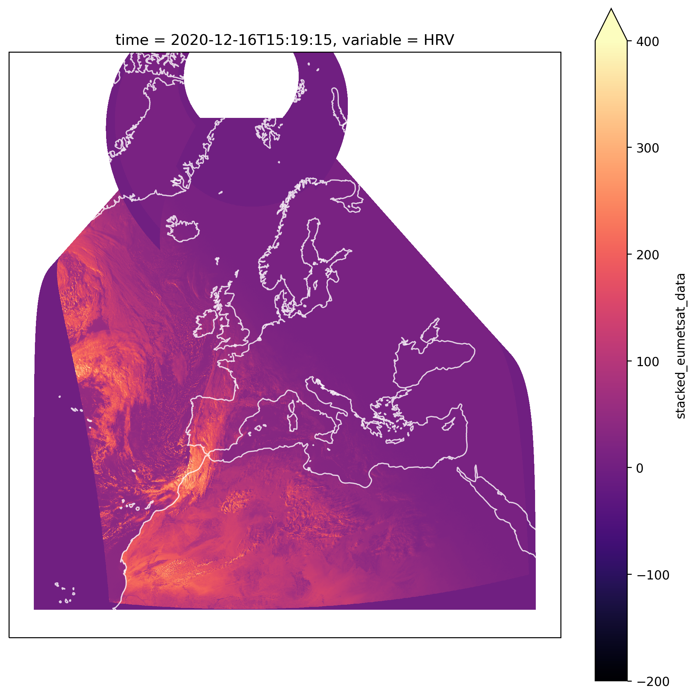

# Zarr


    C:\Users\Ayrto\anaconda3\envs\satip_dev\lib\site-packages\google\auth\_default.py:69: UserWarning: Your application has authenticated using end user credentials from Google Cloud SDK without a quota project. You might receive a "quota exceeded" or "API not enabled" error. We recommend you rerun `gcloud auth application-default login` and make sure a quota project is added. Or you can use service accounts instead. For more information about service accounts, see https://cloud.google.com/docs/authentication/
      warnings.warn(_CLOUD_SDK_CREDENTIALS_WARNING)
    Downloading: 100%|█████████████████████████████████████████████████████████████████████| 1/1 [00:00<00:00,  3.31rows/s]
    

```python
import os
import dotenv

import matplotlib.pyplot as plt
import cartopy.crs as ccrs
```

<br>

### User Inputs

```python
data_dir = '../data/raw'
metadata_db_fp = '../data/EUMETSAT_metadata.db'
debug_fp = '../logs/EUMETSAT_download.txt'
new_grid_fp='../data/intermediate/new_grid_4km_TM.json'
new_coords_fp = '../data/intermediate/reproj_coords_TM_4km.csv'

in_zarr_bucket = 'solar-pv-nowcasting-data/satellite/EUMETSAT/SEVIRI_RSS/OSGB36/all_zarr'
out_zarr_bucket = 'solar-pv-nowcasting-data/satellite/EUMETSAT/SEVIRI_RSS/full_extent_TM_int16'
```

<br>

### Loading Environment Variables

```python
dotenv.load_dotenv('../.env')

user_key = os.environ.get('USER_KEY')
user_secret = os.environ.get('USER_SECRET')
slack_id = os.environ.get('SLACK_ID')
slack_webhook_url = os.environ.get('SLACK_WEBHOOK_URL')
```

<br>

### Preparing Data to Save to Zarr

We'll start by loading in one of the datasets we've just downloaded, in this instance we'll take the most recent one by identifying it from the metadata db.

dm = eumetsat.DownloadManager(user_key, user_secret, data_dir, metadata_db_fp, debug_fp)

df_metadata = dm.get_df_metadata()

df_metadata.tail()

<br>

We'll then load in the file

```python
filename = df_metadata.loc[df_metadata.index[-2], 'file_name']
native_fp = f'{data_dir}/{filename}.nat'

severi_area_def = reproj.get_seviri_area_def(native_fp)
seviri_crs = severi_area_def.to_cartopy_crs()

scene = reproj.load_scene(native_fp)
scene.load(['HRV'])
```

    C:\Users\Ayrto\anaconda3\envs\satip_dev\lib\site-packages\pyproj\crs\crs.py:543: UserWarning: You will likely lose important projection information when converting to a PROJ string from another format. See: https://proj.org/faq.html#what-is-the-best-format-for-describing-coordinate-reference-systems
      proj_string = self.to_proj4()
    C:\Users\Ayrto\anaconda3\envs\satip_dev\lib\site-packages\pyproj\crs\crs.py:543: UserWarning: You will likely lose important projection information when converting to a PROJ string from another format. See: https://proj.org/faq.html#what-is-the-best-format-for-describing-coordinate-reference-systems
      proj_string = self.to_proj4()
    

<br>

And visualise it to test that everything is working

```python
fig = plt.figure(dpi=250, figsize=(10, 10))
ax = plt.axes(projection=seviri_crs)

scene['HRV'].plot.imshow(ax=ax, cmap='magma', vmin=0, vmax=50)

ax.coastlines(resolution='50m', alpha=0.8, color='white')
```


    <cartopy.mpl.feature_artist.FeatureArtist at 0x292182c9a30>


<br>

We now need to reproject it

```python
%%capture --no-stdout
%%time

reprojector = reproj.Reprojector(new_coords_fp, new_grid_fp)
ds_reproj = reprojector.reproject(native_fp, reproj_library='pyresample')
```

    Wall time: 4.59 s
    

<br>

Which again we'll check through visualisation

```python
fig = plt.figure(dpi=250, figsize=(10, 10))
ax = plt.axes(projection=ccrs.TransverseMercator())

ds_reproj['stacked_eumetsat_data'].sel(variable='HRV').plot.imshow(ax=ax, cmap='magma', vmin=0, vmax=50)

ax.coastlines(resolution='50m', alpha=0.8, color='white')
```

    <ipython-input-67-53f177b0781d>:2: UserWarning: The default value for the *approx* keyword argument to TransverseMercator will change from True to False after 0.18.
      ax = plt.axes(projection=ccrs.TransverseMercator())
    C:\Users\Ayrto\anaconda3\envs\satip_dev\lib\site-packages\dask\core.py:121: RuntimeWarning: invalid value encountered in cos
      return func(*(_execute_task(a, cache) for a in args))
    C:\Users\Ayrto\anaconda3\envs\satip_dev\lib\site-packages\dask\core.py:121: RuntimeWarning: invalid value encountered in sin
      return func(*(_execute_task(a, cache) for a in args))
    


    <cartopy.mpl.feature_artist.FeatureArtist at 0x292178ed7f0>


<br>

### Compressing

We'll now develop our compressor class that will reduce the size of the datasets that we save to Zarr, in this instance we'll normalize the data and transform it to Int16. This has been found to reduce the size by ~50%.

```python
#exports
def add_constant_coord_to_da(da, coord_name, coord_val):
    """
    Adds a new coordinate with a 
    constant value to the DataArray
    
    Parameters
    ----------
    da : xr.DataArray
        DataArrray which will have the new coords added to it
    coord_name : str
        Name for the new coordinate dimensions
    coord_val
        Value that will be assigned to the new coordinates
        
    Returns
    -------
    da : xr.DataArray
        DataArrray with the new coords added to it
    
    """
    
    da = (da
          .assign_coords({coord_name:coord_val})
          .expand_dims(coord_name)
         )
    
    return da

class Compressor:
    def __init__(self, 
                 bits_per_pixel=10, 
                 mins=np.array([-1.2278595, -2.5118103, -64.83977, 63.404694, 2.844452, 199.10002, -17.254883, -26.29155, -1.1009827, -2.4184198, 199.57048, 198.95093]), 
                 maxs=np.array([103.90016, 69.60857, 339.15588, 340.26526, 317.86752, 313.2767, 315.99194, 274.82297, 93.786545, 101.34922, 249.91806, 286.96323]),
                 variable_order=['HRV', 'IR_016', 'IR_039', 'IR_087', 'IR_097', 'IR_108', 'IR_120', 'IR_134', 'VIS006', 'VIS008', 'WV_062', 'WV_073']
                ):
        
        locals_ = locals()
        attrs_to_add = ['bits_per_pixel', 'mins', 'maxs', 'variable_order']
        
        for attr in attrs_to_add:
            setattr(self, attr, locals_[attr])
            
        return
    
    def fit(self, da, dims=['time', 'y', 'x']):
        self.mins = da.min(dims).compute()
        self.maxs = da.max(dims).compute()
        self.variable_order = da.coords['variable'].values
        
        print(f'The mins are: {self.mins}')
        print(f'The maxs are: {self.maxs}')
        print(f'The variable order is: {self.variable_order}')
        
        return

    def compress(self, da):
        da_meta = da.attrs 
        
        for attr in ['mins', 'maxs']:
            assert getattr(self, attr) is not None, f'{attr} must be set in initialisation or through `fit`'

        if 'time' not in da.dims:
            time = pd.to_datetime(da_meta['end_time'])
            da = add_constant_coord_to_da(da, 'time', time)

        da = (da
              .reindex({'variable': self.variable_order})
              .transpose('time', 'y', 'x', 'variable')
             )

        upper_bound = (2 ** self.bits_per_pixel) - 1
        new_max = self.maxs - self.mins

        da -= self.mins
        da /= new_max
        da *= upper_bound

        da = (da
              .fillna(-1)
              .round()
              .astype(np.int16)
             )

        da.attrs = {'meta': str(da_meta)} # Must be serialisable

        return da
```

```python
%%time

compressor = Compressor()

da_compressed = compressor.compress(ds_reproj['stacked_eumetsat_data'])
```

    2020-12-15 12:20:10.182808
    Wall time: 19 ms
    

<br>

### Saving to Zarr

We'll now create a helper function for saving the data-array to a zarr database

```python
# exports
get_time_as_unix = lambda da: pd.Series((pd.to_datetime(da.time.values) - pd.Timestamp('1970-01-01')).total_seconds()).astype(int).values

def save_da_to_zarr(da, zarr_bucket, dim_order=['time', 'x', 'y', 'variable'], zarr_mode='a'):
    da = da.transpose(*dim_order)
    da['time'] = get_time_as_unix(da)
    
    _, y_size, x_size, _ = da.shape
    out_store = gcsfs.GCSMap(root=zarr_bucket, gcs=gcsfs.GCSFileSystem())

    chunks = (36, y_size, x_size, 1)

    ds = xr.Dataset({'stacked_eumetsat_data': da.chunk(chunks)})
    
    zarr_mode_to_extra_kwargs = {
        'a': {
            'append_dim': 'time'
        },
        'w': {
            'encoding': {
                'stacked_eumetsat_data': {
                    'compressor': numcodecs.Blosc(cname='zstd', clevel=5),
                    'chunks': chunks
                }
            }
        }
    }
    
    assert zarr_mode in ['a', 'w'], '`zarr_mode` must be one of: `a`, `w`'
    extra_kwargs = zarr_mode_to_extra_kwargs[zarr_mode]
    
    ds.to_zarr(out_store, mode=zarr_mode, consolidated=True, **extra_kwargs)

    return ds
```

<br>

Now we can save it!

```python
out_zarr_bucket = 'solar-pv-nowcasting-data/satellite/EUMETSAT/SEVIRI_RSS/full_extent_TM_int16'

ds = save_da_to_zarr(da_compressed, out_zarr_bucket, zarr_mode='w')
```

    C:\Users\Ayrto\anaconda3\envs\satip_dev\lib\site-packages\dask\core.py:121: RuntimeWarning: invalid value encountered in sin
      return func(*(_execute_task(a, cache) for a in args))
    C:\Users\Ayrto\anaconda3\envs\satip_dev\lib\site-packages\dask\core.py:121: RuntimeWarning: invalid value encountered in cos
      return func(*(_execute_task(a, cache) for a in args))
    

<br>

### Loading Zarr Data

We'll start by defining a loading function and a replacement for the standard `gcsfs.utils` `is_retriable` function

<br>

We'll now read it in

```python
%%time

loaded_xarray = load_from_zarr_bucket(out_zarr_bucket)

loaded_xarray.time.compute()
```

    Wall time: 2.27 s
    


<div><svg style="position: absolute; width: 0; height: 0; overflow: hidden">
<defs>
<symbol id="icon-database" viewBox="0 0 32 32">
<path d="M16 0c-8.837 0-16 2.239-16 5v4c0 2.761 7.163 5 16 5s16-2.239 16-5v-4c0-2.761-7.163-5-16-5z"></path>
<path d="M16 17c-8.837 0-16-2.239-16-5v6c0 2.761 7.163 5 16 5s16-2.239 16-5v-6c0 2.761-7.163 5-16 5z"></path>
<path d="M16 26c-8.837 0-16-2.239-16-5v6c0 2.761 7.163 5 16 5s16-2.239 16-5v-6c0 2.761-7.163 5-16 5z"></path>
</symbol>
<symbol id="icon-file-text2" viewBox="0 0 32 32">
<path d="M28.681 7.159c-0.694-0.947-1.662-2.053-2.724-3.116s-2.169-2.030-3.116-2.724c-1.612-1.182-2.393-1.319-2.841-1.319h-15.5c-1.378 0-2.5 1.121-2.5 2.5v27c0 1.378 1.122 2.5 2.5 2.5h23c1.378 0 2.5-1.122 2.5-2.5v-19.5c0-0.448-0.137-1.23-1.319-2.841zM24.543 5.457c0.959 0.959 1.712 1.825 2.268 2.543h-4.811v-4.811c0.718 0.556 1.584 1.309 2.543 2.268zM28 29.5c0 0.271-0.229 0.5-0.5 0.5h-23c-0.271 0-0.5-0.229-0.5-0.5v-27c0-0.271 0.229-0.5 0.5-0.5 0 0 15.499-0 15.5 0v7c0 0.552 0.448 1 1 1h7v19.5z"></path>
<path d="M23 26h-14c-0.552 0-1-0.448-1-1s0.448-1 1-1h14c0.552 0 1 0.448 1 1s-0.448 1-1 1z"></path>
<path d="M23 22h-14c-0.552 0-1-0.448-1-1s0.448-1 1-1h14c0.552 0 1 0.448 1 1s-0.448 1-1 1z"></path>
<path d="M23 18h-14c-0.552 0-1-0.448-1-1s0.448-1 1-1h14c0.552 0 1 0.448 1 1s-0.448 1-1 1z"></path>
</symbol>
</defs>
</svg>
<style>/* CSS stylesheet for displaying xarray objects in jupyterlab.
 *
 */

:root {
  --xr-font-color0: var(--jp-content-font-color0, rgba(0, 0, 0, 1));
  --xr-font-color2: var(--jp-content-font-color2, rgba(0, 0, 0, 0.54));
  --xr-font-color3: var(--jp-content-font-color3, rgba(0, 0, 0, 0.38));
  --xr-border-color: var(--jp-border-color2, #e0e0e0);
  --xr-disabled-color: var(--jp-layout-color3, #bdbdbd);
  --xr-background-color: var(--jp-layout-color0, white);
  --xr-background-color-row-even: var(--jp-layout-color1, white);
  --xr-background-color-row-odd: var(--jp-layout-color2, #eeeeee);
}

html[theme=dark],
body.vscode-dark {
  --xr-font-color0: rgba(255, 255, 255, 1);
  --xr-font-color2: rgba(255, 255, 255, 0.54);
  --xr-font-color3: rgba(255, 255, 255, 0.38);
  --xr-border-color: #1F1F1F;
  --xr-disabled-color: #515151;
  --xr-background-color: #111111;
  --xr-background-color-row-even: #111111;
  --xr-background-color-row-odd: #313131;
}

.xr-wrap {
  display: block;
  min-width: 300px;
  max-width: 700px;
}

.xr-text-repr-fallback {
  /* fallback to plain text repr when CSS is not injected (untrusted notebook) */
  display: none;
}

.xr-header {
  padding-top: 6px;
  padding-bottom: 6px;
  margin-bottom: 4px;
  border-bottom: solid 1px var(--xr-border-color);
}

.xr-header > div,
.xr-header > ul {
  display: inline;
  margin-top: 0;
  margin-bottom: 0;
}

.xr-obj-type,
.xr-array-name {
  margin-left: 2px;
  margin-right: 10px;
}

.xr-obj-type {
  color: var(--xr-font-color2);
}

.xr-sections {
  padding-left: 0 !important;
  display: grid;
  grid-template-columns: 150px auto auto 1fr 20px 20px;
}

.xr-section-item {
  display: contents;
}

.xr-section-item input {
  display: none;
}

.xr-section-item input + label {
  color: var(--xr-disabled-color);
}

.xr-section-item input:enabled + label {
  cursor: pointer;
  color: var(--xr-font-color2);
}

.xr-section-item input:enabled + label:hover {
  color: var(--xr-font-color0);
}

.xr-section-summary {
  grid-column: 1;
  color: var(--xr-font-color2);
  font-weight: 500;
}

.xr-section-summary > span {
  display: inline-block;
  padding-left: 0.5em;
}

.xr-section-summary-in:disabled + label {
  color: var(--xr-font-color2);
}

.xr-section-summary-in + label:before {
  display: inline-block;
  content: 'â–º';
  font-size: 11px;
  width: 15px;
  text-align: center;
}

.xr-section-summary-in:disabled + label:before {
  color: var(--xr-disabled-color);
}

.xr-section-summary-in:checked + label:before {
  content: 'â–¼';
}

.xr-section-summary-in:checked + label > span {
  display: none;
}

.xr-section-summary,
.xr-section-inline-details {
  padding-top: 4px;
  padding-bottom: 4px;
}

.xr-section-inline-details {
  grid-column: 2 / -1;
}

.xr-section-details {
  display: none;
  grid-column: 1 / -1;
  margin-bottom: 5px;
}

.xr-section-summary-in:checked ~ .xr-section-details {
  display: contents;
}

.xr-array-wrap {
  grid-column: 1 / -1;
  display: grid;
  grid-template-columns: 20px auto;
}

.xr-array-wrap > label {
  grid-column: 1;
  vertical-align: top;
}

.xr-preview {
  color: var(--xr-font-color3);
}

.xr-array-preview,
.xr-array-data {
  padding: 0 5px !important;
  grid-column: 2;
}

.xr-array-data,
.xr-array-in:checked ~ .xr-array-preview {
  display: none;
}

.xr-array-in:checked ~ .xr-array-data,
.xr-array-preview {
  display: inline-block;
}

.xr-dim-list {
  display: inline-block !important;
  list-style: none;
  padding: 0 !important;
  margin: 0;
}

.xr-dim-list li {
  display: inline-block;
  padding: 0;
  margin: 0;
}

.xr-dim-list:before {
  content: '(';
}

.xr-dim-list:after {
  content: ')';
}

.xr-dim-list li:not(:last-child):after {
  content: ',';
  padding-right: 5px;
}

.xr-has-index {
  font-weight: bold;
}

.xr-var-list,
.xr-var-item {
  display: contents;
}

.xr-var-item > div,
.xr-var-item label,
.xr-var-item > .xr-var-name span {
  background-color: var(--xr-background-color-row-even);
  margin-bottom: 0;
}

.xr-var-item > .xr-var-name:hover span {
  padding-right: 5px;
}

.xr-var-list > li:nth-child(odd) > div,
.xr-var-list > li:nth-child(odd) > label,
.xr-var-list > li:nth-child(odd) > .xr-var-name span {
  background-color: var(--xr-background-color-row-odd);
}

.xr-var-name {
  grid-column: 1;
}

.xr-var-dims {
  grid-column: 2;
}

.xr-var-dtype {
  grid-column: 3;
  text-align: right;
  color: var(--xr-font-color2);
}

.xr-var-preview {
  grid-column: 4;
}

.xr-var-name,
.xr-var-dims,
.xr-var-dtype,
.xr-preview,
.xr-attrs dt {
  white-space: nowrap;
  overflow: hidden;
  text-overflow: ellipsis;
  padding-right: 10px;
}

.xr-var-name:hover,
.xr-var-dims:hover,
.xr-var-dtype:hover,
.xr-attrs dt:hover {
  overflow: visible;
  width: auto;
  z-index: 1;
}

.xr-var-attrs,
.xr-var-data {
  display: none;
  background-color: var(--xr-background-color) !important;
  padding-bottom: 5px !important;
}

.xr-var-attrs-in:checked ~ .xr-var-attrs,
.xr-var-data-in:checked ~ .xr-var-data {
  display: block;
}

.xr-var-data > table {
  float: right;
}

.xr-var-name span,
.xr-var-data,
.xr-attrs {
  padding-left: 25px !important;
}

.xr-attrs,
.xr-var-attrs,
.xr-var-data {
  grid-column: 1 / -1;
}

dl.xr-attrs {
  padding: 0;
  margin: 0;
  display: grid;
  grid-template-columns: 125px auto;
}

.xr-attrs dt,
.xr-attrs dd {
  padding: 0;
  margin: 0;
  float: left;
  padding-right: 10px;
  width: auto;
}

.xr-attrs dt {
  font-weight: normal;
  grid-column: 1;
}

.xr-attrs dt:hover span {
  display: inline-block;
  background: var(--xr-background-color);
  padding-right: 10px;
}

.xr-attrs dd {
  grid-column: 2;
  white-space: pre-wrap;
  word-break: break-all;
}

.xr-icon-database,
.xr-icon-file-text2 {
  display: inline-block;
  vertical-align: middle;
  width: 1em;
  height: 1.5em !important;
  stroke-width: 0;
  stroke: currentColor;
  fill: currentColor;
}
</style><pre class='xr-text-repr-fallback'>&lt;xarray.DataArray &#x27;time&#x27; (time: 26)&gt;
array([&#x27;2020-12-16T15:19:15.000000000&#x27;, &#x27;2020-12-16T15:24:16.000000000&#x27;,
       &#x27;2020-12-16T15:29:17.000000000&#x27;, &#x27;2020-12-16T15:34:18.000000000&#x27;,
       &#x27;2020-12-16T15:39:18.000000000&#x27;, &#x27;2020-12-16T15:44:18.000000000&#x27;,
       &#x27;2020-12-16T15:49:18.000000000&#x27;, &#x27;2020-12-16T15:54:16.000000000&#x27;,
       &#x27;2020-12-16T15:59:15.000000000&#x27;, &#x27;2020-12-16T16:04:13.000000000&#x27;,
       &#x27;2020-12-16T16:14:13.000000000&#x27;, &#x27;2020-12-16T16:19:13.000000000&#x27;,
       &#x27;2020-12-16T16:24:14.000000000&#x27;, &#x27;2020-12-16T16:29:15.000000000&#x27;,
       &#x27;2020-12-16T16:39:16.000000000&#x27;, &#x27;2020-12-16T16:44:16.000000000&#x27;,
       &#x27;2020-12-16T16:49:16.000000000&#x27;, &#x27;2020-12-16T16:54:16.000000000&#x27;,
       &#x27;2020-12-16T16:59:15.000000000&#x27;, &#x27;2020-12-16T17:04:15.000000000&#x27;,
       &#x27;2020-12-16T17:09:15.000000000&#x27;, &#x27;2020-12-16T17:19:15.000000000&#x27;,
       &#x27;2020-12-16T17:24:16.000000000&#x27;, &#x27;2020-12-16T17:29:17.000000000&#x27;,
       &#x27;2020-12-16T17:34:18.000000000&#x27;, &#x27;2020-12-16T17:39:18.000000000&#x27;],
      dtype=&#x27;datetime64[ns]&#x27;)
Coordinates:
  * time     (time) datetime64[ns] 2020-12-16T15:19:15 ... 2020-12-16T17:39:18</pre><div class='xr-wrap' hidden><div class='xr-header'><div class='xr-obj-type'>xarray.DataArray</div><div class='xr-array-name'>'time'</div><ul class='xr-dim-list'><li><span class='xr-has-index'>time</span>: 26</li></ul></div><ul class='xr-sections'><li class='xr-section-item'><div class='xr-array-wrap'><input id='section-2100848d-ebb5-455a-98a1-f8da3af258f3' class='xr-array-in' type='checkbox' checked><label for='section-2100848d-ebb5-455a-98a1-f8da3af258f3' title='Show/hide data repr'><svg class='icon xr-icon-database'><use xlink:href='#icon-database'></use></svg></label><div class='xr-array-preview xr-preview'><span>2020-12-16T15:19:15 2020-12-16T15:24:16 ... 2020-12-16T17:39:18</span></div><div class='xr-array-data'><pre>array([&#x27;2020-12-16T15:19:15.000000000&#x27;, &#x27;2020-12-16T15:24:16.000000000&#x27;,
       &#x27;2020-12-16T15:29:17.000000000&#x27;, &#x27;2020-12-16T15:34:18.000000000&#x27;,
       &#x27;2020-12-16T15:39:18.000000000&#x27;, &#x27;2020-12-16T15:44:18.000000000&#x27;,
       &#x27;2020-12-16T15:49:18.000000000&#x27;, &#x27;2020-12-16T15:54:16.000000000&#x27;,
       &#x27;2020-12-16T15:59:15.000000000&#x27;, &#x27;2020-12-16T16:04:13.000000000&#x27;,
       &#x27;2020-12-16T16:14:13.000000000&#x27;, &#x27;2020-12-16T16:19:13.000000000&#x27;,
       &#x27;2020-12-16T16:24:14.000000000&#x27;, &#x27;2020-12-16T16:29:15.000000000&#x27;,
       &#x27;2020-12-16T16:39:16.000000000&#x27;, &#x27;2020-12-16T16:44:16.000000000&#x27;,
       &#x27;2020-12-16T16:49:16.000000000&#x27;, &#x27;2020-12-16T16:54:16.000000000&#x27;,
       &#x27;2020-12-16T16:59:15.000000000&#x27;, &#x27;2020-12-16T17:04:15.000000000&#x27;,
       &#x27;2020-12-16T17:09:15.000000000&#x27;, &#x27;2020-12-16T17:19:15.000000000&#x27;,
       &#x27;2020-12-16T17:24:16.000000000&#x27;, &#x27;2020-12-16T17:29:17.000000000&#x27;,
       &#x27;2020-12-16T17:34:18.000000000&#x27;, &#x27;2020-12-16T17:39:18.000000000&#x27;],
      dtype=&#x27;datetime64[ns]&#x27;)</pre></div></div></li><li class='xr-section-item'><input id='section-81e5a5c3-e284-4c96-9625-84d6cb6bc9d9' class='xr-section-summary-in' type='checkbox'  checked><label for='section-81e5a5c3-e284-4c96-9625-84d6cb6bc9d9' class='xr-section-summary' >Coordinates: <span>(1)</span></label><div class='xr-section-inline-details'></div><div class='xr-section-details'><ul class='xr-var-list'><li class='xr-var-item'><div class='xr-var-name'><span class='xr-has-index'>time</span></div><div class='xr-var-dims'>(time)</div><div class='xr-var-dtype'>datetime64[ns]</div><div class='xr-var-preview xr-preview'>2020-12-16T15:19:15 ... 2020-12-...</div><input id='attrs-e000d2c7-6ba6-4b2c-8c5b-6a9407160808' class='xr-var-attrs-in' type='checkbox' disabled><label for='attrs-e000d2c7-6ba6-4b2c-8c5b-6a9407160808' title='Show/Hide attributes'><svg class='icon xr-icon-file-text2'><use xlink:href='#icon-file-text2'></use></svg></label><input id='data-a773b7b9-69a8-48c7-826b-824267c00f73' class='xr-var-data-in' type='checkbox'><label for='data-a773b7b9-69a8-48c7-826b-824267c00f73' title='Show/Hide data repr'><svg class='icon xr-icon-database'><use xlink:href='#icon-database'></use></svg></label><div class='xr-var-attrs'><dl class='xr-attrs'></dl></div><div class='xr-var-data'><pre>array([&#x27;2020-12-16T15:19:15.000000000&#x27;, &#x27;2020-12-16T15:24:16.000000000&#x27;,
       &#x27;2020-12-16T15:29:17.000000000&#x27;, &#x27;2020-12-16T15:34:18.000000000&#x27;,
       &#x27;2020-12-16T15:39:18.000000000&#x27;, &#x27;2020-12-16T15:44:18.000000000&#x27;,
       &#x27;2020-12-16T15:49:18.000000000&#x27;, &#x27;2020-12-16T15:54:16.000000000&#x27;,
       &#x27;2020-12-16T15:59:15.000000000&#x27;, &#x27;2020-12-16T16:04:13.000000000&#x27;,
       &#x27;2020-12-16T16:14:13.000000000&#x27;, &#x27;2020-12-16T16:19:13.000000000&#x27;,
       &#x27;2020-12-16T16:24:14.000000000&#x27;, &#x27;2020-12-16T16:29:15.000000000&#x27;,
       &#x27;2020-12-16T16:39:16.000000000&#x27;, &#x27;2020-12-16T16:44:16.000000000&#x27;,
       &#x27;2020-12-16T16:49:16.000000000&#x27;, &#x27;2020-12-16T16:54:16.000000000&#x27;,
       &#x27;2020-12-16T16:59:15.000000000&#x27;, &#x27;2020-12-16T17:04:15.000000000&#x27;,
       &#x27;2020-12-16T17:09:15.000000000&#x27;, &#x27;2020-12-16T17:19:15.000000000&#x27;,
       &#x27;2020-12-16T17:24:16.000000000&#x27;, &#x27;2020-12-16T17:29:17.000000000&#x27;,
       &#x27;2020-12-16T17:34:18.000000000&#x27;, &#x27;2020-12-16T17:39:18.000000000&#x27;],
      dtype=&#x27;datetime64[ns]&#x27;)</pre></div></li></ul></div></li><li class='xr-section-item'><input id='section-ffb9d52e-f8fa-487b-ba0a-8707a9a1dc6c' class='xr-section-summary-in' type='checkbox' disabled ><label for='section-ffb9d52e-f8fa-487b-ba0a-8707a9a1dc6c' class='xr-section-summary'  title='Expand/collapse section'>Attributes: <span>(0)</span></label><div class='xr-section-inline-details'></div><div class='xr-section-details'><dl class='xr-attrs'></dl></div></li></ul></div></div>


```python
fig = plt.figure(dpi=250, figsize=(10, 10))
ax = plt.axes(projection=ccrs.TransverseMercator())

loaded_xarray['stacked_eumetsat_data'].isel(variable=0, time=0).T.plot(ax=ax, cmap='magma', vmin=-200, vmax=400)

ax.coastlines(resolution='50m', alpha=0.8, color='white')
```

    <ipython-input-82-f7e189d5f897>:2: UserWarning: The default value for the *approx* keyword argument to TransverseMercator will change from True to False after 0.18.
      ax = plt.axes(projection=ccrs.TransverseMercator())
    


    <cartopy.mpl.feature_artist.FeatureArtist at 0x2925b42afa0>





```python
# Disk space is priority, then look at io speeds
# 
# Priority order
# * notebook examples
# * airflow
# * end-to-end pipeline with benchmarking
# * publish documentation
# * add more tests
```

<br>

Brief
- [x] Tweak Zarr data types to minimise storage space (e.g. re-scale all channels to [0, 1023] and store as int16s, with missing values encoded as -1; and compressed using zstd level 5).  (To re-scale to [0, 1023], you'll need to know the min and max values!  I've computed the mins and maxes for as 12 channels from James Fulton's 'all_zarr' array.  The mins and maxes are listed here.  Not sure if these mins and maxes will be the same after you've re-projected the entire geographical scope though.  
- [x] Each Zarr chunk could be something like 32 timesteps, 512 pixels wide, 512 pixels high, and 1 channel.  (We're not sure how many channels will be useful for PV nowcasting.  So, it's probably best to keep the channels in separate chunks.)
- [x] Would be great to use all the CPU cores on the VM.  If the reprojection library doesn't do this itself, then maybe consider spinning up multiple processes, maybe using concurrent.futures.ProcessPoolExecutor.map(worker_func, [list of native files to re-projected]); or using dask.delayed.  Zarr supports parallel writes as long as the writes are to different chunks (see Zarr's docs on parallel processing).
- [x] One challenge will be that, if each Zarr chunk is multiple timesteps, then the conversion script may have to load multiple timesteps in memory, or in temporary files on the VM, before concatenating multiple timesteps into one Zarr chunk.
- [ ] When the script is finished processing a Native file, maybe we should move the native file to a cheaper storage class (e.g. coldline storage or archive storage).

<br>

### WMS Notes

https://en.wikipedia.org/wiki/Tiled_web_map

Conventions:
* Tiles are 256x256 pixels
* At the outer most zoom level, 0, the entire world can be rendered in a single map tile.
* Each zoom level doubles in both dimensions, so a single tile is replaced by 4 tiles when zooming in. This means that about 22 zoom levels are sufficient for most practical purposes.
* The Web Mercator projection is used, with latitude limits of around 85 degrees.
* An X and Y numbering scheme
* PNG images for tiles
* Images are served through a Web server, with a URL like http://.../Z/X/Y.png, where Z is the zoom level, and X and Y identify the tile.
* Tile Map Service: (0 to 2zoom-1, 2zoom-1 to 0) for the range (-180, +85.0511) - (+180, -85.0511).
