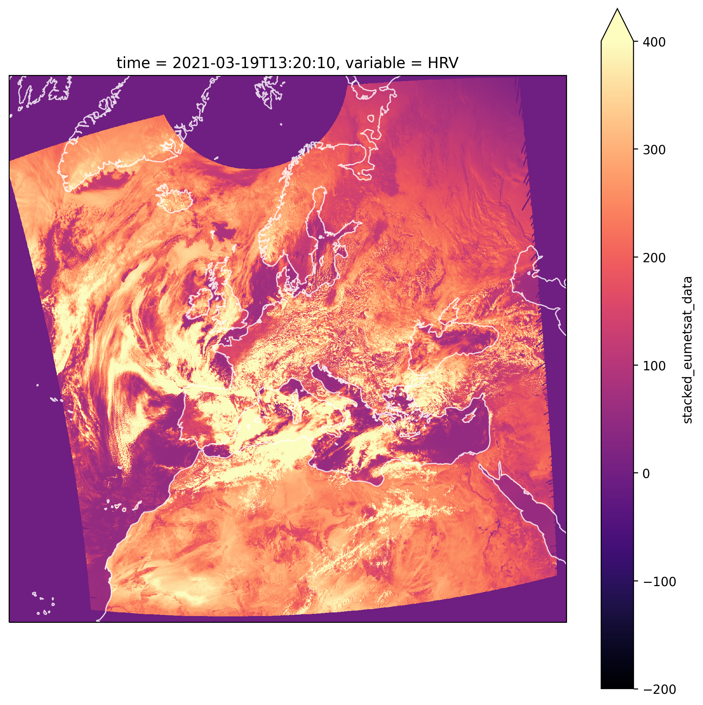

# Loading from Zarr 


```python
import numpy as np
import pandas as pd

from satip import io

import seaborn as sns
import matplotlib as mpl
import matplotlib.pyplot as plt
import cartopy.crs as ccrs
import FEAutils as hlp
from warnings import warn
from ipypb import track
```

<br>

### User Inputs

We have to specify the bucket where the data is located

```python
zarr_bucket = 'solar-pv-nowcasting-data/satellite/EUMETSAT/SEVIRI_RSS/zarr_full_extent_TM_int16'
```

<br>

### Loading Data

The `satip` wrapper for loading data will then generate an `xarray` `Dataset` when passed the path to the zarr bucket

```python
ds = io.load_from_zarr_bucket(zarr_bucket)

ds['stacked_eumetsat_data']
```


<div><svg style="position: absolute; width: 0; height: 0; overflow: hidden">
<defs>
<symbol id="icon-database" viewBox="0 0 32 32">
<path d="M16 0c-8.837 0-16 2.239-16 5v4c0 2.761 7.163 5 16 5s16-2.239 16-5v-4c0-2.761-7.163-5-16-5z"></path>
<path d="M16 17c-8.837 0-16-2.239-16-5v6c0 2.761 7.163 5 16 5s16-2.239 16-5v-6c0 2.761-7.163 5-16 5z"></path>
<path d="M16 26c-8.837 0-16-2.239-16-5v6c0 2.761 7.163 5 16 5s16-2.239 16-5v-6c0 2.761-7.163 5-16 5z"></path>
</symbol>
<symbol id="icon-file-text2" viewBox="0 0 32 32">
<path d="M28.681 7.159c-0.694-0.947-1.662-2.053-2.724-3.116s-2.169-2.030-3.116-2.724c-1.612-1.182-2.393-1.319-2.841-1.319h-15.5c-1.378 0-2.5 1.121-2.5 2.5v27c0 1.378 1.122 2.5 2.5 2.5h23c1.378 0 2.5-1.122 2.5-2.5v-19.5c0-0.448-0.137-1.23-1.319-2.841zM24.543 5.457c0.959 0.959 1.712 1.825 2.268 2.543h-4.811v-4.811c0.718 0.556 1.584 1.309 2.543 2.268zM28 29.5c0 0.271-0.229 0.5-0.5 0.5h-23c-0.271 0-0.5-0.229-0.5-0.5v-27c0-0.271 0.229-0.5 0.5-0.5 0 0 15.499-0 15.5 0v7c0 0.552 0.448 1 1 1h7v19.5z"></path>
<path d="M23 26h-14c-0.552 0-1-0.448-1-1s0.448-1 1-1h14c0.552 0 1 0.448 1 1s-0.448 1-1 1z"></path>
<path d="M23 22h-14c-0.552 0-1-0.448-1-1s0.448-1 1-1h14c0.552 0 1 0.448 1 1s-0.448 1-1 1z"></path>
<path d="M23 18h-14c-0.552 0-1-0.448-1-1s0.448-1 1-1h14c0.552 0 1 0.448 1 1s-0.448 1-1 1z"></path>
</symbol>
</defs>
</svg>
<style>/* CSS stylesheet for displaying xarray objects in jupyterlab.
 *
 */

:root {
  --xr-font-color0: var(--jp-content-font-color0, rgba(0, 0, 0, 1));
  --xr-font-color2: var(--jp-content-font-color2, rgba(0, 0, 0, 0.54));
  --xr-font-color3: var(--jp-content-font-color3, rgba(0, 0, 0, 0.38));
  --xr-border-color: var(--jp-border-color2, #e0e0e0);
  --xr-disabled-color: var(--jp-layout-color3, #bdbdbd);
  --xr-background-color: var(--jp-layout-color0, white);
  --xr-background-color-row-even: var(--jp-layout-color1, white);
  --xr-background-color-row-odd: var(--jp-layout-color2, #eeeeee);
}

html[theme=dark],
body.vscode-dark {
  --xr-font-color0: rgba(255, 255, 255, 1);
  --xr-font-color2: rgba(255, 255, 255, 0.54);
  --xr-font-color3: rgba(255, 255, 255, 0.38);
  --xr-border-color: #1F1F1F;
  --xr-disabled-color: #515151;
  --xr-background-color: #111111;
  --xr-background-color-row-even: #111111;
  --xr-background-color-row-odd: #313131;
}

.xr-wrap {
  display: block;
  min-width: 300px;
  max-width: 700px;
}

.xr-text-repr-fallback {
  /* fallback to plain text repr when CSS is not injected (untrusted notebook) */
  display: none;
}

.xr-header {
  padding-top: 6px;
  padding-bottom: 6px;
  margin-bottom: 4px;
  border-bottom: solid 1px var(--xr-border-color);
}

.xr-header > div,
.xr-header > ul {
  display: inline;
  margin-top: 0;
  margin-bottom: 0;
}

.xr-obj-type,
.xr-array-name {
  margin-left: 2px;
  margin-right: 10px;
}

.xr-obj-type {
  color: var(--xr-font-color2);
}

.xr-sections {
  padding-left: 0 !important;
  display: grid;
  grid-template-columns: 150px auto auto 1fr 20px 20px;
}

.xr-section-item {
  display: contents;
}

.xr-section-item input {
  display: none;
}

.xr-section-item input + label {
  color: var(--xr-disabled-color);
}

.xr-section-item input:enabled + label {
  cursor: pointer;
  color: var(--xr-font-color2);
}

.xr-section-item input:enabled + label:hover {
  color: var(--xr-font-color0);
}

.xr-section-summary {
  grid-column: 1;
  color: var(--xr-font-color2);
  font-weight: 500;
}

.xr-section-summary > span {
  display: inline-block;
  padding-left: 0.5em;
}

.xr-section-summary-in:disabled + label {
  color: var(--xr-font-color2);
}

.xr-section-summary-in + label:before {
  display: inline-block;
  content: 'â–º';
  font-size: 11px;
  width: 15px;
  text-align: center;
}

.xr-section-summary-in:disabled + label:before {
  color: var(--xr-disabled-color);
}

.xr-section-summary-in:checked + label:before {
  content: 'â–¼';
}

.xr-section-summary-in:checked + label > span {
  display: none;
}

.xr-section-summary,
.xr-section-inline-details {
  padding-top: 4px;
  padding-bottom: 4px;
}

.xr-section-inline-details {
  grid-column: 2 / -1;
}

.xr-section-details {
  display: none;
  grid-column: 1 / -1;
  margin-bottom: 5px;
}

.xr-section-summary-in:checked ~ .xr-section-details {
  display: contents;
}

.xr-array-wrap {
  grid-column: 1 / -1;
  display: grid;
  grid-template-columns: 20px auto;
}

.xr-array-wrap > label {
  grid-column: 1;
  vertical-align: top;
}

.xr-preview {
  color: var(--xr-font-color3);
}

.xr-array-preview,
.xr-array-data {
  padding: 0 5px !important;
  grid-column: 2;
}

.xr-array-data,
.xr-array-in:checked ~ .xr-array-preview {
  display: none;
}

.xr-array-in:checked ~ .xr-array-data,
.xr-array-preview {
  display: inline-block;
}

.xr-dim-list {
  display: inline-block !important;
  list-style: none;
  padding: 0 !important;
  margin: 0;
}

.xr-dim-list li {
  display: inline-block;
  padding: 0;
  margin: 0;
}

.xr-dim-list:before {
  content: '(';
}

.xr-dim-list:after {
  content: ')';
}

.xr-dim-list li:not(:last-child):after {
  content: ',';
  padding-right: 5px;
}

.xr-has-index {
  font-weight: bold;
}

.xr-var-list,
.xr-var-item {
  display: contents;
}

.xr-var-item > div,
.xr-var-item label,
.xr-var-item > .xr-var-name span {
  background-color: var(--xr-background-color-row-even);
  margin-bottom: 0;
}

.xr-var-item > .xr-var-name:hover span {
  padding-right: 5px;
}

.xr-var-list > li:nth-child(odd) > div,
.xr-var-list > li:nth-child(odd) > label,
.xr-var-list > li:nth-child(odd) > .xr-var-name span {
  background-color: var(--xr-background-color-row-odd);
}

.xr-var-name {
  grid-column: 1;
}

.xr-var-dims {
  grid-column: 2;
}

.xr-var-dtype {
  grid-column: 3;
  text-align: right;
  color: var(--xr-font-color2);
}

.xr-var-preview {
  grid-column: 4;
}

.xr-var-name,
.xr-var-dims,
.xr-var-dtype,
.xr-preview,
.xr-attrs dt {
  white-space: nowrap;
  overflow: hidden;
  text-overflow: ellipsis;
  padding-right: 10px;
}

.xr-var-name:hover,
.xr-var-dims:hover,
.xr-var-dtype:hover,
.xr-attrs dt:hover {
  overflow: visible;
  width: auto;
  z-index: 1;
}

.xr-var-attrs,
.xr-var-data {
  display: none;
  background-color: var(--xr-background-color) !important;
  padding-bottom: 5px !important;
}

.xr-var-attrs-in:checked ~ .xr-var-attrs,
.xr-var-data-in:checked ~ .xr-var-data {
  display: block;
}

.xr-var-data > table {
  float: right;
}

.xr-var-name span,
.xr-var-data,
.xr-attrs {
  padding-left: 25px !important;
}

.xr-attrs,
.xr-var-attrs,
.xr-var-data {
  grid-column: 1 / -1;
}

dl.xr-attrs {
  padding: 0;
  margin: 0;
  display: grid;
  grid-template-columns: 125px auto;
}

.xr-attrs dt,
.xr-attrs dd {
  padding: 0;
  margin: 0;
  float: left;
  padding-right: 10px;
  width: auto;
}

.xr-attrs dt {
  font-weight: normal;
  grid-column: 1;
}

.xr-attrs dt:hover span {
  display: inline-block;
  background: var(--xr-background-color);
  padding-right: 10px;
}

.xr-attrs dd {
  grid-column: 2;
  white-space: pre-wrap;
  word-break: break-all;
}

.xr-icon-database,
.xr-icon-file-text2 {
  display: inline-block;
  vertical-align: middle;
  width: 1em;
  height: 1.5em !important;
  stroke-width: 0;
  stroke: currentColor;
  fill: currentColor;
}
</style><pre class='xr-text-repr-fallback'>&lt;xarray.DataArray &#x27;stacked_eumetsat_data&#x27; (time: 11652, x: 1870, y: 1831, variable: 12)&gt;
dask.array&lt;xarray-stacked_eumetsat_data, shape=(11652, 1870, 1831, 12), dtype=int16, chunksize=(36, 1870, 1831, 1), chunktype=numpy.ndarray&gt;
Coordinates:
  * time      (time) datetime64[ns] 2021-03-19T13:20:10 ... 2020-04-04T06:19:16
  * variable  (variable) object &#x27;HRV&#x27; &#x27;IR_016&#x27; &#x27;IR_039&#x27; ... &#x27;WV_062&#x27; &#x27;WV_073&#x27;
  * x         (x) float64 -3.088e+06 -3.084e+06 ... 4.384e+06 4.388e+06
  * y         (y) float64 9.012e+06 9.008e+06 9.004e+06 ... 1.696e+06 1.692e+06
Attributes:
    meta:     {&#x27;orbital_parameters&#x27;: {&#x27;projection_longitude&#x27;: 9.5, &#x27;projectio...</pre><div class='xr-wrap' hidden><div class='xr-header'><div class='xr-obj-type'>xarray.DataArray</div><div class='xr-array-name'>'stacked_eumetsat_data'</div><ul class='xr-dim-list'><li><span class='xr-has-index'>time</span>: 11652</li><li><span class='xr-has-index'>x</span>: 1870</li><li><span class='xr-has-index'>y</span>: 1831</li><li><span class='xr-has-index'>variable</span>: 12</li></ul></div><ul class='xr-sections'><li class='xr-section-item'><div class='xr-array-wrap'><input id='section-214a8732-6156-4f8b-bbb7-0fb0fcae41f0' class='xr-array-in' type='checkbox' checked><label for='section-214a8732-6156-4f8b-bbb7-0fb0fcae41f0' title='Show/hide data repr'><svg class='icon xr-icon-database'><use xlink:href='#icon-database'></use></svg></label><div class='xr-array-preview xr-preview'><span>dask.array&lt;chunksize=(36, 1870, 1831, 1), meta=np.ndarray&gt;</span></div><div class='xr-array-data'><table>
<tr>
<td>
<table>
  <thead>
    <tr><td> </td><th> Array </th><th> Chunk </th></tr>
  </thead>
  <tbody>
    <tr><th> Bytes </th><td> 957.51 GB </td> <td> 246.53 MB </td></tr>
    <tr><th> Shape </th><td> (11652, 1870, 1831, 12) </td> <td> (36, 1870, 1831, 1) </td></tr>
    <tr><th> Count </th><td> 3889 Tasks </td><td> 3888 Chunks </td></tr>
    <tr><th> Type </th><td> int16 </td><td> numpy.ndarray </td></tr>
  </tbody>
</table>
</td>
<td>
<svg width="479" height="115" style="stroke:rgb(0,0,0);stroke-width:1" >

  <!-- Horizontal lines -->
  <line x1="0" y1="0" x2="120" y2="0" style="stroke-width:2" />
  <line x1="0" y1="25" x2="120" y2="25" style="stroke-width:2" />

  <!-- Vertical lines -->
  <line x1="0" y1="0" x2="0" y2="25" style="stroke-width:2" />
  <line x1="3" y1="0" x2="3" y2="25" />
  <line x1="7" y1="0" x2="7" y2="25" />
  <line x1="11" y1="0" x2="11" y2="25" />
  <line x1="14" y1="0" x2="14" y2="25" />
  <line x1="18" y1="0" x2="18" y2="25" />
  <line x1="22" y1="0" x2="22" y2="25" />
  <line x1="25" y1="0" x2="25" y2="25" />
  <line x1="30" y1="0" x2="30" y2="25" />
  <line x1="33" y1="0" x2="33" y2="25" />
  <line x1="37" y1="0" x2="37" y2="25" />
  <line x1="41" y1="0" x2="41" y2="25" />
  <line x1="44" y1="0" x2="44" y2="25" />
  <line x1="48" y1="0" x2="48" y2="25" />
  <line x1="52" y1="0" x2="52" y2="25" />
  <line x1="55" y1="0" x2="55" y2="25" />
  <line x1="60" y1="0" x2="60" y2="25" />
  <line x1="63" y1="0" x2="63" y2="25" />
  <line x1="67" y1="0" x2="67" y2="25" />
  <line x1="71" y1="0" x2="71" y2="25" />
  <line x1="74" y1="0" x2="74" y2="25" />
  <line x1="78" y1="0" x2="78" y2="25" />
  <line x1="82" y1="0" x2="82" y2="25" />
  <line x1="86" y1="0" x2="86" y2="25" />
  <line x1="90" y1="0" x2="90" y2="25" />
  <line x1="93" y1="0" x2="93" y2="25" />
  <line x1="97" y1="0" x2="97" y2="25" />
  <line x1="101" y1="0" x2="101" y2="25" />
  <line x1="104" y1="0" x2="104" y2="25" />
  <line x1="108" y1="0" x2="108" y2="25" />
  <line x1="112" y1="0" x2="112" y2="25" />
  <line x1="116" y1="0" x2="116" y2="25" />
  <line x1="120" y1="0" x2="120" y2="25" style="stroke-width:2" />

  <!-- Colored Rectangle -->
  <polygon points="0.0,0.0 120.0,0.0 120.0,25.412616514582485 0.0,25.412616514582485" style="fill:#8B4903A0;stroke-width:0"/>

  <!-- Text -->
  <text x="60.000000" y="45.412617" font-size="1.0rem" font-weight="100" text-anchor="middle" >11652</text>
  <text x="140.000000" y="12.706308" font-size="1.0rem" font-weight="100" text-anchor="middle" transform="rotate(0,140.000000,12.706308)">1</text>


  <!-- Horizontal lines -->
  <line x1="190" y1="0" x2="214" y2="24" style="stroke-width:2" />
  <line x1="190" y1="40" x2="214" y2="65" style="stroke-width:2" />

  <!-- Vertical lines -->
  <line x1="190" y1="0" x2="190" y2="40" style="stroke-width:2" />
  <line x1="214" y1="24" x2="214" y2="65" style="stroke-width:2" />

  <!-- Colored Rectangle -->
  <polygon points="190.0,0.0 214.13415148675503,24.134151486755034 214.13415148675503,65.0628781439491 190.0,40.92872665719407" style="fill:#ECB172A0;stroke-width:0"/>

  <!-- Horizontal lines -->
  <line x1="190" y1="0" x2="215" y2="0" style="stroke-width:2" />
  <line x1="214" y1="24" x2="239" y2="24" style="stroke-width:2" />

  <!-- Vertical lines -->
  <line x1="190" y1="0" x2="214" y2="24" style="stroke-width:2" />
  <line x1="192" y1="0" x2="216" y2="24" />
  <line x1="194" y1="0" x2="218" y2="24" />
  <line x1="196" y1="0" x2="220" y2="24" />
  <line x1="198" y1="0" x2="222" y2="24" />
  <line x1="200" y1="0" x2="224" y2="24" />
  <line x1="202" y1="0" x2="226" y2="24" />
  <line x1="204" y1="0" x2="228" y2="24" />
  <line x1="206" y1="0" x2="231" y2="24" />
  <line x1="209" y1="0" x2="233" y2="24" />
  <line x1="211" y1="0" x2="235" y2="24" />
  <line x1="213" y1="0" x2="237" y2="24" />
  <line x1="215" y1="0" x2="239" y2="24" style="stroke-width:2" />

  <!-- Colored Rectangle -->
  <polygon points="190.0,0.0 215.41261651458248,0.0 239.5467680013375,24.134151486755034 214.13415148675503,24.134151486755034" style="fill:#ECB172A0;stroke-width:0"/>

  <!-- Horizontal lines -->
  <line x1="214" y1="24" x2="239" y2="24" style="stroke-width:2" />
  <line x1="214" y1="65" x2="239" y2="65" style="stroke-width:2" />

  <!-- Vertical lines -->
  <line x1="214" y1="24" x2="214" y2="65" style="stroke-width:2" />
  <line x1="216" y1="24" x2="216" y2="65" />
  <line x1="218" y1="24" x2="218" y2="65" />
  <line x1="220" y1="24" x2="220" y2="65" />
  <line x1="222" y1="24" x2="222" y2="65" />
  <line x1="224" y1="24" x2="224" y2="65" />
  <line x1="226" y1="24" x2="226" y2="65" />
  <line x1="228" y1="24" x2="228" y2="65" />
  <line x1="231" y1="24" x2="231" y2="65" />
  <line x1="233" y1="24" x2="233" y2="65" />
  <line x1="235" y1="24" x2="235" y2="65" />
  <line x1="237" y1="24" x2="237" y2="65" />
  <line x1="239" y1="24" x2="239" y2="65" style="stroke-width:2" />

  <!-- Colored Rectangle -->
  <polygon points="214.13415148675503,24.134151486755034 239.5467680013375,24.134151486755034 239.5467680013375,65.0628781439491 214.13415148675503,65.0628781439491" style="fill:#ECB172A0;stroke-width:0"/>

  <!-- Text -->
  <text x="226.840460" y="85.062878" font-size="1.0rem" font-weight="100" text-anchor="middle" >12</text>
  <text x="259.546768" y="44.598515" font-size="1.0rem" font-weight="100" text-anchor="middle" transform="rotate(-90,259.546768,44.598515)">1831</text>
  <text x="192.067076" y="72.995802" font-size="1.0rem" font-weight="100" text-anchor="middle" transform="rotate(45,192.067076,72.995802)">1870</text>
</svg>
</td>
</tr>
</table></div></div></li><li class='xr-section-item'><input id='section-c50a19c0-5576-48ca-8444-7235ee9b2871' class='xr-section-summary-in' type='checkbox'  checked><label for='section-c50a19c0-5576-48ca-8444-7235ee9b2871' class='xr-section-summary' >Coordinates: <span>(4)</span></label><div class='xr-section-inline-details'></div><div class='xr-section-details'><ul class='xr-var-list'><li class='xr-var-item'><div class='xr-var-name'><span class='xr-has-index'>time</span></div><div class='xr-var-dims'>(time)</div><div class='xr-var-dtype'>datetime64[ns]</div><div class='xr-var-preview xr-preview'>2021-03-19T13:20:10 ... 2020-04-...</div><input id='attrs-12aed879-243c-475e-a9ab-444220744b7a' class='xr-var-attrs-in' type='checkbox' disabled><label for='attrs-12aed879-243c-475e-a9ab-444220744b7a' title='Show/Hide attributes'><svg class='icon xr-icon-file-text2'><use xlink:href='#icon-file-text2'></use></svg></label><input id='data-660acc7d-37db-4289-8fa3-b362a0597350' class='xr-var-data-in' type='checkbox'><label for='data-660acc7d-37db-4289-8fa3-b362a0597350' title='Show/Hide data repr'><svg class='icon xr-icon-database'><use xlink:href='#icon-database'></use></svg></label><div class='xr-var-attrs'><dl class='xr-attrs'></dl></div><div class='xr-var-data'><pre>array([&#x27;2021-03-19T13:20:10.000000000&#x27;, &#x27;2021-03-19T13:24:16.000000000&#x27;,
       &#x27;2021-03-19T13:29:17.000000000&#x27;, ..., &#x27;2020-04-04T06:09:17.000000000&#x27;,
       &#x27;2020-04-04T06:14:17.000000000&#x27;, &#x27;2020-04-04T06:19:16.000000000&#x27;],
      dtype=&#x27;datetime64[ns]&#x27;)</pre></div></li><li class='xr-var-item'><div class='xr-var-name'><span class='xr-has-index'>variable</span></div><div class='xr-var-dims'>(variable)</div><div class='xr-var-dtype'>object</div><div class='xr-var-preview xr-preview'>&#x27;HRV&#x27; &#x27;IR_016&#x27; ... &#x27;WV_073&#x27;</div><input id='attrs-b9bea8d7-9263-4707-8b74-fbc489fecace' class='xr-var-attrs-in' type='checkbox' disabled><label for='attrs-b9bea8d7-9263-4707-8b74-fbc489fecace' title='Show/Hide attributes'><svg class='icon xr-icon-file-text2'><use xlink:href='#icon-file-text2'></use></svg></label><input id='data-4d0f1e4c-95fb-4c1d-96f6-39561c84d77d' class='xr-var-data-in' type='checkbox'><label for='data-4d0f1e4c-95fb-4c1d-96f6-39561c84d77d' title='Show/Hide data repr'><svg class='icon xr-icon-database'><use xlink:href='#icon-database'></use></svg></label><div class='xr-var-attrs'><dl class='xr-attrs'></dl></div><div class='xr-var-data'><pre>array([&#x27;HRV&#x27;, &#x27;IR_016&#x27;, &#x27;IR_039&#x27;, &#x27;IR_087&#x27;, &#x27;IR_097&#x27;, &#x27;IR_108&#x27;, &#x27;IR_120&#x27;,
       &#x27;IR_134&#x27;, &#x27;VIS006&#x27;, &#x27;VIS008&#x27;, &#x27;WV_062&#x27;, &#x27;WV_073&#x27;], dtype=object)</pre></div></li><li class='xr-var-item'><div class='xr-var-name'><span class='xr-has-index'>x</span></div><div class='xr-var-dims'>(x)</div><div class='xr-var-dtype'>float64</div><div class='xr-var-preview xr-preview'>-3.088e+06 -3.084e+06 ... 4.388e+06</div><input id='attrs-361b6b9e-c4b6-467c-aadd-143b625c2995' class='xr-var-attrs-in' type='checkbox' disabled><label for='attrs-361b6b9e-c4b6-467c-aadd-143b625c2995' title='Show/Hide attributes'><svg class='icon xr-icon-file-text2'><use xlink:href='#icon-file-text2'></use></svg></label><input id='data-9e80d3a4-9d9f-4660-a135-760843d23b9d' class='xr-var-data-in' type='checkbox'><label for='data-9e80d3a4-9d9f-4660-a135-760843d23b9d' title='Show/Hide data repr'><svg class='icon xr-icon-database'><use xlink:href='#icon-database'></use></svg></label><div class='xr-var-attrs'><dl class='xr-attrs'></dl></div><div class='xr-var-data'><pre>array([-3088000., -3084000., -3080000., ...,  4380000.,  4384000.,  4388000.])</pre></div></li><li class='xr-var-item'><div class='xr-var-name'><span class='xr-has-index'>y</span></div><div class='xr-var-dims'>(y)</div><div class='xr-var-dtype'>float64</div><div class='xr-var-preview xr-preview'>9.012e+06 9.008e+06 ... 1.692e+06</div><input id='attrs-462f0ee7-d172-4554-8237-e152c0b7414f' class='xr-var-attrs-in' type='checkbox' disabled><label for='attrs-462f0ee7-d172-4554-8237-e152c0b7414f' title='Show/Hide attributes'><svg class='icon xr-icon-file-text2'><use xlink:href='#icon-file-text2'></use></svg></label><input id='data-4cb6096e-2cd9-44f3-bf74-49061f4d100c' class='xr-var-data-in' type='checkbox'><label for='data-4cb6096e-2cd9-44f3-bf74-49061f4d100c' title='Show/Hide data repr'><svg class='icon xr-icon-database'><use xlink:href='#icon-database'></use></svg></label><div class='xr-var-attrs'><dl class='xr-attrs'></dl></div><div class='xr-var-data'><pre>array([9012000., 9008000., 9004000., ..., 1700000., 1696000., 1692000.])</pre></div></li></ul></div></li><li class='xr-section-item'><input id='section-b8e6bbd1-d2d6-4d40-8361-70d43c23b36d' class='xr-section-summary-in' type='checkbox'  checked><label for='section-b8e6bbd1-d2d6-4d40-8361-70d43c23b36d' class='xr-section-summary' >Attributes: <span>(1)</span></label><div class='xr-section-inline-details'></div><div class='xr-section-details'><dl class='xr-attrs'><dt><span>meta :</span></dt><dd>{&#x27;orbital_parameters&#x27;: {&#x27;projection_longitude&#x27;: 9.5, &#x27;projection_latitude&#x27;: 0.0, &#x27;projection_altitude&#x27;: 35785831.0}, &#x27;sun_earth_distance_correction_applied&#x27;: True, &#x27;sun_earth_distance_correction_factor&#x27;: 0.9911189780118609, &#x27;units&#x27;: &#x27;%&#x27;, &#x27;wavelength&#x27;: WavelengthRange(min=0.5, central=0.7, max=0.9, unit=&#x27;µm&#x27;), &#x27;standard_name&#x27;: &#x27;toa_bidirectional_reflectance&#x27;, &#x27;platform_name&#x27;: &#x27;Meteosat-10&#x27;, &#x27;sensor&#x27;: &#x27;seviri&#x27;, &#x27;start_time&#x27;: datetime.datetime(2021, 3, 19, 13, 15, 9, 278906), &#x27;end_time&#x27;: datetime.datetime(2021, 3, 19, 13, 20, 10, 330158), &#x27;area&#x27;: Area ID: geos_seviri_hrv
Description: SEVIRI high resolution channel area
Projection ID: seviri_hrv
Projection: {&#x27;a&#x27;: &#x27;6378169&#x27;, &#x27;h&#x27;: &#x27;35785831&#x27;, &#x27;lon_0&#x27;: &#x27;9.5&#x27;, &#x27;no_defs&#x27;: &#x27;None&#x27;, &#x27;proj&#x27;: &#x27;geos&#x27;, &#x27;rf&#x27;: &#x27;295.488065897014&#x27;, &#x27;type&#x27;: &#x27;crs&#x27;, &#x27;units&#x27;: &#x27;m&#x27;, &#x27;x_0&#x27;: &#x27;0&#x27;, &#x27;y_0&#x27;: &#x27;0&#x27;}
Number of columns: 5568
Number of rows: 4176
Area extent: (2790874.9005, 5571248.3904, -2777873.154, 1394687.3495), &#x27;name&#x27;: &#x27;HRV&#x27;, &#x27;resolution&#x27;: 1000.134348869, &#x27;calibration&#x27;: &#x27;reflectance&#x27;, &#x27;modifiers&#x27;: (), &#x27;_satpy_id&#x27;: DataID(name=&#x27;HRV&#x27;, wavelength=WavelengthRange(min=0.5, central=0.7, max=0.9, unit=&#x27;µm&#x27;), resolution=1000.134348869, calibration=&lt;calibration.reflectance&gt;, modifiers=()), &#x27;ancillary_variables&#x27;: []}</dd></dl></div></li></ul></div></div>


<br>

We can then index this as we would any other `xarray` object

```python
da_HRV_sample = ds['stacked_eumetsat_data'].isel(time=0).sel(variable='HRV')

da_HRV_sample
```


<div><svg style="position: absolute; width: 0; height: 0; overflow: hidden">
<defs>
<symbol id="icon-database" viewBox="0 0 32 32">
<path d="M16 0c-8.837 0-16 2.239-16 5v4c0 2.761 7.163 5 16 5s16-2.239 16-5v-4c0-2.761-7.163-5-16-5z"></path>
<path d="M16 17c-8.837 0-16-2.239-16-5v6c0 2.761 7.163 5 16 5s16-2.239 16-5v-6c0 2.761-7.163 5-16 5z"></path>
<path d="M16 26c-8.837 0-16-2.239-16-5v6c0 2.761 7.163 5 16 5s16-2.239 16-5v-6c0 2.761-7.163 5-16 5z"></path>
</symbol>
<symbol id="icon-file-text2" viewBox="0 0 32 32">
<path d="M28.681 7.159c-0.694-0.947-1.662-2.053-2.724-3.116s-2.169-2.030-3.116-2.724c-1.612-1.182-2.393-1.319-2.841-1.319h-15.5c-1.378 0-2.5 1.121-2.5 2.5v27c0 1.378 1.122 2.5 2.5 2.5h23c1.378 0 2.5-1.122 2.5-2.5v-19.5c0-0.448-0.137-1.23-1.319-2.841zM24.543 5.457c0.959 0.959 1.712 1.825 2.268 2.543h-4.811v-4.811c0.718 0.556 1.584 1.309 2.543 2.268zM28 29.5c0 0.271-0.229 0.5-0.5 0.5h-23c-0.271 0-0.5-0.229-0.5-0.5v-27c0-0.271 0.229-0.5 0.5-0.5 0 0 15.499-0 15.5 0v7c0 0.552 0.448 1 1 1h7v19.5z"></path>
<path d="M23 26h-14c-0.552 0-1-0.448-1-1s0.448-1 1-1h14c0.552 0 1 0.448 1 1s-0.448 1-1 1z"></path>
<path d="M23 22h-14c-0.552 0-1-0.448-1-1s0.448-1 1-1h14c0.552 0 1 0.448 1 1s-0.448 1-1 1z"></path>
<path d="M23 18h-14c-0.552 0-1-0.448-1-1s0.448-1 1-1h14c0.552 0 1 0.448 1 1s-0.448 1-1 1z"></path>
</symbol>
</defs>
</svg>
<style>/* CSS stylesheet for displaying xarray objects in jupyterlab.
 *
 */

:root {
  --xr-font-color0: var(--jp-content-font-color0, rgba(0, 0, 0, 1));
  --xr-font-color2: var(--jp-content-font-color2, rgba(0, 0, 0, 0.54));
  --xr-font-color3: var(--jp-content-font-color3, rgba(0, 0, 0, 0.38));
  --xr-border-color: var(--jp-border-color2, #e0e0e0);
  --xr-disabled-color: var(--jp-layout-color3, #bdbdbd);
  --xr-background-color: var(--jp-layout-color0, white);
  --xr-background-color-row-even: var(--jp-layout-color1, white);
  --xr-background-color-row-odd: var(--jp-layout-color2, #eeeeee);
}

html[theme=dark],
body.vscode-dark {
  --xr-font-color0: rgba(255, 255, 255, 1);
  --xr-font-color2: rgba(255, 255, 255, 0.54);
  --xr-font-color3: rgba(255, 255, 255, 0.38);
  --xr-border-color: #1F1F1F;
  --xr-disabled-color: #515151;
  --xr-background-color: #111111;
  --xr-background-color-row-even: #111111;
  --xr-background-color-row-odd: #313131;
}

.xr-wrap {
  display: block;
  min-width: 300px;
  max-width: 700px;
}

.xr-text-repr-fallback {
  /* fallback to plain text repr when CSS is not injected (untrusted notebook) */
  display: none;
}

.xr-header {
  padding-top: 6px;
  padding-bottom: 6px;
  margin-bottom: 4px;
  border-bottom: solid 1px var(--xr-border-color);
}

.xr-header > div,
.xr-header > ul {
  display: inline;
  margin-top: 0;
  margin-bottom: 0;
}

.xr-obj-type,
.xr-array-name {
  margin-left: 2px;
  margin-right: 10px;
}

.xr-obj-type {
  color: var(--xr-font-color2);
}

.xr-sections {
  padding-left: 0 !important;
  display: grid;
  grid-template-columns: 150px auto auto 1fr 20px 20px;
}

.xr-section-item {
  display: contents;
}

.xr-section-item input {
  display: none;
}

.xr-section-item input + label {
  color: var(--xr-disabled-color);
}

.xr-section-item input:enabled + label {
  cursor: pointer;
  color: var(--xr-font-color2);
}

.xr-section-item input:enabled + label:hover {
  color: var(--xr-font-color0);
}

.xr-section-summary {
  grid-column: 1;
  color: var(--xr-font-color2);
  font-weight: 500;
}

.xr-section-summary > span {
  display: inline-block;
  padding-left: 0.5em;
}

.xr-section-summary-in:disabled + label {
  color: var(--xr-font-color2);
}

.xr-section-summary-in + label:before {
  display: inline-block;
  content: 'â–º';
  font-size: 11px;
  width: 15px;
  text-align: center;
}

.xr-section-summary-in:disabled + label:before {
  color: var(--xr-disabled-color);
}

.xr-section-summary-in:checked + label:before {
  content: 'â–¼';
}

.xr-section-summary-in:checked + label > span {
  display: none;
}

.xr-section-summary,
.xr-section-inline-details {
  padding-top: 4px;
  padding-bottom: 4px;
}

.xr-section-inline-details {
  grid-column: 2 / -1;
}

.xr-section-details {
  display: none;
  grid-column: 1 / -1;
  margin-bottom: 5px;
}

.xr-section-summary-in:checked ~ .xr-section-details {
  display: contents;
}

.xr-array-wrap {
  grid-column: 1 / -1;
  display: grid;
  grid-template-columns: 20px auto;
}

.xr-array-wrap > label {
  grid-column: 1;
  vertical-align: top;
}

.xr-preview {
  color: var(--xr-font-color3);
}

.xr-array-preview,
.xr-array-data {
  padding: 0 5px !important;
  grid-column: 2;
}

.xr-array-data,
.xr-array-in:checked ~ .xr-array-preview {
  display: none;
}

.xr-array-in:checked ~ .xr-array-data,
.xr-array-preview {
  display: inline-block;
}

.xr-dim-list {
  display: inline-block !important;
  list-style: none;
  padding: 0 !important;
  margin: 0;
}

.xr-dim-list li {
  display: inline-block;
  padding: 0;
  margin: 0;
}

.xr-dim-list:before {
  content: '(';
}

.xr-dim-list:after {
  content: ')';
}

.xr-dim-list li:not(:last-child):after {
  content: ',';
  padding-right: 5px;
}

.xr-has-index {
  font-weight: bold;
}

.xr-var-list,
.xr-var-item {
  display: contents;
}

.xr-var-item > div,
.xr-var-item label,
.xr-var-item > .xr-var-name span {
  background-color: var(--xr-background-color-row-even);
  margin-bottom: 0;
}

.xr-var-item > .xr-var-name:hover span {
  padding-right: 5px;
}

.xr-var-list > li:nth-child(odd) > div,
.xr-var-list > li:nth-child(odd) > label,
.xr-var-list > li:nth-child(odd) > .xr-var-name span {
  background-color: var(--xr-background-color-row-odd);
}

.xr-var-name {
  grid-column: 1;
}

.xr-var-dims {
  grid-column: 2;
}

.xr-var-dtype {
  grid-column: 3;
  text-align: right;
  color: var(--xr-font-color2);
}

.xr-var-preview {
  grid-column: 4;
}

.xr-var-name,
.xr-var-dims,
.xr-var-dtype,
.xr-preview,
.xr-attrs dt {
  white-space: nowrap;
  overflow: hidden;
  text-overflow: ellipsis;
  padding-right: 10px;
}

.xr-var-name:hover,
.xr-var-dims:hover,
.xr-var-dtype:hover,
.xr-attrs dt:hover {
  overflow: visible;
  width: auto;
  z-index: 1;
}

.xr-var-attrs,
.xr-var-data {
  display: none;
  background-color: var(--xr-background-color) !important;
  padding-bottom: 5px !important;
}

.xr-var-attrs-in:checked ~ .xr-var-attrs,
.xr-var-data-in:checked ~ .xr-var-data {
  display: block;
}

.xr-var-data > table {
  float: right;
}

.xr-var-name span,
.xr-var-data,
.xr-attrs {
  padding-left: 25px !important;
}

.xr-attrs,
.xr-var-attrs,
.xr-var-data {
  grid-column: 1 / -1;
}

dl.xr-attrs {
  padding: 0;
  margin: 0;
  display: grid;
  grid-template-columns: 125px auto;
}

.xr-attrs dt,
.xr-attrs dd {
  padding: 0;
  margin: 0;
  float: left;
  padding-right: 10px;
  width: auto;
}

.xr-attrs dt {
  font-weight: normal;
  grid-column: 1;
}

.xr-attrs dt:hover span {
  display: inline-block;
  background: var(--xr-background-color);
  padding-right: 10px;
}

.xr-attrs dd {
  grid-column: 2;
  white-space: pre-wrap;
  word-break: break-all;
}

.xr-icon-database,
.xr-icon-file-text2 {
  display: inline-block;
  vertical-align: middle;
  width: 1em;
  height: 1.5em !important;
  stroke-width: 0;
  stroke: currentColor;
  fill: currentColor;
}
</style><pre class='xr-text-repr-fallback'>&lt;xarray.DataArray &#x27;stacked_eumetsat_data&#x27; (x: 1870, y: 1831)&gt;
dask.array&lt;getitem, shape=(1870, 1831), dtype=int16, chunksize=(1870, 1831), chunktype=numpy.ndarray&gt;
Coordinates:
    time      datetime64[ns] 2021-03-19T13:20:10
    variable  &lt;U3 &#x27;HRV&#x27;
  * x         (x) float64 -3.088e+06 -3.084e+06 ... 4.384e+06 4.388e+06
  * y         (y) float64 9.012e+06 9.008e+06 9.004e+06 ... 1.696e+06 1.692e+06
Attributes:
    meta:     {&#x27;orbital_parameters&#x27;: {&#x27;projection_longitude&#x27;: 9.5, &#x27;projectio...</pre><div class='xr-wrap' hidden><div class='xr-header'><div class='xr-obj-type'>xarray.DataArray</div><div class='xr-array-name'>'stacked_eumetsat_data'</div><ul class='xr-dim-list'><li><span class='xr-has-index'>x</span>: 1870</li><li><span class='xr-has-index'>y</span>: 1831</li></ul></div><ul class='xr-sections'><li class='xr-section-item'><div class='xr-array-wrap'><input id='section-59d5274b-0cba-4114-9b04-b2245ca380ac' class='xr-array-in' type='checkbox' checked><label for='section-59d5274b-0cba-4114-9b04-b2245ca380ac' title='Show/hide data repr'><svg class='icon xr-icon-database'><use xlink:href='#icon-database'></use></svg></label><div class='xr-array-preview xr-preview'><span>dask.array&lt;chunksize=(1870, 1831), meta=np.ndarray&gt;</span></div><div class='xr-array-data'><table>
<tr>
<td>
<table>
  <thead>
    <tr><td> </td><th> Array </th><th> Chunk </th></tr>
  </thead>
  <tbody>
    <tr><th> Bytes </th><td> 6.85 MB </td> <td> 6.85 MB </td></tr>
    <tr><th> Shape </th><td> (1870, 1831) </td> <td> (1870, 1831) </td></tr>
    <tr><th> Count </th><td> 3902 Tasks </td><td> 1 Chunks </td></tr>
    <tr><th> Type </th><td> int16 </td><td> numpy.ndarray </td></tr>
  </tbody>
</table>
</td>
<td>
<svg width="167" height="170" style="stroke:rgb(0,0,0);stroke-width:1" >

  <!-- Horizontal lines -->
  <line x1="0" y1="0" x2="117" y2="0" style="stroke-width:2" />
  <line x1="0" y1="120" x2="117" y2="120" style="stroke-width:2" />

  <!-- Vertical lines -->
  <line x1="0" y1="0" x2="0" y2="120" style="stroke-width:2" />
  <line x1="117" y1="0" x2="117" y2="120" style="stroke-width:2" />

  <!-- Colored Rectangle -->
  <polygon points="0.0,0.0 117.49732620320856,0.0 117.49732620320856,120.0 0.0,120.0" style="fill:#ECB172A0;stroke-width:0"/>

  <!-- Text -->
  <text x="58.748663" y="140.000000" font-size="1.0rem" font-weight="100" text-anchor="middle" >1831</text>
  <text x="137.497326" y="60.000000" font-size="1.0rem" font-weight="100" text-anchor="middle" transform="rotate(-90,137.497326,60.000000)">1870</text>
</svg>
</td>
</tr>
</table></div></div></li><li class='xr-section-item'><input id='section-ebf0e54c-3dc3-40c5-8162-de5b7fdc46f1' class='xr-section-summary-in' type='checkbox'  checked><label for='section-ebf0e54c-3dc3-40c5-8162-de5b7fdc46f1' class='xr-section-summary' >Coordinates: <span>(4)</span></label><div class='xr-section-inline-details'></div><div class='xr-section-details'><ul class='xr-var-list'><li class='xr-var-item'><div class='xr-var-name'><span>time</span></div><div class='xr-var-dims'>()</div><div class='xr-var-dtype'>datetime64[ns]</div><div class='xr-var-preview xr-preview'>2021-03-19T13:20:10</div><input id='attrs-76d8f230-b8fc-45d3-8bef-8ff0287d02f7' class='xr-var-attrs-in' type='checkbox' disabled><label for='attrs-76d8f230-b8fc-45d3-8bef-8ff0287d02f7' title='Show/Hide attributes'><svg class='icon xr-icon-file-text2'><use xlink:href='#icon-file-text2'></use></svg></label><input id='data-50fd311b-34d7-4f41-b2a2-0b01622d419b' class='xr-var-data-in' type='checkbox'><label for='data-50fd311b-34d7-4f41-b2a2-0b01622d419b' title='Show/Hide data repr'><svg class='icon xr-icon-database'><use xlink:href='#icon-database'></use></svg></label><div class='xr-var-attrs'><dl class='xr-attrs'></dl></div><div class='xr-var-data'><pre>array(&#x27;2021-03-19T13:20:10.000000000&#x27;, dtype=&#x27;datetime64[ns]&#x27;)</pre></div></li><li class='xr-var-item'><div class='xr-var-name'><span>variable</span></div><div class='xr-var-dims'>()</div><div class='xr-var-dtype'>&lt;U3</div><div class='xr-var-preview xr-preview'>&#x27;HRV&#x27;</div><input id='attrs-82a54063-5e26-4064-a3e2-2a5765093893' class='xr-var-attrs-in' type='checkbox' disabled><label for='attrs-82a54063-5e26-4064-a3e2-2a5765093893' title='Show/Hide attributes'><svg class='icon xr-icon-file-text2'><use xlink:href='#icon-file-text2'></use></svg></label><input id='data-ad5c6fd9-184f-4852-be82-c68f6eab4600' class='xr-var-data-in' type='checkbox'><label for='data-ad5c6fd9-184f-4852-be82-c68f6eab4600' title='Show/Hide data repr'><svg class='icon xr-icon-database'><use xlink:href='#icon-database'></use></svg></label><div class='xr-var-attrs'><dl class='xr-attrs'></dl></div><div class='xr-var-data'><pre>array(&#x27;HRV&#x27;, dtype=&#x27;&lt;U3&#x27;)</pre></div></li><li class='xr-var-item'><div class='xr-var-name'><span class='xr-has-index'>x</span></div><div class='xr-var-dims'>(x)</div><div class='xr-var-dtype'>float64</div><div class='xr-var-preview xr-preview'>-3.088e+06 -3.084e+06 ... 4.388e+06</div><input id='attrs-df666b20-59f6-4341-9980-cadc7f84d412' class='xr-var-attrs-in' type='checkbox' disabled><label for='attrs-df666b20-59f6-4341-9980-cadc7f84d412' title='Show/Hide attributes'><svg class='icon xr-icon-file-text2'><use xlink:href='#icon-file-text2'></use></svg></label><input id='data-8d2d3551-49dc-41ef-bd3a-0271c3c60d7b' class='xr-var-data-in' type='checkbox'><label for='data-8d2d3551-49dc-41ef-bd3a-0271c3c60d7b' title='Show/Hide data repr'><svg class='icon xr-icon-database'><use xlink:href='#icon-database'></use></svg></label><div class='xr-var-attrs'><dl class='xr-attrs'></dl></div><div class='xr-var-data'><pre>array([-3088000., -3084000., -3080000., ...,  4380000.,  4384000.,  4388000.])</pre></div></li><li class='xr-var-item'><div class='xr-var-name'><span class='xr-has-index'>y</span></div><div class='xr-var-dims'>(y)</div><div class='xr-var-dtype'>float64</div><div class='xr-var-preview xr-preview'>9.012e+06 9.008e+06 ... 1.692e+06</div><input id='attrs-00760939-537b-49a3-a464-d95b0715de1f' class='xr-var-attrs-in' type='checkbox' disabled><label for='attrs-00760939-537b-49a3-a464-d95b0715de1f' title='Show/Hide attributes'><svg class='icon xr-icon-file-text2'><use xlink:href='#icon-file-text2'></use></svg></label><input id='data-83319d34-c65a-4bca-88d7-e9ce003cee5f' class='xr-var-data-in' type='checkbox'><label for='data-83319d34-c65a-4bca-88d7-e9ce003cee5f' title='Show/Hide data repr'><svg class='icon xr-icon-database'><use xlink:href='#icon-database'></use></svg></label><div class='xr-var-attrs'><dl class='xr-attrs'></dl></div><div class='xr-var-data'><pre>array([9012000., 9008000., 9004000., ..., 1700000., 1696000., 1692000.])</pre></div></li></ul></div></li><li class='xr-section-item'><input id='section-b8920e0d-d024-426a-8741-3809871e3e0c' class='xr-section-summary-in' type='checkbox'  checked><label for='section-b8920e0d-d024-426a-8741-3809871e3e0c' class='xr-section-summary' >Attributes: <span>(1)</span></label><div class='xr-section-inline-details'></div><div class='xr-section-details'><dl class='xr-attrs'><dt><span>meta :</span></dt><dd>{&#x27;orbital_parameters&#x27;: {&#x27;projection_longitude&#x27;: 9.5, &#x27;projection_latitude&#x27;: 0.0, &#x27;projection_altitude&#x27;: 35785831.0}, &#x27;sun_earth_distance_correction_applied&#x27;: True, &#x27;sun_earth_distance_correction_factor&#x27;: 0.9911189780118609, &#x27;units&#x27;: &#x27;%&#x27;, &#x27;wavelength&#x27;: WavelengthRange(min=0.5, central=0.7, max=0.9, unit=&#x27;µm&#x27;), &#x27;standard_name&#x27;: &#x27;toa_bidirectional_reflectance&#x27;, &#x27;platform_name&#x27;: &#x27;Meteosat-10&#x27;, &#x27;sensor&#x27;: &#x27;seviri&#x27;, &#x27;start_time&#x27;: datetime.datetime(2021, 3, 19, 13, 15, 9, 278906), &#x27;end_time&#x27;: datetime.datetime(2021, 3, 19, 13, 20, 10, 330158), &#x27;area&#x27;: Area ID: geos_seviri_hrv
Description: SEVIRI high resolution channel area
Projection ID: seviri_hrv
Projection: {&#x27;a&#x27;: &#x27;6378169&#x27;, &#x27;h&#x27;: &#x27;35785831&#x27;, &#x27;lon_0&#x27;: &#x27;9.5&#x27;, &#x27;no_defs&#x27;: &#x27;None&#x27;, &#x27;proj&#x27;: &#x27;geos&#x27;, &#x27;rf&#x27;: &#x27;295.488065897014&#x27;, &#x27;type&#x27;: &#x27;crs&#x27;, &#x27;units&#x27;: &#x27;m&#x27;, &#x27;x_0&#x27;: &#x27;0&#x27;, &#x27;y_0&#x27;: &#x27;0&#x27;}
Number of columns: 5568
Number of rows: 4176
Area extent: (2790874.9005, 5571248.3904, -2777873.154, 1394687.3495), &#x27;name&#x27;: &#x27;HRV&#x27;, &#x27;resolution&#x27;: 1000.134348869, &#x27;calibration&#x27;: &#x27;reflectance&#x27;, &#x27;modifiers&#x27;: (), &#x27;_satpy_id&#x27;: DataID(name=&#x27;HRV&#x27;, wavelength=WavelengthRange(min=0.5, central=0.7, max=0.9, unit=&#x27;µm&#x27;), resolution=1000.134348869, calibration=&lt;calibration.reflectance&gt;, modifiers=()), &#x27;ancillary_variables&#x27;: []}</dd></dl></div></li></ul></div></div>


<br>

As well as visualise it, here we'll use `cartopy` to plot the data with a coastline overlay.

The darker area on the right hand side of the image are the areas where the sun has already set.

```python
fig = plt.figure(dpi=250, figsize=(10, 10))
ax = plt.axes(projection=ccrs.TransverseMercator())

da_HRV_sample.T.plot.imshow(ax=ax, cmap='magma', vmin=-200, vmax=400)

ax.coastlines(resolution='50m', alpha=0.8, color='white')
```

    <ipython-input-7-5badebb6746d>:2: UserWarning: The default value for the *approx* keyword argument to TransverseMercator will change from True to False after 0.18.
      ax = plt.axes(projection=ccrs.TransverseMercator())
    


    <cartopy.mpl.feature_artist.FeatureArtist at 0x1cb9345ca30>




